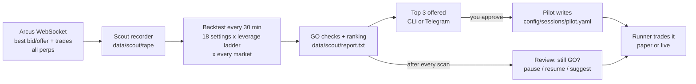

# treading-bot

A maker (limit-order) trading bot for **Arcus perpetual futures**. Its goal is as much **maker volume** per day as
possible while staying at breakeven or better. It sizes itself from your account: every order size, position cap and
stop is a fixed share of the capital, so the same setup runs on $20 or $20,000 ([4.6](#46-capital-the-least-and-the-most)).
The examples in this guide use $100.

It does three things:

1. **Scout.** It records every Arcus perp around the clock and, every 30 minutes, backtests 18 strategy settings on
   every market at several leverage levels. It ranks what passes a set of safety checks.
2. **Pilot.** It offers you the **top 3**. You approve one, and it deploys that exact setting (paper or live), then
   keeps checking it against fresh data.
3. **Runner.** It trades the approved setting with the same risk rules the backtest used, plus kill switches, a dead
   man's switch, an independent guardian process and a Telegram control bot for your phone.

> **Risk warning.** This is experimental software that can place real orders with real money. Backtests are
> estimates, not promises: markets change, and the backtest cannot see how your own orders change other traders'
> behaviour. Nothing here is financial advice. Run in paper mode first, and only trade money you can afford to lose.

### Quick start: the only commands you need

From `treading-bot/bot` on the machine that runs the bot (after the one-time install in [3.2](#32-install)):

| Terminal | What it does |
|---|---|
| `bot up` | Starts everything in the background: the scout (records and ranks), the Telegram bot, and the guardian while a live bot runs |
| `bot status` | One screen: what runs, what is deployed, the last scan and its top 3, the balance |
| `bot dashboard` | Live screen, redrawn every 10 s: today's volume and PnL, your capital's profit or loss (Ctrl-C leaves) |
| `bot pilot approve 1` | Trades the scout's #1 setup in paper (add `--live` for real money; `--list volume` or `--list aggressive` picks from those top 3, `--max-lev` runs it at the market's maximum leverage) |
| `bot pilot close` | Closes the position and stops trading |
| `bot down` | Stops the scout and the Telegram bot (`bot down --all`: the trading bot too, position kept) |

(`bot` is `.venv/bin/bot`; activate the venv with `source .venv/bin/activate`, or type the full path.)

On your phone, send `/menu` for buttons, or: `/dashboard` (a live screen that updates itself every 10 s), `/top3`
(best setups, Run), `/openpositions` (what runs), `/status`, `/balance`, `/pauseneworders`, `/closeall`, `/settings` and `/set` (change capital, share of the balance, stops, scan
interval without editing files). [Section 9](#9-the-telegram-bot) has them all.

---

## Contents

1. [How it works](#1-how-it-works)
2. [Repository layout](#2-repository-layout)
3. [Tutorial: from zero to a running bot](#3-tutorial-from-zero-to-a-running-bot)
4. [The scout: recording, backtesting, ranking](#4-the-scout-recording-backtesting-ranking)
5. [The pilot: approve, run, re-check](#5-the-pilot-approve-run-re-check)
6. [Risk rules and safety systems](#6-risk-rules-and-safety-systems)
7. [Strategies explained](#7-strategies-explained)
8. [Session files (configuration)](#8-session-files-configuration)
9. [The Telegram bot](#9-the-telegram-bot)
10. [Command reference](#10-command-reference)
11. [The server PC: what runs 24/7](#11-the-server-pc-what-runs-247)
12. [The live bot on a VPS (systemd)](#12-the-live-bot-on-a-vps-systemd)
13. [Daily routine and troubleshooting](#13-daily-routine-and-troubleshooting)
14. [Development](#14-development)
15. [Glossary](#15-glossary)

---

## 1. How it works



- **One strategy on one market at a time.** The bot never runs several deployments in parallel, and it never switches
  markets without your approval.
- **The backtest and the live bot share their rules.** Capital, order sizes, leverage, the stops, the safety pause
  and the order-budget governor are the same numbers in both, computed by the same code (`bot/common/sizing.py`).
- **Paper mode** uses live market data with simulated orders and fills, through the same code as live.
- **Arcus only.** The bot trades Arcus perps alone: no hedging on another venue, no spot. (The two-venue Lighter
  code, the Autopilot and the old research recorder were removed on 2026-09-25; they are in the git history.)

---

## 2. Repository layout

```
treading-bot/
  README.md                   this guide
  bot/                        the bot (Python 3.12 package `bot`, command `bot`)
    bot/scout/                tape (data store), record (recorder), sim (backtest), scan (menu + ranking), pilot, service
    bot/core/                 runner, engine (the stops), risk engine, order manager, state, ledger, guardian, doctor
    bot/strategies/           mid, grid, rgrid, signal (the scout's menu)
    bot/telegram/             the Telegram control bot
    bot/venues/               Arcus (REST + WebSocket + signing) and the paper venue (queue-aware fill model)
    config/                   app.yaml (risk limits), venues/, sessions/, calendars/ (CPI, FOMC, NFP, earnings)
    deploy/                   systemd units and a VPS bootstrap script
    docs/RUNBOOK.md           operations handbook; docs/incidents/ what went wrong live and why
    tests/                    offline tests (no network, no keys); tests/sim/ replays synthetic markets through the
                              live engine
    Dockerfile, docker-compose.yml   the scout for a server
    .env.example              the credentials template (copy to .env)
```

Created at run time and never committed: `bot/.env` (credentials), `bot/data/` (recordings and backtest cache),
`bot/state/` (databases, heartbeats, pilot state), `bot/logs/`, `bot/reports/`.

---

## 3. Tutorial: from zero to a running bot

### 3.1 Requirements

- macOS or Linux, Python **3.12**, and [uv](https://docs.astral.sh/uv/) (`brew install uv`, or
  `curl -LsSf https://astral.sh/uv/install.sh | sh`).
- An Arcus account and an **API key** (only needed for live trading and for the account checks; recording and paper
  trading need no keys).
- Money: any amount above the chosen setup's minimum. The floor is under $10 for every market at its maximum leverage,
  but setups only start passing the checks somewhat higher; see [4.6](#46-capital-the-least-and-the-most) for the
  measured numbers.
- Disk: the scout needs about 0.1 GB per day (0.2–0.5 GB with depth recording). Recording pauses by itself under
  5 GB free.
- Optional: a Telegram account for phone control.

### 3.2 Install

```bash
git clone https://github.com/dhruvamity/treading-bot.git
cd treading-bot/bot
make install
.venv/bin/bot --help
```

`make install` creates `.venv` with Python 3.12 and installs the bot plus the dev tools; `bot --help` lists every
command.

All commands below are run from `treading-bot/bot`. `bot` means `.venv/bin/bot` (or activate the venv with
`source .venv/bin/activate`).

> **Copying commands:** the command blocks in this guide contain commands only, so paste them as they are. Run a
> block line by line when its lines are alternatives. (On macOS, zsh does not treat `# ...` as a comment when
> typed or pasted, so a trailing comment would be passed to the command as extra arguments.)

### 3.3 Credentials

```bash
cp .env.example .env
chmod 600 .env
```

Fill in only what you use:

| Variable | What it is | Needed for |
|---|---|---|
| `ARCUS_ADDRESS` | The wallet address (0x…) that owns the API key. `ARCUS_WALLET_ADDRESS` is also accepted. | live, `doctor`, `keys`, `selftest` |
| `ARCUS_API_PRIVATE_KEY` | The API key's private part (64 hex). Arcus web app → API Keys → Generate, or `.venv/bin/python scripts/arcus_register_key.py --env mainnet --account N` on your own machine. | live, `doctor`, `keys`, `selftest` |
| `ARCUS_API_PRIVATE_KEY_2`… | Keys for other subaccounts (one key per subaccount) | optional |
| `TELEGRAM_BOT_TOKEN`, `TELEGRAM_CHAT_ID` | The Telegram bot and your chat ([section 9](#9-the-telegram-bot)) | Telegram |
| `TELEGRAM_ALLOWED_USER_IDS` | Only these Telegram users may send commands | recommended |
| `BOT_PILOT_LIVE` | `1` allows LIVE deployments from the pilot; empty = paper only | live via the pilot |

The bot asks Arcus for everything else (which subaccount a key trades, when it expires). Check with:

```bash
bot keys
bot doctor
```

`bot keys` lists your API keys as Arcus sees them (subaccount, status, days left). `bot doctor` checks credentials,
account, clock and region, and places no orders.

`.env` is in `.gitignore`: never commit it. For an encrypted alternative see `bot secrets --help`.

### 3.4 Start the scout (recording + backtests)

```bash
.venv/bin/bot up
```

- `bot up` starts the scout in the background (with the Telegram bot if it is set up); logs go to `logs/scout.out`,
  its process id to `state/scout.pid`. `bot status` shows it, `bot down` stops it.
- It connects to Arcus's public WebSocket, subscribes to every online perp and writes data every 5 minutes.
- About 10 seconds after it starts, and then every 30 minutes, it ranks every market and writes
  `data/scout/latest.json` and `data/scout/report.txt`. It stays light enough to share a machine with the trading bot
  ([11.2](#112-what-it-backtests-every-30-minutes)): the full search over all 3,204 setups runs once a day, and each
  30-minute scan re-checks only the few that pass on their full days.
- It backtests at **your capital**: before each scan it reads the subaccount's equity (with `ARCUS_ADDRESS` in `.env`;
  an unfunded account or no address means the $100 paper capital). `--capital 250` sizes for a fixed amount instead,
  e.g. for a deposit you have not made yet.
- A market needs at least one **full day** of data (the recorder up for 20+ hours of a UTC day) before it can be
  ranked. The checks get more reliable as the history grows towards 7 days.
- `bot down` stops it cleanly within seconds: a scan in progress stops (the days it finished stay cached) and the
  recorder writes out its buffers.
- To record and backtest 24/7 on another machine instead, see [section 11](#11-the-server-pc-what-runs-247).

### 3.5 Read the ranking

```bash
cat data/scout/report.txt
bot pilot status
```

`report.txt` is the latest ranking (`bot scout scan` runs one scan now and prints it instead). `bot pilot status`
shows what is deployed and the current top 3.

An example from 2026-09-24 02:28 UTC (4 full days of data; the numbers change every scan):

```
best per market (any leverage up to the max):
   market       setting                         order fills/d  volume/d   pnl/d   worst    24h  why not
 1 QQQ-USD      deep 3bp, skew @ 20x              800      46    20,961   +0.29   -1.60  +1.28  GO
 2 GLD-USD      deep 3bp, skew @ 5x               200      62     9,001   +0.20   -0.02  +0.58  GO
 3 GOOGL-USD    touch 1bp @ 10x                   400      23     5,813   +1.13   -1.21  +5.27  GO
```

| Column | Meaning |
|---|---|
| setting | The strategy setting ([section 7.2](#72-the-scout-menu-18-settings)) and the leverage it was sized at |
| order | Dollar size of each order |
| fills/d, volume/d | Average maker fills and maker volume (USD) per full day |
| pnl/d, worst | Average and worst daily PnL in USD, after fees and after closing any leftover position |
| 24h | PnL over the last 24 hours (re-run on every scan) |
| why not | `GO`, or the checks it failed ([section 4.4](#44-go-checks)) |

A second table in the report shows each market **at its maximum leverage**, even when that fails the checks.

### 3.6 Run the #1 setup in paper

```bash
bot pilot approve 1
```

This writes `config/sessions/pilot.yaml` (the exact backtested setting, leverage and stops) and starts
`bot run pilot` in **paper** mode: live market data, simulated orders. The paper account starts with the capital
the scan used, and its sizes follow the paper equity the same way live sizes follow the real one. Watch it:

```bash
bot status
bot report --mode paper
tail -f logs/runs/pilot-paper-*.log
```

`bot status` shows the heartbeat, open orders and positions for each mode; `bot report` shows today's PnL split and
volume.

Or from Telegram: `/top3` → **Run #1** → **Paper** → Confirm. Let paper run for a few days and compare its daily PnL
and volume with the backtest (`/openpositions` shows both).

### 3.7 Go live (real money)

Do these in order:

1. **Self-test while the account is still empty:** `bot selftest`. It sends every kind of signed request the bot uses
   (dead man's switch, cancel-all, a post-only order 3% away from the price, a modify, a batch, set-leverage). On an
   unfunded subaccount Arcus checks each request and then rejects the orders as `UNDERCOLLATERALIZED`, so nothing can
   trade. Every line should say `PASS` or `INFO`.
2. **Use a dedicated subaccount** if you also trade by hand: the bot treats every order and position on its
   subaccount as its own (it cancels orders it did not place and trades existing positions down).
3. **Deposit USDG** into that subaccount (Arcus web app): at least the minimum for the setup you want
   ([4.6](#46-capital-the-least-and-the-most)); more only adds size once the scout has backtested at the new amount.
4. Put `BOT_PILOT_LIVE=1` in `.env`, and wait for the next scan: the scout then backtests at the account's equity.
5. `bot doctor pilot` must end in **READY**. Its `sizing` line shows the order size, cap and stops for your equity.
   It fails a live start on a market that is not ONLINE, and warns about a market listed in the last 21 days and
   about a stock with no earnings date in `config/calendars/earnings.csv` (the file ships empty: add the next report
   date of the stock you trade as `SYMBOL,YYYY-MM-DD,bmo,source` (or `amc`), so the bot pauses around it).
6. `bot pilot approve 1 --live`, read the summary, and type `LIVE`. From Telegram: **Run #1** → **LIVE**, the bot
   runs `doctor`, then you type back the one-time code it sends.

Before the first order the runner sets the session's leverage on Arcus (cross margin) and arms the dead man's switch.

### 3.8 Stop, pause, close

| Want to | CLI | Telegram |
|---|---|---|
| Stop placing new orders (exits keep working) | — | `/pauseneworders [MARKET]`, `/unpause` |
| Close the position and stop the pilot's bot | `bot pilot close` | `/openpositions` → Close & stop |
| Stop the bot (cancels quotes, keeps positions) | Ctrl-C, or `systemctl stop bot` | `/stop` |
| Cancel every open order on the account now | `bot cancel-all --venue arcus` | `/cancelall` |
| Close every position now | `bot flatten --venue arcus [--taker]` | `/closeall [taker]` |
| Clear a safe mode / kill stop after checking why | `bot resume --all` | `/resumeaftersl` |

---

## 4. The scout: recording, backtesting, ranking

### 4.1 What it records

Per market per UTC day, compact NumPy files under `data/scout/tape/<MARKET>/<YYYY-MM-DD>/`:

- **bbo**: the best bid and ask with their sizes: a row whenever a price changes, or sizes change and a second
  has passed.
- **trades**: every trade with price, size, which side the taker was on, and Arcus's `sequenceNumber` (all prints of
  one taker order share it).
- **depth** (optional, `--depth`): the top 10 book levels on each side, sampled once a second when the book changed.
  Used later for a queue-position fill model; the Docker setup records it by default.

It uses two WebSocket connections (three with depth), re-reads the market list every 10 minutes and pauses recording below 5 GB
of free disk. `data/scout/recorder.json` shows its health.

### 4.2 How the backtest works

For each market, each setting and each UTC day (each day starts flat, with 2 hours of warm-up), the simulator in
`bot/scout/sim.py` replays the tape one second at a time, the way the live bot decides once a second:

- **Timing.** New orders go live and cancels take effect 150 ms later. A post-only order that would cross the book on
  arrival is rejected.
- **Fills (conservative).** A resting order fills only when a taker trades **through** its price. A trade exactly at
  its price does not count, because the queue position there is unknown. One taker order fills us for at most what
  it printed **beyond** our price: with our order resting there, the taker would first have used up the better levels
  and the queue at our price. This is a lower bound; assuming we were first in the queue adds only about 10–15%
  volume at 3 bps from the mid.
- **Costs.** Maker fee 0, taker fee 2.25 bps (Arcus's current fees; the live bot reads them from the API). A taker
  exit pays the opposite best price plus 5 bps slippage on any size beyond what the best level shows. A position left
  at the end of a window is charged the half-spread plus the taker fee.
- **Arcus order budget.** Each subaccount has an order pool of 20,000 actions, growing by one per $0.10 filled. The
  governor doubles the requote tolerance when actions per filled dollar get too high and allows cancels only when the
  pool is nearly empty, exactly like the live governor.
- **Risk rules.** The same stops as live ([section 6.1](#61-the-stops-backtest-and-live)), plus the safety
  pause, the liquidation-distance cut and liquidation itself.
- **Session hours.** Stock, index and commodity perps (RWA) need 1.5× the initial margin to open positions outside
  their session (04:00–20:00 New York time on weekdays; weekends and NYSE holidays are off-hours). The backtest
  shrinks the inventory cap and the order size there, as the live bot does.

Completed days are cached in `data/scout/cache/`, so a scan only re-runs the current 24 hours.

### 4.3 Leverage and order size

Every market is tested at its **maximum Arcus leverage** (1 / `initialMarginFraction`, e.g. SPY 50x, QQQ/GLD/SLV 25x,
NVDA 20x, most stocks and alts 10x) and then at 20x, 10x, 5x and 2x below it. **BTC and ETH are capped at 20x**
(`LEV_CAPS` in `bot/scout/scan.py`). The leverage sets the size:

| Quantity | Rule | QQQ at 10x, $100 capital |
|---|---|---|
| Largest position Arcus allows | capital × leverage | $1,000 |
| Inventory cap (`inventory_cap_usd`) | that ÷ 1.25, so the risk engine's hard cap (1.25 × cap) lands on the venue limit | $800 |
| Order size (`order_size_usd`) | half the cap, per level per side | $400 |
| Off-hours (RWA) | cap and order × (off-hours leverage ÷ leverage) | unchanged at 10x (QQQ allows 16.7x off-hours) |
| Stops | 1% / 2% / 10% of the capital ([6.1](#61-the-stops-backtest-and-live)) | $1 / $2 / $10 |

Leverage does not create fills by itself; it lets you post bigger orders, and bigger orders capture more of each
taker order that reaches them. The stops grow with the **capital**, not with the leverage, so at high leverage a
small price move reaches them. That trade-off is exactly what the ladder measures.

### 4.4 GO checks

A setting is **GO** only when all three windows pass:

| Window | Checks |
|---|---|
| Long: up to the last 7 full days | average PnL/day ≥ −0.25% of the capital; at most one daily stop; never the kill or a liquidation; at least half the days not negative; at least 5 fills a day |
| Short: last 24 h (re-run every scan) | 24 h PnL ≥ −0.25%; last 6 h ≥ −0.50%; no kill in the last 24 h; at least 30% of its usual fills (the flow is still there) |
| Now: last 60 one-minute prices | not trending (efficiency ratio < 0.5); volatility and spread under 2× their usual level; data less than 5 minutes old |

The percentages are of the capital the setting uses: −0.25% is −$0.25 a day on $100 and −$2.50 on $1,000.

**New markets.** Arcus pre-lists markets as OFFLINE (September 2026: F, BAC, CCL, VT, SGOV, RVI) and switches them
on later, and a fresh listing can go back OFFLINE (KBONK did, hours after listing). The scout handles this:
- a market's first recorded day counts as a full day only if its own data covers 20 hours of it;
- a market trading for under 21 days (Arcus's listing time, or the recorder first seeing it after it started) needs
  **3 full days** before it can be GO: listing-week flow is unusual, and new listings start with small open-interest
  caps ($100k for CPER, GME, QNT, MRNA);
- a deployment whose market goes offline is paused, and resumes after two GO scans once it trades again.

**Ranking:** GO settings rank by maker volume per day, then PnL. The best setting per market is kept, and the top 3
markets are offered.

### 4.5 Files

| File | What |
|---|---|
| `data/scout/report.txt` | The latest ranking, readable |
| `data/scout/reports/<day>.txt` | The last scan of each UTC day |
| `data/scout/latest.json` | The full latest scan (the pilot reads it) |
| `data/scout/scans/<time>.json` | Every scan, without the per-setting list |
| `data/scout/recorder.json` | Recorder health: markets, rows, message age, free disk |
| `data/scout/markets.json` | Arcus market parameters (ticks, minimums, margins, status, listing time), refreshed every 10 minutes |

### 4.6 Capital: the least and the most

Nothing in the bot is tied to a fixed amount. Every size and stop is a share of the **capital**
(`bot/common/sizing.py`, used by the backtest, the session file, the live engine and the doctor):

| Quantity | Formula | $50 at QQQ 20x | $1,000 at QQQ 20x |
|---|---|---|---|
| Order size | capital × leverage ÷ 2.5 | $400 | $8,000 |
| Inventory cap | 2 × order | $800 | $16,000 |
| Position stop (the risk per trade) | 1% of capital | $0.50 | $10 |
| Daily stop | 2% of capital | $1 | $20 |
| Kill | 10% of capital | $5 | $100 |

**Where the capital comes from.** `sizing.capital_usd` in `config/app.yaml`:
- `auto` (default): the subaccount's equity × `capital_frac`, capped at `max_capital_usd`. With no `ARCUS_ADDRESS`
  or an unfunded account it is `paper_capital_usd` ($100).
- A number: exactly that, e.g. to rank setups for a deposit you have not made yet (`bot scout run --capital 500`).

The capital is rounded **down** to a fixed series (…, 90, 100, 110, 125, 140, 160, …; about 20 steps per decade), so
the backtest and the live bot size from exactly the same number and cached backtests stay valid while equity moves.

**The scout's capital settles** (`state/scout_capital.json`): every new capital means backtesting the whole week
again, so the scout keeps scanning at the capital it has while the balance stays within 25% of it, and moves at most
once per UTC day when it leaves that band. A fixed amount, the first deposit (paper → a funded account), or a
Telegram `/set` of a sizing setting applies at once. Every reading of the balance is kept
([the balance history](#balance-history)).

**How the live bot follows the account** (sessions written by the pilot have `sizing.follow_equity: true`):
1. At start and at every 00:00 UTC it reads the equity and re-computes the order size, caps and dollar stops.
2. It never sizes above **1.25×** the capital the setup was last backtested at. Every scan in which the running
   setup is still GO records the capital it used, so growth is followed one validated step at a time. A deposit that
   doubles the account takes effect after the scout has confirmed the setup at the new size.
3. Your Telegram settings (`trade_share`, `capital`, `max_capital`, the stops) apply at the same re-size.
4. Losses shrink the sizes the same way (at the next 00:00 UTC), and the stops shrink with them.
5. If the equity falls below the setup's **least capital**, it stops quoting and closes what is left.

<a id="balance-history"></a>**The balance history** (`state/balances.jsonl`): the scout logs the account before every
scan, the live bot every 5 minutes, and Telegram's `/balance` each time you ask. Each row has the time, the equity,
the free collateral and Arcus's **net deposits** (deposits minus withdrawals), so trading profit (equity − net
deposits) is never confused with money you moved in or out. `/balance` shows the latest reading with its 1-, 7- and
30-day change; `bot status` shows the last one.

<a id="dashboard"></a>**The live dashboard** (`/dashboard` in Telegram, `bot dashboard` in a terminal) refreshes
every 10 s:
- **Volume today:** the bot's own fills since 00:00 UTC, exact to the last fill.
- **Pace:** today's volume scaled to a full day. It shows after 30 minutes of trading, next to the backtest's volume
  per day.
- **PnL today:** trading PnL now minus trading PnL at 00:00 UTC, taken from the balance history. It counts fees,
  funding and the open position's mark-to-market. Deposits never count, and restarting the bot during the day does
  not reset it.
- **Capital P/L:** equity minus net deposits, since your first deposit.
- **Where equity comes from:** the running bot reads it every 15 s. With no bot running, the dashboard reads the
  account itself, at most once a minute.

**The floor: least capital.** The smallest order the bot places, the off-hours one on RWA perps, must stay at least
1.2× the Arcus minimum order (max($5, minimum size × price)). So the least capital is 3 × minimum order ÷ off-hours
leverage: $0.90 for QQQ or GLD at their maximum (25x, 16.7x off-hours), $7.50 for most markets at 2x, $8.11 for
SNDK at its maximum. A leverage that the capital cannot fund is not backtested, and the report lists it as "capital
too small". `bot scout limits` prints the table for every market.

**The ceiling: market liquidity.** An order larger than almost every taker order does not fill more; it only takes on
more risk. So one order never exceeds the market's **order ceiling**: the 99th-percentile taker order over the
recorded days (September 2026: QQQ $11k, GLD $25k, SPY $9k, NVDA $4k, BTC $22k). Past it the sizes stop growing and
the stops apply to the capital actually used; the rest of the account is margin cushion. QQQ at 20x therefore uses at
most about $1,375 of capital, and at 2x about $13,750. There is no upper limit on the account, but one deployment on
one market can only use what that market trades. (Running several markets at once would use more; the bot runs one.)

**Measured: the whole menu at nine capital levels.** Every market and setting was backtested on the 4 full days
recorded 2026-09-20 to 09-23, with the checks as of 2026-09-24 02:50 UTC. These are backtests on a short history,
not promises:

| Capital | Setups that pass | Best by maker volume (capital it uses) | Order | Maker volume/day | PnL/day (best) | Worst day |
|---|---|---|---|---|---|---|
| $5 | 4 markets | NVDA deep 2bp ×2 @ 5x ($5) | $10 | $1,008 | +$0.05 | −$0.04 |
| $10 | 6 | NVDA deep 3bp, skew @ 5x ($10) | $20 | $1,256 | −$0.00 | −$0.11 |
| $25 | 7 | NVDA deep 3bp, no pause @ 5x ($25) | $50 | $2,080 | +$0.37 | −$0.01 |
| $50 | 8 | QQQ deep 3bp, skew @ 20x ($50) | $400 | $11,452 | −$0.01 | −$0.60 |
| $100 | 8 | QQQ deep 3bp, skew @ 20x ($100) | $800 | $20,961 | +$0.29 | −$1.60 |
| $250 | 9 | QQQ deep 3bp, skew @ 25x ($250) | $2,500 | $42,959 | −$0.00 | −$5.50 |
| $1,000 | 13 | QQQ deep 1.5bp, no pause @ 10x ($1,000) | $4,000 | $102,561 | +$6.29 | −$6.87 |
| $5,000 | 14 | QQQ deep 1bp @ 5x ($5,000) | $10,000 | $204,963 | +$8.75 | −$47.35 |
| $25,000 | 16 | HYPE deep 3bp, skew @ 2x ($11,250) | $9,000 | $404,706 | +$81.34 | −$237.82 |

What it says:
- **The least money that works is about $5**, but only four markets pass and each order is $10, so volume is about
  $1k a day. HOOD, INTC and SNDK need more than $5 (their minimum order is $12–18); from $10 every market can be
  funded.
- **Around $50 is where it gets useful:** QQQ at 20x can then post $400 orders and does about $11k of maker volume a
  day near breakeven. From $50 to about $1,000, volume grows almost in step with the capital (100–230× the capital
  a day).
- **Past about $1,000 the growth slows:** at $5,000 the best setup does about 40× the capital a day, and at $25,000
  about 16×. Orders hit the markets' liquidity ceilings, so extra capital becomes margin cushion (the $25,000 row uses
  $11,250), and the best market changes (HYPE at $25,000).
- **The worst day grows with the capital** (the stops are a percentage of it), as do the stakes of a four-day sample
  being wrong. Scan at your own capital and let the scout's history grow before sizing up.

---

## 5. The pilot: approve, run, re-check

**Approving** (`bot pilot approve N [--live]`, or the Telegram Run buttons):

1. It re-reads the latest scan and refuses if it is over 90 minutes old (is the scout running?). From Telegram it
   also refuses if the top 3 changed between your tap and your confirm.
2. It writes `config/sessions/pilot.yaml`: the strategy, leverage, order size, caps and stops at the backtested
   capital, quoting 24/7, plus the `sizing` recipe the engine uses to re-size from the account's equity.
3. If a bot is already running, it first sends it the **close** command (reduce-only maker exit, then a taker order;
   the bot stops even if a position is still open after 10 minutes, with a critical alert).
4. It starts `bot run pilot` (paper, or live with the checks in [3.7](#37-go-live-real-money)).

**Reviewing**, after every scan (`bot scout run` does this automatically):

| Situation | What the pilot does |
|---|---|
| Nothing running | Offers the top 3 whenever they change |
| Running and still GO | Records the capital it was backtested at (kv `sizing_ok`): the engine may size up to 1.25× that at the next 00:00 UTC |
| Running and no longer GO | **Pauses quoting** on that market (reduce-only exits close the position) and tells you why, with the current top 3 |
| Paused, then GO on two scans in a row | Resumes quoting by itself |
| Another GO setting with ≥ 1.5× the maker volume | Suggests a switch, once. It never switches without you |

State lives in `state/pilot.json`; every event is a line in `state/pilot_events.jsonl`, which the Telegram bot posts.

---

## 6. Risk rules and safety systems

### 6.1 The stops (backtest and live)

The stops are percentages of the capital (`sizing` in `config/app.yaml`). The pilot writes them into every session
file both as dollars (for the capital it was backtested at) and as percentages (the `sizing` block), and the engine
re-computes the dollars from the account's equity at start and at 00:00 UTC ([4.6](#46-capital-the-least-and-the-most)).

| Rule | Default | On $100 | What happens |
|---|---|---|---|
| Position stop | 1% | $1 | The open position is down 1% of the capital from its average entry: cancel quotes, exit with a reduce-only maker order at the touch, cross the spread with a taker order after 20 s if it has not filled, then pause 60 s |
| Daily stop | 2% | $2 | The day's PnL is below −2%: close the position the same way, no new orders until 00:00 UTC, then resume by itself |
| Kill | 10% | $10 | Equity more than 10% below its peak: close everything with a taker order and stop until you resume it |
| Safety pause | on | — | Spread over 3× its 1-hour median (and more than 1 bp above it) or a 1-second move over 6σ: no quotes for 30 s |
| Liquidation distance | 4σ | — | Distance to liquidation below 4σ of 1-hour moves: cut half the position at market; re-armed above 6σ |
| Position caps | 1.2× / 1.25× | — | No new order that could take the position past 1.2× the cap; the risk engine rejects anything past 1.25× |

### 6.2 Other kill switches (live engine)

| Trigger | Automatic action | Resume |
|---|---|---|
| Session loss ≥ `stop_loss_pct` of capital | Cancel quotes, flatten (maker, then IOC) | next session |
| Event window (CPI, FOMC, NFP ±30 min; earnings ±24 h) | No new quotes | window end |
| Arcus off-hours price band in its expansion zone, or open-interest cap reached | Stop quoting that market | cleared |
| The market is not ONLINE (Arcus's live `markets` channel: halted, delisted, a listing switched off) | Stop quoting that market; the exit book closes any position once it trades | ONLINE again |
| Heartbeat silent 60 s | Dead man's switch and guardian cancel everything | manual, after reconciliation |
| Order pool < 5% | Cancels only | pool recovered |
| Dead man's switch refresh fails twice | Safe mode | manual |
| `SELF_TRADE` or `GEO_RESTRICTED` rejection | Stop the venue, critical alert | manual |
| Unexpected error in the trading loop | Safe mode: cancel quotes, keep positions | manual |
| The same rejection 5 times in 60 s (e.g. `UNDERCOLLATERALIZED`) | Pause that market | 60 s, doubling up to 10 min |

When a session has no stops of its own, the app-wide limits in `config/app.yaml` apply: daily loss 3% of capital,
drawdown 10%.

### 6.3 Safety systems

- **Live lock.** A real order needs `--live` on the command line **and** your approval (typing `LIVE`, or
  `live_enabled: true` in the session for unattended `--yes` starts) **and** a `doctor` with no FAIL. Only this module
  can open mainnet writes; a live request is never silently turned into paper.
- **Dead man's switch.** Every 20 s the bot tells Arcus "cancel all my orders in 60 s unless I check in again"
  (`scheduleCancel`). If the bot or the machine dies, Arcus cancels everything by itself.
- **Guardian** (`bot guardian`, systemd `bot-guardian`). A separate process with its own connections. It cancels
  everything if the live heartbeat is silent for 60 s, and flattens (reduce-only) past the drawdown limit. It never
  sends an order that increases risk.
- **Reconciliation.** Every 5 minutes, and on every start, the venue is the source of truth: unknown orders are
  cancelled and positions are taken from Arcus.
- **Separate state per mode.** Paper, testnet and live each have their own database and heartbeat.

---

## 7. Strategies explained

### 7.1 Key ideas first

- **Mid** m = (best bid + best ask) / 2. **1 bp** (basis point) = 0.01% of the price.
- **Maker vs taker.** A maker order rests on the book (post-only, "ALO" on Arcus) and pays no fee. A taker order
  crosses the spread, fills immediately and pays 2.25 bps.
- **Where the edge comes from.** Research on the recorded Arcus books showed that quoting **at** the best bid or ask
  loses on most liquid markets: whoever trades against you there often knows the price is about to move. Orders a few
  bps **deeper** get filled mostly by large taker orders that sweep through several levels and then partly bounce
  back, and those fills have earned on average. The effect is strongest on quiet stock, index and gold perps; it is
  near zero or negative on BTC and ETH.
- **Inventory skew.** With inventory I (in dollars) and cap I_cap, the skew is u = clamp(I / I_cap, −1, 1). The
  **reservation price** r = m × (1 − κ × u × h) shifts both quotes away from the side you are already heavy on (h is
  the half-spread as a fraction, κ the `skew_kappa`). Order sizes skew too: bid size = q × (1 − u), ask size =
  q × (1 + u). At u = ±1 the side that would add inventory stops.
- **Requote tolerance.** A live order is kept (keeping its queue place) while it is within max(2 ticks,
  0.25 × half-spread) of the wanted price and within 20% of the wanted size; otherwise it is replaced.

### 7.2 The scout menu (18 settings)

Every setting runs at every leverage on the ladder, so the report labels look like `deep 3bp, skew @ 10x`.

| Menu name | Live strategy | What it quotes |
|---|---|---|
| `deep 1bp`, `1.5bp`, `2bp`, `3bp`, `5bp` | mid, passive, κ 0 | one bid and one ask at mid ± d bps |
| `deep 1.5bp, no pause`, `deep 3bp, no pause` | same, safety pause off | as above, also through volatile moments |
| `deep 3bp, skew` | mid, passive, κ 1 | as `deep 3bp`, quotes shifted against inventory |
| `deep 2bp x2`, `deep 4bp x2` | mid, passive, 2 levels | levels at d and d + 3 bps each side |
| `touch 1bp`, `touch 3bp` | mid, normal | mid ± max(d, half the spread) |
| `improve touch` | mid, aggressive | one tick inside the best bid and ask |
| `grid 10bp`, `grid 25bp` | grid, 3 levels | static geometric grid |
| `rgrid 5bp`, `rgrid 15bp` | rgrid | trailing grid that cuts losing inventory |
| `rsi signal` | signal | RSI mean reversion with maker entries |

### 7.3 Mid (`mode: mid`)

Quotes 1–3 levels per side around the reservation price r. The **execution style** sets where level 0 sits:

| Style | Bid / ask | Behaviour |
|---|---|---|
| `passive` | r ∓ (h + k × σ₁ₘ) × m | A fixed distance from the mid (the pilot sets k = `passive_k_sigma` = 0). Fills only on sweeps: the "deep" settings. |
| `normal` | r ∓ max(h × m, spread / 2) | At least at the touch, further out when h is wider than the spread. |
| `aggressive` | best bid + 1 tick / best ask − 1 tick (or join the touch when the spread is one tick) | Most fills, most adverse selection. |

- h = `spacing_bps` (or, with `auto`, the 1-minute volatility, at least 2 ticks). Extra levels sit `level_step_bps`
  further out each.
- `offset_bps` shifts both quotes (negative = inward; "Mid-1" in Tread terms is −1).
- A post-only guard keeps the bid below the best ask and the ask above the best bid.
- **Participation cap:** when your fills exceed `participation_cap_pct` of the market's volume over 5 minutes, h
  widens by 50% (the pilot sets 100%, i.e. off).
- **Off-hours** (RWA outside its session): mid is disabled unless `off_hours.allow_mid: true` (the pilot allows it);
  spacing and size are multiplied by `off_hours.spacing_mult` / `size_mult`.

### 7.4 Grid (`mode: grid`)

A static geometric grid around a centre C: point j sits at C × (1 + δ)^j for j = −N…N.

- Start: buys at j = −1…−N, sells at j = 1…N (point 0 empty).
- A filled buy at j re-lists as a **sell one step up** (j + 1); a filled sell at j re-lists as a **buy one step down**.
  Each round trip earns δ.
- No new buys once inventory reaches the cap (and the mirror for sells).
- **Re-centre:** when the mid stays more than `reset_threshold_pct` from C for `recentre_after_s`, the grid moves to
  the current mid. Inventory carried over is handled by `recentre_inventory`: `skew_exit` (skew sizes against it) or
  `maker_unwind` (a reduce-only maker order at the touch).
- δ = `spacing_bps`, or with `auto` δ = clamp(k × σ₁ₕ / √(target fills per hour), δ_min, δ_max) from the session's
  `auto_spacing` block.
- Good in ranges; in a trend it accumulates a growing losing position until it re-centres.

### 7.5 RGrid, trailing grid (`mode: rgrid`)

1–3 levels per side around an **EMA of the mid** (`rgrid_ema_s`, default 300 s), so the grid follows the price.

- If the mid moves more than `reset_threshold_pct` from the centre, the centre jumps to the mid.
- **Cut rule:** when inventory is more than 1.5 orders and the price has moved more than one level against its
  average entry, the excess is cut: a reduce-only maker order at the touch, then an IOC taker order every
  `rgrid_cut_after_s` (default 20 s) until it is gone.
- This caps a trend's loss near one level plus the reset distance, at the cost of some taker fees.

### 7.6 Signal (`mode: signal`)

RSI mean reversion, one position at a time:

- **Entry:** RSI(14) on 1-minute prices below `rsi_low` (25) → buy at the best bid; above `rsi_high` (75) → sell at
  the best ask. Only when the trend is flat: |EMA20 − EMA60| < `trend_z` × σ (in price units).
- **Exits:** a maker take-profit at +`tp_bps` (15), a taker stop at −`sl_bps` (25), or a maker exit after
  `max_hold_min` (120).
- A cooldown (`cooldown_s`, 300 s) after each trade. Few orders, so it is light on the order budget.

---

## 8. Session files (configuration)

A session is one YAML file in `bot/config/sessions/`. The pilot writes `pilot.yaml`; the others are examples
(`bot sessions` lists them). The main fields of a market-making session:

| Field | Meaning |
|---|---|
| `session_id`, `venue`, `market` | Name, `arcus`, and the base asset (e.g. `QQQ` for QQQ-USD) |
| `account_index` | Arcus subaccount 0–9 (must match the one your key is bound to; `bot keys`) |
| `mode` | `mid`, `grid`, `rgrid` or `signal` |
| `live_enabled` | Part of the live lock: required for unattended live starts |
| `capital_usd`, `leverage_max` | Capital, and the leverage the runner sets on Arcus before quoting |
| `order_size_usd`, `inventory_cap_usd` | Order size per level per side, and the inventory cap (`auto` = derived) |
| `inventory_cap_off_usd` | Cap outside an RWA session (higher off-hours margin) |
| `execution_style`, `spacing_bps`, `levels_per_side`, `level_step_bps`, `offset_bps` | Quote placement ([7.3](#73-mid-mode-mid)) |
| `skew_kappa`, `passive_k_sigma` | Inventory skew strength; passive extra distance in 1-minute σ |
| `pos_stop_usd`, `daily_stop_usd`, `kill_usd`, `exit_taker_after_s`, `cooldown_s` | The stops in dollars for `capital_usd` ([6.1](#61-the-stops-backtest-and-live)) |
| `sizing` | Pilot sessions: `follow_equity`, `backtest_capital_usd`, `capital_frac`, `max_capital_usd`, `leverage` / `leverage_off` (the leverage the sizes use), `order_max_usd` (the liquidity ceiling), the stops in %, `min_capital_usd`. With `follow_equity: true` the engine rewrites the dollar sizes and stops from the account's equity at start and at 00:00 UTC ([4.6](#46-capital-the-least-and-the-most)) |
| `stop_loss_pct`, `take_profit_pct` | Session-level stop and take-profit, in % of capital |
| `participation_cap_pct` | Widen when your share of market volume is higher than this |
| `safety_pause` | `move_sigma_1s`, `spread_x_median`, `depth_frac_min`, `resume_s` |
| `session` | `duration`, `repeat`, `windows_ist` (trading windows) and `skip_events` (`cpi`, `fomc`, `nfp`, `earnings`) |
| `off_hours` | `spacing_mult`, `size_mult`, `allow_mid` for RWA perps outside their session |
| `reset_threshold_pct`, `recentre_after_s`, `recentre_inventory`, `rgrid_*` | Grid and RGrid ([7.4](#74-grid-mode-grid), [7.5](#75-rgrid-trailing-grid-mode-rgrid)) |
| `signal`, `auto_spacing` | Signal's settings; the Grid/RGrid spacing when `spacing_bps: auto` |

To change the account-wide numbers the scout uses (capital, stops), edit `Risk` in `bot/scout/sim.py`; to change the
leverage caps or ladder, edit `LEV_CAPS` / `LADDER` in `bot/scout/scan.py`. App-wide limits are in
`config/app.yaml`. Event dates are in `config/calendars/events.csv` (keep FOMC 30 days and CPI 14 days ahead).

---

## 9. The Telegram bot

Control and alerts from your phone. It reads the runner's state, writes flags the runner applies on its next tick,
and holds no trading state of its own.

### 9.1 Setup

1. In Telegram, message **@BotFather**, send `/newbot`, and copy the **token** into `TELEGRAM_BOT_TOKEN` in `.env`.
2. Send any message to your new bot, then open `https://api.telegram.org/bot<TOKEN>/getUpdates` in a browser and
   copy `chat.id` into `TELEGRAM_CHAT_ID`.
3. Start it: `bot telegram` (keep it running; systemd unit `bot-telegram`).
4. Send `/whoami` and put your user id in `TELEGRAM_ALLOWED_USER_IDS` (comma-separated), then restart it.
5. Optional: `BOT_PILOT_LIVE=1` to allow LIVE deployments from the Run buttons. `bot telegram --read-only` refuses
   every control and only shows status and alerts.

### 9.2 Commands

Send `/menu` for buttons. Telegram's `/` list shows the everyday commands; the rest work too.

**Every day**

| Command | What it does |
|---|---|
| `/top3` | The 3 best setups that are about breakeven or better, with sizes and backtest numbers and **Run** buttons |
| `/volume` | The 3 with the most volume for at most your cost per $1,000 traded (`/set volume_cost`), any strategy setting. Also starts a fresh scan and posts its top 3 when done |
| `/aggressive` | Aggressive Mid: quotes at or inside the best bid/ask and flips fast ("improve touch", "touch 1bp"), the most volume within the same cost. Also starts a fresh scan |
| **Run #k** | Asks **Recommended** leverage (what the list picked) or **Max** (the same setting at the market's maximum, with its own backtest and a warning if it falls out of the list), then **Paper** or **LIVE** |
| `/openpositions` | What is deployed: state, today's PnL vs the backtest, the last check, **Close & stop** |
| `/dashboard` | A live screen that updates itself every 10 s, pinned at the top of the chat: today's volume (and its pace vs the backtest), today's PnL, the position, and your capital's profit or loss (equity minus deposits). ⏹ stops it, ▶️ starts it again; a newer `/dashboard` replaces the old one |
| `/status` | Is it running, today's PnL, fills, volume |
| `/balance` | The account now (read live and logged): equity, free collateral, deposits vs trading PnL, the 1/7/30-day change, and the capital the scout and the bot size for |
| `/positions`, `/orders` | What you hold; what is waiting on the book |
| `/yesterdayreport [YYYY-MM-DD]` | The daily report: yesterday's, or the date given |

**Control and emergencies**

| Command | What it does |
|---|---|
| `/pauseneworders [MARKET]`, `/unpause [MARKET]` | Stop / restart placing new orders; orders that close a position keep working |
| `/stop` | Shut the bot down: quotes cancelled, positions kept (Confirm button) |
| `/resumeaftersl` | Trade again after a safety stop (safe mode, the kill or the daily stop), once you know why (Confirm button) |
| `/cancelall` | Cancel every open order on the account (Confirm button) |
| `/closeall [taker]` | Close every position, maker or with IOC (typed code) |

**Settings** (no file editing, no restart)

| Command | What it does |
|---|---|
| `/settings` | Each setting, its value, what it does and when a change applies |
| `/set <name> <value>` | Change one (Confirm button); `/set <name> default` undoes it |
| `/scannow` | Scan now instead of waiting for the next one |

| Setting | Values | What it changes |
|---|---|---|
| `capital` | `auto` or dollars | Money the bot sizes for: the account's balance, or a fixed amount (never more than the balance) |
| `trade_share` | 1–100 (%) | Share of the balance to trade; the rest is left untouched |
| `max_capital` | dollars or `none` | Never size for more than this |
| `position_stop`, `daily_stop`, `kill` | % of the capital | The stops ([6.1](#61-the-stops-backtest-and-live)); must stay position ≤ daily ≤ kill. Changing them means a full re-backtest (slow, low priority) |
| `scan_every` | 10–240 (minutes) | Time between scans |
| `scan_workers` | `auto` or 1–32 | CPU cores a scan may use (always one while a bot runs on the machine) |
| `volume_cost` | $0.01–$5 per $1,000 | The most the Volume and Aggressive Mid lists may cost: dollars lost per $1,000 traded (default $0.15, about 1.5 bp). The lists re-rank at once; the next scan also re-checks the last 24 h of the setups it lets in |

The scout picks up a change at its next scan (a sizing change triggers one at once); the running bot at its next
re-size (00:00 UTC, or when it restarts). Stored in `state/settings.json`. Switching live trading on stays a
deliberate step in `.env` (`BOT_PILOT_LIVE=1`), not a Telegram setting.

**More** (not in the `/` list)

| Command | What it does |
|---|---|
| `/pnl` | PnL by market |
| `/logs [n]` | The latest decisions (why it did what it did) |
| `/sessions`, `/run <session> [live]`, `/doctor <session>` | Session files; start one (live needs `live_enabled: true`, a passing `doctor` and a typed code); the readiness check |
| `/alerts`, `/mute [minutes]`, `/unmute` | Alert settings (fills: each, hourly summary, or off) |
| `/menu`, `/help`, `/whoami` | Buttons, help, your ids |

Commands act on the running bot (live first); add `paper`, `testnet` or `live` to pick one, e.g. `/status paper`.
The earlier names (`/scout`, `/pilot`, `/report`, `/pause`, `/resume`, `/flatten`) still work.

### 9.3 Deploying from your phone

`/top3` → **Run #N** → **Paper** → **Confirm**. For real money: **Run #N** → **LIVE** (shown only with
`BOT_PILOT_LIVE=1`); the bot runs `doctor` on the generated session and then sends a 6-digit code that you type back
within 2 minutes. If a bot is already running it first closes its position and stops.

### 9.4 Alerts it sends by itself

- The trading bot went down or came back.
- Safe mode, a drawdown stop or a daily stop appeared or cleared.
- Today's PnL reached half, then all, of the daily limit.
- Fills (each, an hourly summary, or none) and a digest shortly after 00:00 UTC.
- The pilot: new top 3 when nothing runs, a deployment paused (with the reason), resumed, a better setup suggested, a
  deployment that failed to start.

`/mute` silences everything except critical alerts.

---

## 10. Command reference

**Scout and pilot**

| Command | What |
|---|---|
| `bot up` / `bot down [--all]` / `bot status [--json]` | Start or stop the background services (scout, Telegram, guardian); one status screen |
| `bot dashboard [--once]` | The live dashboard in the terminal, redrawn every 10 s (same numbers as Telegram's `/dashboard`) |
| `bot scout run [--workers auto\|N] [--every-min M] [--depth] [--max-only] [--capital auto\|USD]` | Record everything and scan every M minutes (the daemon; `bot up` runs it), at the account's equity or a fixed capital |
| `bot scout scan [--markets …] [--max-only] [--capital auto\|USD] [--full]` | One scan now, printed as a table (`--full`: re-run the last 24 h for every setting) |
| `bot scout limits [--markets …]` | Per market: the least capital it can run on, the order ceiling, and the capital it can fully use |
| `bot scout import PATH` | One-off import of older recordings |
| `bot pilot status` / `approve N [--live]` / `close` | See, deploy, or close the one deployment |

**Trading**

| Command | What |
|---|---|
| `bot sessions` | List the session files |
| `bot doctor [SESSION] [--paper]` | Everything a run needs: credentials, subaccount, funds, sizing, clock, region, calendar. Places no orders |
| `bot run SESSION [--live] [--yes] [--seconds N]` | Run a session (paper by default) |
| `bot status [--mode live\|paper\|testnet]` | Heartbeat, open orders, positions |
| `bot report [--date D] [--mode M]` | Daily report: Net = spread capture + inventory PnL + funding − fees − liquidation loss |
| `bot resume [--venue V] [--all]` | Clear safe mode / stops |
| `bot cancel-all --venue arcus [--market M] [--yes]` | Cancel all open orders (asks to confirm) |
| `bot flatten --venue arcus [--taker]` | Close all positions, reduce-only (asks to confirm) |
| `bot guardian` | The independent guardian process |

**Account and keys**

| Command | What |
|---|---|
| `bot keys` | Your API keys as Arcus sees them |
| `bot selftest [--allow-funded]` | Prove every signed request works, without trading |
| `bot probe` | Live market parameters, compliance and rate budgets |
| `bot region-check` | May this machine's IP trade Arcus perps? |
| `bot secrets …` | Encrypted secrets store (alternative to `.env`) |

---

## 11. The server PC: what runs 24/7

A second machine (a home PC or a small server) should run the **scout** around the clock, so the history keeps
growing and the ranking stays current even when your laptop is off. It needs no keys and places no orders: it only
reads Arcus's public market data. Everything runs from `bot/docker-compose.yml`.

### 11.1 What it records, continuously

For **every online Arcus perp** (60 in late September 2026; a new listing, or a pre-listed market that turns ONLINE, is
picked up within 10 minutes and added without interrupting the others):

| Stream | What is stored | What it is used for | Disk per day (all markets) |
|---|---|---|---|
| Best bid and offer | Price and size of the best bid and ask: a row whenever a price changes, or sizes change and 1 s has passed | Backtest prices and spreads, the safety pause, the "now" checks | ~50–150 MB (with trades) |
| Trades | Every trade: price, size, taker side, trade id, and the `sequenceNumber` that groups one taker order's prints | Fills in the backtest (which taker orders reached our price and how much they had left), the flow checks | included above |
| Depth (`--depth`, on by default in Docker) | The top 10 levels of each side, sampled once a second when the book changed | A queue-position fill model for larger, leveraged orders (the next backtest upgrade); not used by the scan yet | ~150–400 MB |
| Market parameters | `markets.json`, refreshed every 10 minutes: tick, minimum size, margins (so maximum leverage), open-interest caps, session hours | Order sizes, the leverage ladder, the off-hours margin | tiny |

Files: `data/scout/tape/<MARKET>/<YYYY-MM-DD>/{bbo,trades,depth}-*.npz`. Arcus serves no historical order books, so
**this recording is the only history there will be**: gaps cannot be filled later.

### 11.2 What it backtests, every 30 minutes

Each scan (the first one 10 s after start):

1. Takes every market with at least one full recorded UTC day.
2. Backtests **all 18 settings** ([7.2](#72-the-scout-menu-18-settings)) at **every leverage on the ladder**: the
   market's maximum, then 20x, 10x, 5x and 2x (BTC and ETH at most 20x). It sizes them for the **capital** in
   `SCOUT_CAPITAL` (default `auto`: the Docker container has no keys, so that means the $100 paper capital; set
   `SCOUT_CAPITAL=500` to rank for a $500 account). With today's 58 markets that is 178
   market-leverage pairs and **3,204 backtests per window**.
3. The windows are each of the last **7 full days** (computed once per day, then cached) and the **last 24 hours**.
   The last 24 hours is re-run only for the setups that pass on their full days (about 3–6% of them, measured), and
   for whatever is deployed: a setup that already fails on its full days cannot become GO, so re-running it would
   change nothing. The picks are identical to re-running everything (`bot scout scan --full`), measured on 4 days of
   September data. It also reads the **last hour** for the "now" checks.
4. Applies the GO checks ([4.4](#44-go-checks)) and ranks by maker volume per day.
5. Writes the results:

| File | Contents |
|---|---|
| `data/scout/report.txt` | The latest ranking: best setting per market, then each market at its maximum leverage |
| `data/scout/reports/<YYYY-MM-DD>.txt` | The last ranking of each UTC day: the day-by-day record to compare later |
| `data/scout/scans/<YYYYMMDD-HHMM>.json` | Every scan (top 3, ranking, at-max table), about 48 per day |
| `data/scout/latest.json` | The full latest scan, every setting (what the pilot reads) |
| `data/scout/cache/` | The per-day backtest results |
| `state/pilot_events.jsonl` | The top 3 each time they change (nothing is deployed on the server, so it only offers) |

**How much CPU.** Measured on an Apple-silicon laptop, re-running everything took about 1,180 CPU-seconds per scan;
the shortlist scan takes about 90 (12.7× less), and the simulator itself is 2× faster than before with identical
results. So a 30-minute scan is under a minute of one core, plus the once-a-day search over the new day (roughly
20 minutes of one core on an Intel MacBook). Scan workers run at the **lowest CPU priority** (nice 19, macOS
background), and use **one** worker while a trading bot runs on the same machine (else all cores but one), so the
bot never waits for the CPU. The recorder itself uses about 4% of one core.

### 11.3 What the server does not do

- **No trading and no keys.** The containers never sign a request and need no `.env`.
  - **To trade live on this same machine,** stop the containers (`docker compose down`).
  - Then run the scout natively, next to the bot: `bot scout run --depth` ([3.4](#34-start-the-scout-recording--backtests)).
  - Why: the pilot checks the running bot by its process id, which a container cannot see. A Docker scout would
    never review, pause or resume a native live bot.
  - The native scout keeps using the same `data/scout/` folder, so no history is lost.
- **No Telegram.** Alerts and control come from the machine that runs the trading bot.
- **No live decisions.** Deploying stays on the machine with the keys, after you approve ([section 5](#5-the-pilot-approve-run-re-check)).

### 11.4 Set it up

Hardware: 4 or more CPU cores, 4–8 GB of RAM, and disk for the length of the run. The scout with depth needs about
**15 GB per month**.

1. **Install Docker.**
   - Linux: [Docker Engine](https://docs.docker.com/engine/install/) plus the compose plugin, then
     `sudo systemctl enable docker` so it starts at boot.
   - Windows or macOS: [Docker Desktop](https://www.docker.com/products/docker-desktop/) (WSL 2 on Windows), with
     "Start Docker Desktop when you sign in" on.
2. **Keep the machine awake:** turn off sleep and hibernation, and prefer a wired network. A sleeping machine
   records nothing, and the gap cannot be filled later.
   - macOS: keep it plugged in, turn on System Settings → Battery → Options → "Prevent automatic sleeping on power
     adapter when the display is off", and **keep a laptop's lid open** (closing it sleeps the Mac unless an
     external display is attached). For extra safety, leave `caffeinate -s` running in a Terminal window.
3. **Get the code.** Every `docker compose` command below is run from `treading-bot/bot`, the folder with
   `docker-compose.yml`; from anywhere else it fails with "no configuration file provided".
   ```bash
   git clone https://github.com/dhruvamity/treading-bot.git
   cd treading-bot/bot
   ```
4. **Optional: seed it with the history you already have.** A fresh server has no full day yet, so the first scans
   rank nothing ("still recording") until it has recorded for a day. Skipping this costs nothing in the end: the scan
   reads the last 7 full days, which the server records itself within a week, and its data merges with the
   laptop's when you bring it back ([11.6](#116-bring-the-results-back-after-a-week-or-more)). Copy the laptop's
   `bot/data/scout/tape/` (a few hundred MB) into `bot/data/scout/tape/` on the server and the next scan uses every
   recorded day. This works while the containers run: the two machines write differently named part files.
   With SSH between them, on the server:
   ```bash
   rsync -a laptop:treading-bot/bot/data/scout/tape/ data/scout/tape/
   ```
   Without SSH, pack it on the laptop (from `treading-bot/bot`; the archive goes to your home folder):
   ```bash
   tar -czf ~/scout-tape.tgz -C data/scout tape
   ```
   Send `scout-tape.tgz` to the server by AirDrop (it lands in Downloads) or USB, then unpack it there, from
   `treading-bot/bot`:
   ```bash
   tar -xzf ~/Downloads/scout-tape.tgz -C data/scout
   ```
5. **Start it** with **one** of these commands:

   | Command | Runs |
   |---|---|
   | `docker compose up -d --build` | The scout only (recommended) |
   | `SCOUT_WORKERS=2 docker compose up -d --build` | The scout limited to 2 scan workers (default: all cores but one) |
   | `SCOUT_CAPITAL=500 docker compose up -d --build` | The scout, ranking for a $500 account instead of $100 |

   `restart: unless-stopped` brings the containers back after a crash or a reboot (on macOS and Windows, once Docker
   Desktop has started).

**If this machine also trades** (the live bot runs here too), skip Docker ([11.3](#113-what-the-server-does-not-do)):
run `make install`, put `.env` in `treading-bot/bot`, then start everything with:
```bash
.venv/bin/bot up
```
It starts the scout, the Telegram bot and, while a live bot runs, the guardian, all in the background; `bot status`
checks them and `bot down` stops them. They do not come back by themselves after a reboot: run `bot up` again.

### 11.5 Check on it

From `treading-bot/bot`:

```bash
docker compose ps
docker compose logs --tail 50 scout
cat data/scout/recorder.json
cat data/scout/report.txt
ls data/scout/reports/
df -h .
```

| Command | What healthy looks like |
|---|---|
| `docker compose ps` | `arcus-scout` is "Up … (healthy)": the recorder wrote within the last 15 minutes. |
| `docker compose logs` | `ws_connected`, then a `scout_scan` line every 30 minutes. `"go": 0` with `"events": ["offer"]` is normal: nothing is deployed on the server, so it only records the top 3. |
| `recorder.json` | `markets` ≈ 58, `rows_total` climbing, `last_msg_age_s` a few seconds, `paused_for_disk` false |
| `report.txt` | The time of the last scan and the ranking. For the first day on a fresh server it only lists "still recording (under a full day of data)" (see step 4 of 11.5). |
| `reports/` | One file per UTC day |
| `df -h .` | Free disk. The scout pauses recording under 5 GB free. |

If `last_msg_age_s` in `recorder.json` keeps growing, or the container shows `unhealthy`, restart it with
`docker compose restart scout`. Short outages only leave a gap; the scan ignores days with less than 20 hours
recorded.

### 11.6 Bring the results back (after a week or more)

On your laptop, from `treading-bot/bot`:

```bash
rsync -a server:treading-bot/bot/data/scout/ data/scout/
bot scout scan
bot pilot status
```

That copies the tape, cache, scans and reports, re-ranks with everything recorded, and shows the current top 3.
Without SSH, pack it on the server instead (`tar -czf ~/scout-data.tgz -C data scout`), move it over, and unpack it
on the laptop with `tar -xzf ~/Downloads/scout-data.tgz -C data`.

What to look at:
- **`data/scout/reports/`, day by day.** Does the same market and setting stay GO for most days, or does the top
  change every day? A setup that is GO day after day is more trustworthy than one good day.
- **The "each market at its MAXIMUM leverage" table.** Whether higher leverage starts passing as the history grows.
- **The markets that were new in September** (HOOD, SNDK, MSFT, META and others). They only get full days from the
  server's recording, so the first week is their first real test.

Running the laptop's scout at the same time is fine: each writes its own part files, and the store de-duplicates
when it loads them.

---

## 12. The live bot on a VPS (systemd)

For running the **trading** bot unattended (this machine needs the keys). `deploy/scripts/bootstrap.sh` prepares a
fresh Ubuntu 24.04 server (chrony, uv, Python 3.12, firewall); pick a region Arcus allows (`bot region-check`). The
units in `deploy/systemd/`:

| Unit | Runs |
|---|---|
| `bot` | `bot run $BOT_RUN_ARGS` (from `/etc/bot.env`, e.g. `pilot --live --yes`) |
| `bot-guardian` | The guardian |
| `bot-telegram` | The Telegram bot |
| `bot-scout` | `bot scout run` (the same scout as the Docker container, without depth) |

Details, daily checks and emergency procedures: [bot/docs/RUNBOOK.md](bot/docs/RUNBOOK.md).

---

## 13. Daily routine and troubleshooting

**Every day (2 minutes):** `bot status`; `/openpositions` or `bot pilot status`; `cat data/scout/report.txt`; `bot keys` (Arcus
keys expire after at most 180 days; `doctor` refuses to start within 24 h of expiry).

| Problem | What to check |
|---|---|
| `report.txt` is old | Is the scout running? `pgrep -f "bot scout run"`, `tail logs/scout.out`, `cat data/scout/recorder.json` |
| "still recording (under a full day of data)" | New markets need one full UTC day before they can be ranked |
| "Nothing passes all checks" | Normal in volatile hours: the "now" checks fail. Wait for the next scan |
| `doctor` FAIL "never funded" | Deposit USDG to the subaccount the key is bound to |
| `doctor` warns the calendar is short | Add CPI/FOMC/NFP dates to `config/calendars/events.csv` |
| Repeated `UNDERCOLLATERALIZED` | Not enough margin for the order size: the market is off-hours, equity fell, or leverage is too high. The bot pauses that market itself |
| The pilot refuses to approve | The scan is over 90 minutes old or the top 3 changed: check `bot pilot status` and approve again |
| Paper differs from the backtest | Expected to some degree: the backtest fill rule is conservative, and a few days are noisy. Compare over several days |
| A deployment was paused | `/openpositions` shows why; it resumes by itself after two GO scans in a row |
| `make install` fails building `cryptography` on an Intel Mac | `cryptography` 49+ ships no Intel-Mac wheels; `pyproject.toml` pins it below 49 on Intel Macs, so pull the latest code and run `make install` again |
| The scout or bot log shows `ws_error KeyError` and reconnects every few seconds | An old copy of the code meeting a market that went OFFLINE (its book snapshot is empty). Update the code: it now leaves that book empty and keeps the connection |
| `ws_degraded` in the log | Arcus marked a stream stale; the bot drops that book, re-subscribes for a fresh snapshot, and reconciles the account if it was an account stream. Occasional is normal; constant means Arcus trouble |
| `ws_error_frame "Market 'X' is not available"` | X is OFFLINE (pre-listed, halted or delisted). Harmless: recording starts when it turns ONLINE |

---

## 14. Development

```bash
cd bot
make test
make lint
make type
```

`make test` runs the offline tests (no network, no keys), `make lint` runs ruff, and `make type` runs strict mypy.

- Strategies return **desired orders**; they never call a venue. The same strategy objects run in the backtest,
  paper and live (`bot/strategies/base.py`).
- The scout's backtest policies mirror the live strategies; `tests/unit/test_scout.py` and
  `tests/unit/test_leverage.py` check that they quote identical prices and sizes.
- After changing the simulator, bump `SIM_VERSION` in `bot/scout/scan.py` so cached days are recomputed.

---

## 15. Glossary

| Term | Meaning |
|---|---|
| Perp | Perpetual future: a futures contract with no expiry, kept near the spot price by funding payments |
| Maker / taker | Adds liquidity with a resting order / removes it by crossing the spread |
| bps | Basis points: 1 bp = 0.01% |
| BBO | Best bid and offer (the top of the book) |
| Touch | The best bid or best ask |
| Sweep | One taker order that trades through several price levels |
| Adverse selection | Getting filled just before the price moves against you |
| Inventory / skew | Your current position / shifting quotes to reduce it |
| RWA perp | A perp on a real-world asset (stock, index, commodity ETF) with an underlying session |
| RTH / off-hours | The underlying's trading session (04:00–20:00 ET on Arcus) / outside it |
| IMF / MMF | Initial / maintenance margin fraction; max leverage = 1 / IMF; liquidation below MMF |
| ALO / IOC | Add-liquidity-only (post-only) / immediate-or-cancel |
| Dead man's switch | An order to the venue to cancel everything unless the bot keeps checking in |
| Capital | What the bot sizes from: the subaccount's equity × `capital_frac`, rounded down to a fixed series (about 20 steps per decade) so the backtest and the live bot use the same number |
| Least capital | The smallest capital whose smallest order still clears 1.2× the Arcus minimum order |
| Order ceiling | The 99th percentile taker order on a market; our orders never exceed it, so extra capital beyond it only adds margin |
| GO | A setting that passed every check in the latest scan |
