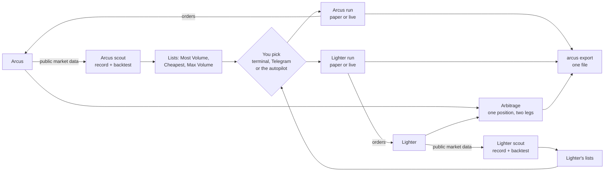

# treading-bot

Three maker (limit-order) bots for perpetual futures. Their aim is as much **maker volume** as possible at the lowest
cost per dollar traded. They share one install, one `.env`, one Telegram chat and one start command.

| Bot | Folder | Terminal | Telegram | What it does | Guide |
|---|---|---|---|---|---|
| **Arcus** | [`arcus/`](arcus) | `arcus …` | `/status`, `/run`, `/closeall` … | Quotes both sides of one Arcus perp at a time. Also runs the shared services: `arcus up`, the Telegram bot, export and import | [arcus/README.md](arcus/README.md), [RUNBOOK](arcus/RUNBOOK.md) |
| **Lighter** | [`lighter/`](lighter) | `lighter …` | the same with `l_`: `/l_status`, `/l_run` | The same setups on Lighter (Robinhood Chain), a zero-fee venue | [lighter/README.md](lighter/README.md) |
| **Arbitrage** | [`arbitrage/`](arbitrage) | `arbitrage …` | `/arb_status`, `/arb_scan` … | Short the venue that pays more funding, long the other, equal size | [arbitrage/README.md](arbitrage/README.md) |

Where each stands (October 2026):
- **Arcus:** traded live with real money; the backtest matched the largest live run on cost.
- **Lighter:** paper only. It has never sent a live order.
- **Arbitrage:** paper only. Live is built and switched off.

> **Risk warning.** Experimental software that can place real orders with real money. Backtests are estimates, not
> promises. Nothing here is financial advice. Run paper first, then small, and only with money you can lose.

**The five commands** (from `treading-bot/arcus`; `arcus` is `.venv/bin/arcus`):

```bash
.venv/bin/arcus up
.venv/bin/arcus status
.venv/bin/arcus pilot approve 1
.venv/bin/arcus pilot close
.venv/bin/arcus export
```

They start everything, show one status screen, run the best Arcus setup on paper, close it, and pack everything recorded
and traded into one file ([Export and import](#4-export-and-import)).

## Contents

1. [How it fits together](#1-how-it-fits-together)
2. [Install](#2-install)
3. [Run it on a server](#3-run-it-on-a-server)
4. [Export and import](#4-export-and-import)
5. [Where everything lives](#5-where-everything-lives)
6. [Troubleshooting](#6-troubleshooting)
7. [Development](#7-development)
8. [Upgrading from the old layout](#8-upgrading-from-the-old-layout)

---

## 1. How it fits together


```mermaid
flowchart LR
    AV[Arcus] -->|public market data| AS[Arcus scout<br/>record + backtest]
    LV[Lighter] -->|public market data| LS[Lighter scout<br/>record + backtest]
    AS --> AL[Lists: Most Volume,<br/>Cheapest, Max Volume]
    LS --> LL[Lighter's lists]
    AL --> YOU{You pick<br/>terminal, Telegram<br/>or the autopilot}
    LL --> YOU
    YOU --> AR[Arcus run<br/>paper or live]
    YOU --> LR[Lighter run<br/>paper or live]
    AR -->|orders| AV
    LR -->|orders| LV
    AV --> ARB[Arbitrage<br/>one position, two legs]
    LV --> ARB
    AR --> EX[arcus export<br/>one file]
    LR --> EX
    ARB --> EX
```

The loop is: **record → backtest → rank → you pick → run → export → analyse → refine.**

**What runs** (every process is an ordinary command in the background):

| Process | Started by | What it does | Needs keys |
|---|---|---|---|
| Arcus scout | `arcus up` | Records every Arcus perp (best bid/offer, trades, top-10 depth). Every 30 min it backtests 8 setups on every market and ranks them; it also checks the running setup and runs the autopilot | no |
| Lighter scout | `arcus up` | The same for every Lighter perp (36 setups) | no |
| Telegram bot | `arcus up`, when the token is in `.env` | The one chat that controls all three bots and posts alerts | the token |
| Guardian | by itself, with a live Arcus run | A separate process: cancels everything if the live bot is silent for 60 s | yes |
| Arcus run | you (`/run`, `arcus pilot approve`) or the autopilot | Trades one setup on one market | live only |
| Lighter run | you (`/l_run`, `lighter run`) or its autopilot | The same on Lighter | live only |
| Arbitrage executor | you (`/arb_start`, `arbitrage start`) | Holds one position across both venues | live only |

**Rules that hold everywhere:**
- **Paper is the default.** Paper uses live market data and simulated orders, through the same code as live.
- **Live needs three things:** a switch in `.env`, a passing `doctor`, and a typed confirmation.
- **One market-making setup per venue at a time.** Starting another closes the first.
- **The backtest and the live bot share their rules:** sizes, stops and quotes come from the same code.
- **The three bots are independent packages.** None imports another's code at start-up; Arcus finds the other two by
  their folder names (`../lighter`, `../arbitrage`) and the arbitrage uses the other two bots' venue clients.

---

## 2. Install

Needs macOS or Linux, Python 3.12 and [uv](https://docs.astral.sh/uv/) (`brew install uv`, or
`curl -LsSf https://astral.sh/uv/install.sh | sh`). On a fresh Ubuntu server use [section 3](#3-run-it-on-a-server).

```bash
git clone https://github.com/dhruvamity/treading-bot.git
cd treading-bot/arcus
make install
cp .env.example .env
chmod 600 .env
```

`make install` builds `arcus/.venv` with all three bots. Every command in these guides runs from `treading-bot/arcus`
(the `.env` is read from the folder you run in).

**Credentials** (`arcus/.env`; fill in only what you use, and never commit it):

| Variable | What it is | Needed for |
|---|---|---|
| `ARCUS_ADDRESS`, `ARCUS_API_PRIVATE_KEY` | Your wallet address and an Arcus API key (Arcus web app → API Keys) | Arcus live, `doctor`, balance |
| `TELEGRAM_BOT_TOKEN`, `TELEGRAM_CHAT_ID` | From @BotFather; your chat id (`/whoami` tells you) | Telegram |
| `TELEGRAM_ALLOWED_USER_IDS` | Only these users may send commands | recommended |
| `BOT_PILOT_LIVE=1` | Allows live Arcus runs | Arcus live |
| `LIGHTER_ADDRESS`, `LIGHTER_API_PRIVATE_KEY`, `LIGHTER_API_KEY_INDEX`, `LIGHTER_ACCOUNT_INDEX` | The Lighter key ([lighter/README.md](lighter/README.md), section 3) | Lighter live |
| `LBOT_LIVE=1` | Allows live Lighter runs | Lighter live |
| `ARB_LIVE=1`, `ARCUS_ACCOUNT_INDEX` | Allows the live arbitrage; the Arcus subaccount it uses | arbitrage live |

The switch names (`BOT_PILOT_LIVE`, `LBOT_LIVE`, `ARB_LIVE`) are unchanged from earlier versions on purpose, so an existing
`.env` keeps working. Recording, backtests and paper need **no keys at all**. Check what you filled in (both only read):

```bash
.venv/bin/arcus doctor
.venv/bin/arcus keys
```

**Telegram** (optional, once):
1. In Telegram, message **@BotFather**, send `/newbot`, and put the token in `TELEGRAM_BOT_TOKEN`.
2. Send your new bot any message, open `https://api.telegram.org/bot<TOKEN>/getUpdates` in a browser, and put
   `chat.id` in `TELEGRAM_CHAT_ID`.
3. `arcus up` starts it. Send `/whoami`, put your user id in `TELEGRAM_ALLOWED_USER_IDS`, then `arcus down` and `arcus up`.

Then follow [arcus/README.md](arcus/README.md), section 2, from zero to a live run.

---

## 3. Run it on a server

A server records around the clock and trades while your laptop is off. Recording needs no keys.

**Pick the machine.** Ubuntu 24.04, 4 or more CPU cores, 8 GB of memory, and disk for the recording: about
0.3–0.5 GB a day for both venues (10–15 GB a month). Pick a region both venues allow; `arcus region-check` asks Arcus,
and `arcus/scripts/latency_map.py` shows how far the machine is from each venue.

**Set it up** (once, as a normal user who can `sudo`):

```bash
git clone https://github.com/dhruvamity/treading-bot.git
cd treading-bot/arcus
bash deploy/scripts/bootstrap.sh
```

The script installs the bots, keeps the clock in sync, closes the firewall to everything but SSH, creates `.env` from
the template, and makes `arcus up` run after every reboot. It starts nothing and is safe to run again. (It has been
syntax-checked but not yet run on a real server: read its 5 steps as they print.)

**Fill in the keys, check, start:**

```bash
nano .env
```

```bash
.venv/bin/arcus region-check
.venv/bin/arcus doctor
.venv/bin/arcus up
```

To move your keys from the laptop instead of typing them: `scp arcus/.env USER@SERVER:treading-bot/arcus/.env`.

**Every day** (or from the phone: `/status`, `/l_status`): `.venv/bin/arcus status`.

**Update the code:**

```bash
git pull
make install
.venv/bin/arcus down
.venv/bin/arcus up
```

`arcus down` does not touch a running trade; `arcus down --all` stops the runs too (positions kept).

**Things to know:**
- **Gaps cannot be refilled.** Neither venue serves old order books, so what the recorder misses is gone. Keep a Mac
  awake (plugged in, sleep off, lid open): a sleeping machine records nothing.
- **Disk:** the recorders pause under 5 GB free. Nothing deletes old tape by itself. `arcus status` and every export
  show the free space.
- **Seed a new server** with the history you already have: `arcus export --full` on the old machine, copy the file,
  `arcus import` on the new one.

**A machine that only records (Docker).** The scout places no orders and needs no keys, so it can run anywhere with
Docker. From `arcus/` (the Arcus scout, container `arcus-scout`) or `lighter/` (container `lighter-scout`):

```bash
docker compose up -d --build
docker compose logs --tail 30 scout
cat data/scout/recorder.json
```

Arcus's `data/scout/report.txt` is the latest ranking; `SCOUT_CAPITAL=500 docker compose up -d` ranks for a $500 account
(the container has no keys, so the default is the $100 paper capital) and `SCOUT_WORKERS=2` caps the scan workers. The
containers restart after a crash or reboot and report unhealthy if the recorder has not written for 15 minutes. **Do not
use Docker on a machine that trades:** a container cannot see a native bot's process, so the pilot could not review,
pause or resume a live run. Run `arcus up` there instead. To bring Docker results home:
`docker compose exec scout arcus export --out data/exports`, then `arcus import` at home.

---

## 4. Export and import

One command on the server packs the recordings, the trades, the state and the logs of all three bots into one file. One
command at home takes it in. Use it to hand the data over for analysis, error hunting or refinement.

**On the server:**

```bash
.venv/bin/arcus export
```

It prints the file, for example `treading-bot/exports/tb-20261006-1612Z.tar` (the date and time are UTC), and the `scp`
line to fetch it. **At home** (put the file in `treading-bot/exports/` or `~/Downloads`):

```bash
scp USER@SERVER:treading-bot/exports/tb-20261006-1612Z.tar ~/Downloads/
```

```bash
.venv/bin/arcus import
```

It must end with `N complete, 0 short`. Then read `arcus/data/server-export/<name>/SUMMARY.md`.

| Command | What it packs |
|---|---|
| `arcus export` | Everything **new since the last export** (the first time: everything) |
| `arcus export --full` | Everything again |
| `arcus export --days 2` | A small one: all state and trades, the logs and tape of the last 2 UTC days |
| `arcus export --since 2026-10-01` | The same, from that UTC day on |
| `arcus export --no-tape` | State, trades and logs only: a quick error report, a few MB |
| `arcus export --tag tokyo` | Adds a word to the name: `tb-tokyo-20261006-1612Z.tar` |
| `arcus export --out /mnt/disk` | Writes it somewhere else |

| Inside the file | What |
|---|---|
| `SUMMARY.md` | Read first: the status screen, the machine, how long a request takes to each venue, fills by day and market, runs and their cost, warnings and crashes in the logs, how complete the recording is |
| `records.tar.gz` | For each bot (`arcus/`, `lighter/`, `arbitrage/`): state (databases, balances, settings), logs, scans, reports, config, fills and orders as CSV; plus `system/` (git commit and local changes, package versions, processes) |
| `tape/` | The market tape of both venues, as recorded |
| `coverage.csv`, `MANIFEST.json`, `files.csv` | Rows and hours per market and day; every tape file's size and SHA-256, written last so a cut-off copy is noticed |

**What is never in it:** `.env`, `config/secrets.enc`, pid files. Every secret value in a `.env` is also blanked out of
every log and database copy. The file does hold your trading history and wallet address, so do not post it.

- **Safe while trading.** It only reads: databases through SQLite's own backup, each tape file through one handle.
- **Disk.** It refuses to take the disk under 6 GB free, and keeps the newest 3 files in `exports/` (`--keep`).
- **Import never touches this machine's own state or logs.** The tape is merged into the tape folders; a file already
  there is kept, unless the incoming one is the same recorder part with more rows.
- **Missed one?** Each plain export holds only what is new. If `arcus import` says the one before it was never
  imported, import that one too, or run `arcus export --full`.

---

## 5. Where everything lives

```
treading-bot/
  README.md  Makefile  .github/workflows/ci.yml
  arcus/             the Arcus bot, and where everything is installed, configured and started
    arcus/           the code: scout/ core/ strategies/ venues/ telegram/ common/, cli.py, ops.py, export.py
    config/          app.yaml (limits and sizing), sessions/, venues/, calendars/ (CPI, FOMC, earnings, holidays)
    deploy/          the server setup script and the region check
    scripts/         one-off tools: register an API key, move collateral, capture frames, latency map
    tests/           offline tests          README.md  RUNBOOK.md  Dockerfile  docker-compose.yml  .env.example
  lighter/           the Lighter bot (package lighter_bot): its engine, config, scripts, tests, README
  arbitrage/         the funding arbitrage (package arbitrage): its code, tests, README
```

Made at run time and never committed:

| Path | What |
|---|---|
| `arcus/.env` | Every credential and live switch |
| `arcus/data/scout/tape/<MARKET>/<UTC day>/` | The Arcus tape: `bbo-`, `trades-`, `depth-*.npz` |
| `arcus/data/scout/` | `report.txt` and `latest.json` (the last scan), `scans/`, `reports/`, `playbook.json`, `recorder.json` (recorder health) |
| `arcus/state/` | `live.sqlite` and `paper.sqlite` (orders, fills, events), `balances.jsonl`, `settings.json`, `pilot.json`, `autopilot.json` |
| `arcus/logs/` | `bot.jsonl` (everything), `decisions.jsonl` (why each order), `runs/` (one file a run), `scout.out`, `telegram.out` |
| `lighter/data/tape/`, `lighter/data/scout/` | The Lighter tape and scans |
| `lighter/state/`, `lighter/logs/` | Lighter runs (`run-<mode>.json`, `fills-<mode>.jsonl`, `status-<mode>.json`), settings, logs |
| `arbitrage/state/`, `arbitrage/data/history/`, `arbitrage/settings.json` | The arbitrage's position and events, the funding history, your settings |
| `arcus/data/server-export/<name>/` | What `arcus import` unpacked |
| `exports/` | Files made by `arcus export` |

Run-time file names such as `bot.jsonl` are unchanged from earlier versions so an existing machine keeps its history.
Anything else you keep at the top level of the repository (research folders, downloaded docs) is ignored by git.

---

## 6. Troubleshooting

| Problem | What to do |
|---|---|
| A list is empty: "still recording" or "1 full day of data (needs 3)" | Each market needs 3 full recorded days. `/run` can still start it |
| "Nothing passes all checks" | Normal in volatile hours. Wait for the next scan |
| `report.txt` is old | Is the scout up? `arcus status`, then `tail logs/scout.out` |
| The pilot refuses to approve | The scan is over 90 minutes old, or the top 3 changed. Check `arcus pilot status` |
| `doctor` says "never funded" | Deposit USDG to the subaccount the key is bound to |
| Repeated `UNDERCOLLATERALIZED` | Not enough margin for the order size. The bot pauses that market by itself |
| A run was paused | `/openpositions` shows why. It resumes after two passing scans |
| The bot stopped after a loss | A kill or safe mode needs you: read `/logs`, then `/resumeaftersl` |
| Lighter: "rate limited" | Lighter answered 429. The bot paused 60 s and requotes less |
| After a reboot nothing runs | `arcus up`. The server setup script adds it to the crontab |
| `arcus import` says SHORT or DAMAGED | Copy the file again; if it repeats, `arcus export --full` on the server |
| `make install` fails building `cryptography` on an Intel Mac | The pin below 49 is in `arcus/pyproject.toml`: pull the latest code and run `make install` again |
| `ws_error KeyError` reconnecting every few seconds | An old copy of the code meeting a market that went OFFLINE. Update the code |
| `ws_degraded` in the log | Arcus marked a stream stale; the bot re-subscribes by itself. Occasional is normal, constant means venue trouble |
| Something else | `arcus export --no-tape`, and read its `SUMMARY.md`, section 4 |

Emergencies (orders must go now, the server is unreachable, a key leaked): [arcus/RUNBOOK.md](arcus/RUNBOOK.md),
section 2.

---

## 7. Development

From the repository root, with `make install` done:

```bash
make test
make lint
make -C arcus type
```

Offline tests for all three bots (no network, no keys), ruff, and strict mypy on Arcus's core. CI
(`.github/workflows/ci.yml`) runs the same, and fails if a credential file or a Telegram token is tracked.

- Strategies return desired orders and never call a venue; the same objects run in the backtest, paper and live.
- After changing the Arcus simulator, bump `SIM_VERSION` in `arcus/arcus/scout/scan.py` so cached days are recomputed.
- No test may start a real `arcus`, `lighter` or `arbitrage` process: `arcus/tests/conftest.py` refuses it.

---

## 8. Upgrading from the old layout

Before this layout the folders were `bot/` and `arb/`, the packages `bot`, `lbot` and `arb`, and the commands `bot …`,
`bot lighter …`, `bot arb …`. `lighter/` kept its name. Data, state, logs, `.env` and settings are **not** tracked, so
they stay where they were and must be moved. On each machine that has the old layout (this assumes the bots are stopped):

```bash
cd treading-bot/bot && .venv/bin/bot down --all   # with the OLD code, before the pull
cd .. && git pull
mv bot/.env bot/data bot/state bot/logs arcus/
mv bot/reports bot/handoffs bot/CONTEXT.md bot/OWNER_ACTIONS.md arcus/ 2>/dev/null
mv bot/config/sessions/pilot.yaml arcus/config/sessions/ 2>/dev/null
mv arb/data arb/state arb/settings.json arb/.env arbitrage/ 2>/dev/null
cd arcus && make install && .venv/bin/arcus up
```

Then delete what is left of `bot/` and `arb/` (an old `.venv` and caches). On a server also run
`bash deploy/scripts/bootstrap.sh` once: it replaces the `@reboot … bot up` crontab line with `… arcus up`. The `.env`
variable names, the log and database file names, and the export format are unchanged. Older exports still import.
