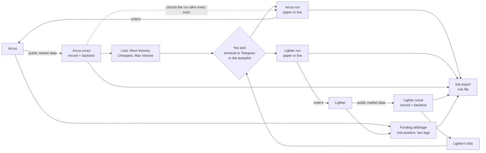

# treading-bot

A maker (limit-order) trading bot for perpetual futures. Its aim is as much **maker volume** as possible at the
lowest cost per dollar traded. It is **one bot**: one install, one `.env`, one `bot up`, one Telegram bot.

| Part | What it does | Terminal | Telegram | Its guide |
|---|---|---|---|---|
| **Arcus** market making | Quotes both sides of one Arcus perp at a time | `bot …` | `/status`, `/run`, `/closeall` … | this file, [reference](bot/docs/REFERENCE.md) |
| **Lighter** market making | The same setups on Lighter (Robinhood Chain), a zero-fee venue | `bot lighter …` | the same with `l_`: `/l_status`, `/l_run` | [lighter/README.md](lighter/README.md) |
| **Funding arbitrage** | Short the venue that pays more funding, long the other, equal size | `bot arb …` | `/arb_status`, `/arb_scan` … | [arb/README.md](arb/README.md) |

Where each part stands (October 2026):
- **Arcus:** traded live with real money; the backtest matched the largest live run on cost
  ([note](bot/docs/notes/2026-10-04-two-weekends-review.md)).
- **Lighter:** paper only so far. It has never sent a live order.
- **Funding arbitrage:** paper only. Live is built and switched off.

> **Risk warning.** Experimental software that can place real orders with real money. Backtests are estimates, not
> promises. Nothing here is financial advice. Run paper first, then small, and only with money you can lose.

**The five commands** (from `treading-bot/bot`; `bot` is `.venv/bin/bot`):

```bash
.venv/bin/bot up
.venv/bin/bot status
.venv/bin/bot pilot approve 1
.venv/bin/bot pilot close
.venv/bin/bot export
```

They start everything, show one status screen, run the best setup on paper, close it, and pack everything recorded
and traded into one file ([section 9](#9-export-and-import-bring-everything-home)).

## Contents

1. [The map](#1-the-map)
2. [Install](#2-install)
3. [Tutorial: zero to a live run](#3-tutorial-zero-to-a-live-run)
4. [Every command](#4-every-command)
5. [Arcus: how it decides](#5-arcus-how-it-decides)
6. [Lighter](#6-lighter)
7. [Funding arbitrage](#7-funding-arbitrage)
8. [Run it on a server (VPS)](#8-run-it-on-a-server-vps)
9. [Export and import: bring everything home](#9-export-and-import-bring-everything-home)
10. [Where everything lives](#10-where-everything-lives)
11. [Troubleshooting](#11-troubleshooting)
12. [Development](#12-development)
13. [More reading](#13-more-reading)

---

## 1. The map


```mermaid
flowchart LR
    AV[Arcus] -->|public market data| AS[Arcus scout<br/>record + backtest]
    LV[Lighter] -->|public market data| LS[Lighter scout<br/>record + backtest]
    AS --> AL[Lists: Most Volume,<br/>Cheapest, Max Volume]
    LS --> LL[Lighter's lists]
    AL --> YOU{You pick<br/>terminal or Telegram<br/>or the autopilot}
    LL --> YOU
    YOU --> AR[Arcus run<br/>paper or live]
    YOU --> LR2[Lighter run<br/>paper or live]
    AR -->|orders| AV
    LR2 -->|orders| LV
    AS -. checks the run after every scan .-> AR
    AV --> ARB[Funding arbitrage<br/>one position, two legs]
    LV --> ARB
    AR --> EX[bot export<br/>one file]
    LR2 --> EX
    AS --> EX
    LS --> EX
    ARB --> EX
```

The loop is: **record → backtest → rank → you pick → run → export → analyse → refine.**

**What runs** (every process is a normal `bot` command in the background):

| Process | Started by | What it does | Needs keys |
|---|---|---|---|
| Arcus scout | `bot up` | Records every Arcus perp (best bid/offer, trades, top-10 depth). Every 30 min it backtests 8 setups on every market and ranks them. It also checks the running setup and runs the autopilot | no |
| Lighter scout | `bot up` | The same for every Lighter perp (36 setups) | no |
| Telegram bot | `bot up`, when the token is in `.env` | The one chat that controls all three parts and posts alerts | the token |
| Guardian | by itself, with a live Arcus run | A separate process: cancels everything if the live bot is silent for 60 s | yes |
| Arcus run | you (`/run`, `bot pilot approve`) or the autopilot | Trades one setup on one market | live only |
| Lighter run | you (`/l_run`, `bot lighter run`) or its autopilot | The same on Lighter | live only |
| Arbitrage executor | you (`/arb_start`, `bot arb start`) | Holds one position across both venues | live only |

**Rules that hold everywhere:**
- **Paper is the default.** Paper uses live market data and simulated orders, through the same code as live.
- **Live needs three things:** a switch in `.env`, a passing `doctor`, and a typed confirmation.
- **One market-making setup per venue at a time.** Starting another closes the first.
- **The backtest and the live bot share their rules:** sizes, stops and quotes come from the same code.

---

## 2. Install

Needs macOS or Linux, Python 3.12 and [uv](https://docs.astral.sh/uv/) (`brew install uv`, or
`curl -LsSf https://astral.sh/uv/install.sh | sh`). On a fresh Ubuntu server use
[section 8](#8-run-it-on-a-server-vps) instead.

```bash
git clone https://github.com/dhruvamity/treading-bot.git
cd treading-bot/bot
make install
cp .env.example .env
chmod 600 .env
```

`make install` builds `bot/.venv` with all three parts. Every command in this guide runs from `treading-bot/bot`.

**Credentials** (`bot/.env`; fill in only what you use, and never commit it):

| Variable | What it is | Needed for |
|---|---|---|
| `ARCUS_ADDRESS`, `ARCUS_API_PRIVATE_KEY` | Your wallet address and an Arcus API key (Arcus web app → API Keys) | Arcus live, `doctor`, balance |
| `TELEGRAM_BOT_TOKEN`, `TELEGRAM_CHAT_ID` | From @BotFather; your chat id (`/whoami` tells you) | Telegram |
| `TELEGRAM_ALLOWED_USER_IDS` | Only these users may send commands | recommended |
| `BOT_PILOT_LIVE=1` | Allows live Arcus runs | Arcus live |
| `LIGHTER_ADDRESS`, `LIGHTER_API_PRIVATE_KEY`, `LIGHTER_API_KEY_INDEX`, `LIGHTER_ACCOUNT_INDEX` | The Lighter key ([lighter/README.md](lighter/README.md), section 3) | Lighter live |
| `LBOT_LIVE=1` | Allows live Lighter runs | Lighter live |
| `ARB_LIVE=1`, `ARCUS_ACCOUNT_INDEX` | Allows the live arbitrage; the Arcus subaccount it uses | arbitrage live |

Recording, backtests and paper need **no keys at all**. Check what you filled in (both only read):

```bash
.venv/bin/bot doctor
.venv/bin/bot keys
```

**Telegram** (optional, once):
1. In Telegram, message **@BotFather**, send `/newbot`, and put the token in `TELEGRAM_BOT_TOKEN`.
2. Send your new bot any message, open `https://api.telegram.org/bot<TOKEN>/getUpdates` in a browser, and put
   `chat.id` in `TELEGRAM_CHAT_ID`.
3. `bot up` starts it. Send `/whoami`, put your user id in `TELEGRAM_ALLOWED_USER_IDS`, then `bot down` and `bot up`.

---

## 3. Tutorial: zero to a live run

**Step 1. Start it.**

```bash
.venv/bin/bot up
```

It starts both scouts and the Telegram bot. A market needs 3 full recorded days before it can be in a list, so the
first lists appear after about 3 days. `/run` works at once: it never waits for a scan.

**Step 2. Look.**

```bash
.venv/bin/bot status
```

```bash
cat data/scout/report.txt
```

`status` is one screen for all three parts. `report.txt` is the latest ranking. On the phone: `/status`, `/top3`.

**Step 3. Run the best setup on paper.**

```bash
.venv/bin/bot pilot approve 1
```

Or your own pick, from Telegram: `/run SPY smart 0 50x paper`. Watch it:

```bash
.venv/bin/bot dashboard
```

The dashboard shows today's volume, PnL and position, every 10 s (`/dashboard` on the phone).

**Step 4. Stop it.**

```bash
.venv/bin/bot pilot close
```

This closes the position and stops. On the phone: `/closeall`, or `/stop` to stop and keep the position.

**Step 5. Go live** (real money), in this order:

1. `.venv/bin/bot selftest` while the account is still empty: every line must say PASS or INFO.
2. Deposit USDG into the Arcus subaccount your key is bound to. Use a subaccount the bot has to itself: it treats
   every order and position there as its own.
3. Put `BOT_PILOT_LIVE=1` in `.env`, then `bot down` and `bot up`.
4. `.venv/bin/bot doctor pilot` must end in **READY**.
5. Start it and type `LIVE` when asked:

```bash
.venv/bin/bot pilot approve 1 --live
```

From Telegram: `/run SPY smart 0 50x live sl=10`, then type back the 6-digit code. `sl=10` means the run may lose
$10 in all.

**Step 6. The other two parts** work the same way: `bot lighter run SPY "smart +1"` or `/l_run`
([section 6](#6-lighter)), `bot arb start --arcus 120 --lighter 120` or `/arb_start 120 120`
([section 7](#7-funding-arbitrage)).

**Step 7. Bring the data home** for analysis: `bot export` ([section 9](#9-export-and-import-bring-everything-home)).

---

## 4. Every command

### 4.1 Terminal

| Command | What it does |
|---|---|
| **Run the machine** | |
| `bot up` | Start both scouts, the Telegram bot, and the guardian while a live bot runs |
| `bot down` | Stop them. `--all` also stops every run (quotes cancelled, positions kept) |
| `bot status` | One screen: services, runs, last scan, balance, Lighter, arbitrage (`--json` for details) |
| `bot dashboard` | Live screen every 10 s: today's volume, PnL, position (`--once` prints once) |
| **Trade (Arcus)** | |
| `bot pilot status` | What is deployed, and the top 3 of each list |
| `bot pilot approve N` | Run a list's pick on paper. `--live` for real money, `--list cheapest` or `max`, `--max-lev` |
| `bot pilot close` | Close the position and stop |
| `bot auto` | The autopilot: `bot auto on --budget 5`, `--live`, `bot auto off` |
| `bot run SESSION` | Run a session file by hand (`--live`, `--seconds N`) |
| `bot cancel-all --venue arcus` | Cancel every open order now |
| `bot flatten --venue arcus` | Close every position now (`--taker` to cross the spread) |
| `bot resume --all` | Trade again after a kill or safe mode, once you know why |
| **Check** | |
| `bot doctor [SESSION]` | Everything a live run needs. Reads only |
| `bot selftest` | Proves Arcus accepts every signed request, without trading |
| `bot keys` | Your API keys as Arcus sees them, with days left |
| `bot account` | All-time volume, fees, fee tier, as Arcus reports them |
| `bot report --date D` | A day's report: PnL split and volume |
| `bot diagnose --hours 6` | Why a run filled what it filled. `--replay` backtests the same minutes beside it |
| `bot region-check` | May this machine's IP trade Arcus perps? |
| **Scout** | |
| `bot scout scan` | One scan now, printed as a table |
| `bot scout limits` | The least and the most capital each market can use |
| `bot scout playbook` | The autopilot's table: cost per market, setup and session |
| **Data** | |
| `bot export` | One file with everything new since the last export ([section 9](#9-export-and-import-bring-everything-home)) |
| `bot import [FILE]` | Take such a file in on this machine |
| **The other parts** | |
| `bot lighter …` | `status`, `run`, `pilot approve`, `close`, `stop`, `doctor`, `set`, `auto`, `markets`, `backtest` |
| `bot arb …` | `scan`, `plan`, `start`, `stop`, `status`, `close`, `pause`, `set`, `history`, `backtest` |

`bot --help`, `bot lighter --help` and `bot arb --help` list every option.

### 4.2 Telegram

Send `/menu` for buttons. An unlabelled reply is Arcus; Lighter's start with **LIGHTER**, the arbitrage's with
**FUNDING ARB**.

| Command | What it does |
|---|---|
| **See** | |
| `/status`, `/dashboard` | Is it running, today's numbers; a live screen that updates itself |
| `/balance`, `/account` | The account now; all-time volume and fees |
| `/positions`, `/orders`, `/openpositions` | What you hold; what is on the book; what is deployed |
| `/yesterdayreport`, `/logs`, `/pnl` | The daily report; the latest decisions; PnL by market |
| **Run** | |
| `/top3`, `/cheapest`, `/maxvolume` | The three lists, with Run buttons |
| `/run` | The run form. In one line: `/run BTC mid 0 40x paper`, `/run SPY smart +1 50x live sl=10 vol=100k tp=5` |
| `/auto` | The autopilot: `/auto on paper budget=5`, `/auto off` |
| **Control** | |
| `/pauseneworders`, `/unpause` | Stop and restart new orders; closing orders keep working |
| `/stop` | Shut the run down, position kept |
| `/closeall`, `/cancelall` | Close every position; cancel every order |
| `/resumeaftersl` | Trade again after a safety stop |
| **Settings** | |
| `/settings`, `/set NAME VALUE` | `capital`, `trade_share`, `max_capital`, `position_stop`, `daily_stop`, `kill`, `volume_cost`, `scan_every`, `scan_budget`, `scan_workers`, `crypto_lev` |
| `/scannow` | Scan now |
| `/alerts`, `/mute`, `/unmute` | What it posts by itself |
| **Lighter** | Every command above with `l_` in front: `/l_status`, `/l_run SPY smart +1 20x sl=10`, `/l_closeall`. `/l` shows its menu |
| **Funding arbitrage** | `/arb_status`, `/arb_scan`, `/arb_plan SPY`, `/arb_start 120 120`, `/arb_stop`, `/arb_close`, `/arb_hold 72`, `/arb_sl 2`, `/arb_pause`, `/arb_set NAME VALUE`. `/arb` shows its menu |

Anything that changes a live bot asks first: a Confirm button, or a code you type back.

---

## 5. Arcus: how it decides

The full detail of every item below is in the [reference](bot/docs/REFERENCE.md).

**Setups.** A setup is a mode, a spread in bps, and a bias: "Mid 0", "Smart +1", "Grid +3 Short".

| Mode | What it quotes | Scanned |
|---|---|---|
| **Mid** | Both sides `spread` bps from the mid, following it | 0, +1, +2, +3 |
| **Smart** | Mid, less the side that would likely lose in the next seconds | 0, +1, +2, +3 |
| **Grid** | Around the last fill: never sells below the last buy + spread | from `/run` only |
| Bias Long / Short | Holds half the position cap on that side | from `/run` only |

**Lists.** Every scan backtests those 8 setups on every market at its maximum leverage, at your capital and stops.

| List | Shows |
|---|---|
| 🚀 Most Volume (`/top3`) | The most volume that costs at most `volume_cost` (default $0.20 per $1,000 traded) |
| 💎 Cheapest (`/cheapest`) | The lowest cost, among setups trading at least 50× the capital a day |
| 🔥 Max Volume (`/maxvolume`) | The most volume whatever it costs |

A setup must also pass the safety checks: no kill or liquidation in the backtest, enough fills, 3 full recorded
days, and a market that is not trending now.

**Sizes and stops** are all shares of your capital, so the same setup runs on $20 or $20,000.

| Quantity | Rule | On $100 at 50x |
|---|---|---|
| Order size | capital × leverage ÷ 2.5 | $2,000 |
| Position cap | 2 × order | $4,000 |
| Position stop | 1–5% of capital, following the market's volatility | $1–5 |
| Daily stop | 2%: close, no new orders until 00:00 UTC | $2 |
| Kill | 10% below the equity peak: close and stop until you resume | $10 |

Change any of them with `/set`. A run's own limits go on the command: `sl=10` (loss), `tp=5` (profit), `vol=100k`.

**Safety.**
- **Dead man's switch:** every 20 s the bot tells Arcus "cancel my orders in 60 s unless I check in".
- **Guardian:** a separate process that cancels everything if the live bot goes silent.
- **Reconciliation:** every 5 minutes Arcus is the source of truth for orders and positions.
- **Event windows:** no new quotes around CPI, jobs reports, FOMC and a stock's earnings.

**Autopilot** (`/auto`, off by default). Given a daily budget, it starts, switches and stops setups by itself. It
picks by the session of the week and each market's state now, and it turns itself off when you take over.

**What the research says** (notes in [section 13](#13-more-reading)):
- Nothing is profitable at speed on Arcus with one market and a small account; the bot buys volume at a known cost.
- SPY at the weekend was the cheapest volume live. BTC Mid 0 is the fastest and dearer.
- Smart costs less than Mid at the same spread, for about 80% of the volume.

---

## 6. Lighter

The same idea on Lighter (Robinhood Chain), written again for its rules: 0% maker and taker fees, a 200 ms speed
bump on orders, and 60 requests a minute in all. Full guide: [lighter/README.md](lighter/README.md).

```bash
.venv/bin/bot lighter status
.venv/bin/bot lighter run SPY "smart +1"
.venv/bin/bot lighter pilot approve 1
.venv/bin/bot lighter close
.venv/bin/bot lighter doctor SPY
```

| | Arcus part | Lighter part |
|---|---|---|
| Fees | 0 maker / 2.25 bp taker | 0 / 0 |
| Decides | once a second (BTC twice) | twice a second, at most 54 requotes a minute |
| Modes | Mid, Smart, Grid | Mid, Smart, Grid, Touch |
| Scan menu | 8 setups | 36 setups |
| Default stops | 1–5% / 2% / 10% | 2% / 5% / 25% |
| Live switch | `BOT_PILOT_LIVE=1` | `LBOT_LIVE=1` |
| Data | `bot/data`, `bot/state`, `bot/logs` | `lighter/data`, `lighter/state`, `lighter/logs` |

Its backtests rest on few recorded days so far. The first small live run is the calibration.

---

## 7. Funding arbitrage

Both venues charge funding every hour. Hold the same market short on the venue with the higher rate and long on the
other, the same size on both: the price moves cancel and each hour pays the difference. Full guide:
[arb/README.md](arb/README.md).

```bash
.venv/bin/bot arb scan
.venv/bin/bot arb plan SPY --arcus 120 --lighter 120
.venv/bin/bot arb start --arcus 120 --lighter 120
.venv/bin/bot arb status
.venv/bin/bot arb close
.venv/bin/bot arb stop
```

- `start` runs the executor on **paper** in the background with that much pretend money on each venue.
- The backtest on 99 days of history made about $0.39 a day at $240, most of it from one meme token.
- Live needs `ARB_LIVE=1`, money on both venues, and accounts the market-making runs are not using.

---

## 8. Run it on a server (VPS)

A server records around the clock and trades while your laptop is off. Recording needs no keys.

**Pick the machine.** Ubuntu 24.04, 4 or more CPU cores, 8 GB of memory, and disk for the recording: about
0.3–0.5 GB a day for both venues (10–15 GB a month). Pick a region both venues allow; `bot region-check` asks Arcus.
Every export's `SUMMARY.md` shows how long a request takes from that server to each venue, so you can compare
regions with numbers.

**Set it up** (once, as a normal user who can `sudo`):

```bash
git clone https://github.com/dhruvamity/treading-bot.git
cd treading-bot/bot
bash deploy/scripts/bootstrap.sh
```

The script installs the bot, keeps the clock in sync, closes the firewall to everything but SSH, creates `.env`
from the template, and makes `bot up` run after every reboot. It starts nothing. (It has been syntax-checked but not
yet run on a real server: read its 5 steps as they print.)

**Fill in the keys, check, start:**

```bash
nano .env
```

```bash
.venv/bin/bot region-check
.venv/bin/bot doctor
.venv/bin/bot up
```

To move your keys from the laptop instead of typing them: `scp bot/.env USER@SERVER:treading-bot/bot/.env`.

**Every day** (or from the phone: `/status`, `/l_status`):

```bash
.venv/bin/bot status
```

**Update the code:**

```bash
git pull
make install
.venv/bin/bot down
.venv/bin/bot up
```

`bot down` does not touch a running trade; `bot down --all` stops the runs too (positions kept).

**Things to know:**
- **Gaps cannot be refilled.** Neither venue serves old order books, so what the recorder misses is gone.
- **Disk:** the recorders pause under 5 GB free. Nothing deletes old tape by itself. `bot status` and every export
  show the free space.
- **Seed a new server** with the history you already have: `bot export --full` on the old machine, copy the file,
  `bot import` on the new one.
- **Docker** (`docker compose up -d --build` in `bot/` or `lighter/`) runs a scout only. Do not use it on a machine
  that trades: a container cannot see a native bot's process. Details: [RUNBOOK](bot/docs/RUNBOOK.md), section 10.

---

## 9. Export and import: bring everything home

One command on the server packs the recordings, the trades, the state and the logs of all three parts into one
file. One command at home takes it in. Use it to hand the data over for analysis, error hunting or refinement.

**On the server:**

```bash
.venv/bin/bot export
```

It prints the file, for example `treading-bot/exports/tb-20261006-1612Z.tar` (the date and time are UTC), and the
`scp` line to fetch it.

**At home** (put the file in `treading-bot/exports/` or `~/Downloads`):

```bash
scp USER@SERVER:treading-bot/exports/tb-20261006-1612Z.tar ~/Downloads/
```

```bash
.venv/bin/bot import
```

It must end with `N complete, 0 short`. Then read `bot/data/server-export/<name>/SUMMARY.md`, or tell the assistant
"analyse the latest export".

| Command | What it packs |
|---|---|
| `bot export` | Everything **new since the last export** (the first time: everything) |
| `bot export --full` | Everything again |
| `bot export --days 2` | A small one: all state and trades, the logs and tape of the last 2 UTC days |
| `bot export --since 2026-10-01` | The same, from that UTC day on |
| `bot export --no-tape` | State, trades and logs only: a quick error report, a few MB |
| `bot export --tag tokyo` | Adds a word to the name: `tb-tokyo-20261006-1612Z.tar` |
| `bot export --out /mnt/disk` | Writes it somewhere else |

**What is in the file:**

| Inside | What |
|---|---|
| `SUMMARY.md` | Read first: the status screen, the machine, how long a request takes to each venue, fills by day and market, runs and their cost, warnings and crashes in the logs, how complete the recording is |
| `records.tar.gz` | For each part: state (databases, balances, settings), logs, scans, reports, config, fills and orders as CSV. Plus `system/`: git commit and local changes, package versions, processes |
| `tape/` | The market tape of both venues, as recorded |
| `coverage.csv` | Rows and hours per market and day, counted before packing |
| `MANIFEST.json`, `files.csv` | Every tape file's size and SHA-256, written last so a cut-off copy is noticed |

**What is never in it:** `.env`, `config/secrets.enc`, pid files. Every secret value in a `.env` is also blanked out
of every log and database copy. The file does hold your trading history and wallet address, so do not post it.

**Good to know:**
- **Safe while trading.** It only reads: databases through SQLite's own backup, each tape file through one handle.
- **Speed and size.** A week of Arcus tape (1.5 GB, 30,000 files) took half a minute on a laptop. A day of both
  venues' tape is 0.3–0.5 GB.
- **Disk.** It refuses to take the disk under 6 GB free, and keeps the newest 3 files in `exports/` (`--keep`).
- **Import never touches this machine's own state or logs.** The tape is merged into the tape folders; a file
  already there is kept, unless the incoming one is the same recorder part with more rows.
- **Missed one?** Each plain export holds only what is new. If `bot import` says the one before it was never
  imported, import that one too, or run `bot export --full`.

---

## 10. Where everything lives

```
treading-bot/
  README.md            this guide
  bot/                 the bot: the Arcus part, and where everything is installed, configured and started
    bot/               the code: scout/ core/ strategies/ venues/ telegram/ common/, cli.py, ops.py, export.py
    config/            app.yaml (limits and sizing), sessions/, calendars/ (CPI, FOMC, earnings, holidays)
    deploy/            the server setup script; older systemd units
    docs/              REFERENCE.md, RUNBOOK.md, notes/ (research), incidents/
    tests/             offline tests
  lighter/             the Lighter part (package lbot): its engine, config, docs and tests
  arb/                 the funding arbitrage (package arb)
  exports/             files made by `bot export` (not committed)
```

Made at run time and never committed:

| Path | What |
|---|---|
| `bot/.env` | Every credential and live switch |
| `bot/data/scout/tape/<MARKET>/<UTC day>/` | The Arcus tape: `bbo-`, `trades-`, `depth-*.npz` |
| `bot/data/scout/` | `report.txt` and `latest.json` (the last scan), `scans/`, `reports/`, `playbook.json`, `recorder.json` (recorder health) |
| `bot/state/` | `live.sqlite` and `paper.sqlite` (orders, fills, events), `balances.jsonl`, `settings.json`, `pilot.json`, `autopilot.json` |
| `bot/logs/` | `bot.jsonl` (everything), `decisions.jsonl` (why each order), `runs/` (one file a run), `scout.out`, `telegram.out` |
| `lighter/data/tape/`, `lighter/data/scout/` | The Lighter tape and scans |
| `lighter/state/`, `lighter/logs/` | Lighter runs (`run-<mode>.json`, `fills-<mode>.jsonl`, `status-<mode>.json`), settings, logs |
| `arb/state/`, `arb/data/history/`, `arb/settings.json` | The arbitrage's position and events, the funding history, your settings |
| `bot/data/server-export/<name>/` | What `bot import` unpacked |

---

## 11. Troubleshooting

| Problem | What to do |
|---|---|
| A list is empty: "still recording" or "1 full day of data (needs 3)" | Each market needs 3 full recorded days. `/run` can still start it |
| "Nothing passes all checks" | Normal in volatile hours. Wait for the next scan |
| `report.txt` is old | Is the scout up? `bot status`, then `tail logs/scout.out` |
| The pilot refuses to approve | The scan is over 90 minutes old, or the top 3 changed. Check `bot pilot status` |
| `doctor` says "never funded" | Deposit USDG to the subaccount the key is bound to |
| Repeated `UNDERCOLLATERALIZED` | Not enough margin for the order size. The bot pauses that market by itself |
| A run was paused | `/openpositions` shows why. It resumes after two passing scans |
| The bot stopped after a loss | A kill or safe mode needs you: read `/logs`, then `/resumeaftersl` |
| Lighter: "rate limited" | Lighter answered 429. The bot paused 60 s and requotes less |
| After a reboot nothing runs | `bot up`. The server setup script adds it to the crontab |
| `bot import` says SHORT or DAMAGED | Copy the file again; if it repeats, `bot export --full` on the server |
| Something else | `bot export --no-tape`, and read its `SUMMARY.md`, section 4 |

Emergencies (orders must go now, the server is unreachable, a key leaked): [RUNBOOK](bot/docs/RUNBOOK.md),
section 4.

---

## 12. Development

```bash
make test
make lint
make type
```

From `bot/`: offline tests (no network, no keys), ruff, strict mypy. The Lighter and arbitrage tests run from their
own folders with `../bot/.venv/bin/python -m pytest`.

- Strategies return desired orders and never call a venue; the same objects run in the backtest, paper and live.
- After changing the Arcus simulator, bump `SIM_VERSION` in `bot/scout/scan.py` so cached days are recomputed.
- No test may start a real `bot` process: `tests/conftest.py` refuses it.

---

## 13. More reading

| Document | What |
|---|---|
| [bot/docs/REFERENCE.md](bot/docs/REFERENCE.md) | Arcus in depth: the scout and its backtest, the checks, capital limits, every risk rule, each strategy, session files, Docker, glossary |
| [bot/docs/RUNBOOK.md](bot/docs/RUNBOOK.md) | Operations: daily checks, emergencies, kill switches, maintenance |
| [lighter/README.md](lighter/README.md), [lighter/docs/RESEARCH.md](lighter/docs/RESEARCH.md) | The Lighter part and its research |
| [arb/README.md](arb/README.md) | The funding arbitrage: rules, backtest, what is unproven |
| [bot/docs/notes/](bot/docs/notes/) | Research notes: [two live weekends](bot/docs/notes/2026-10-04-two-weekends-review.md), [profitability](bot/docs/notes/2026-09-27-profitability.md), [autopilot](bot/docs/notes/2026-09-27-autopilot.md), [setups](bot/docs/notes/2026-09-26-tread-style-setups.md), [fast volume](bot/docs/notes/2026-09-26-fast-volume-research.md) |
| [bot/docs/incidents/](bot/docs/incidents/) | What went wrong live, why, and the fix |
| [lighter/docs/ARCUS_REVIEW.md](lighter/docs/ARCUS_REVIEW.md) | How accurate the Arcus backtests were |
