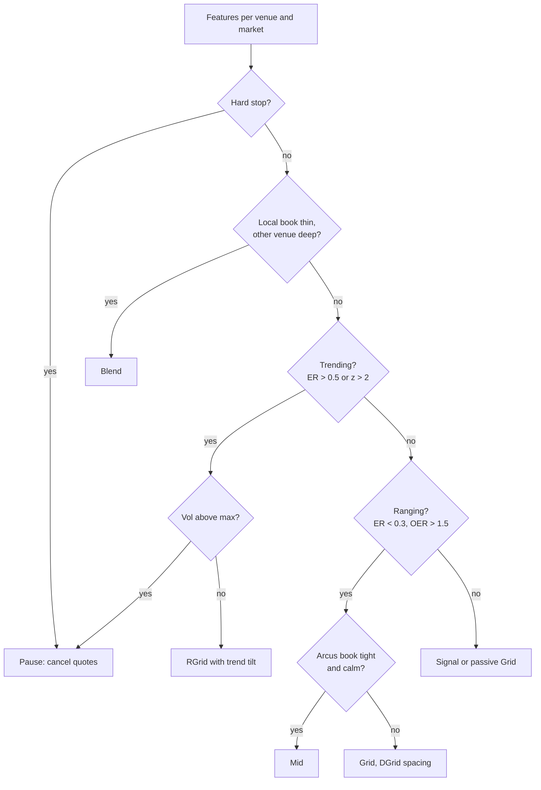
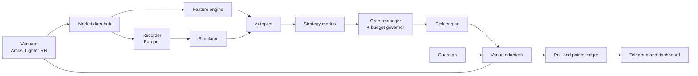

# ArcLight: Custom Farming Bot for Arcus & Lighter RH

As of Sep 23, 2026. Live doc: https://claude.ai/code/artifact/16d44b16-4fd1-4aa3-9d89-81eda3d4ef64

ArcLight is a self-hosted bot that re-creates Tread.fi's Market Maker modes (Mid, Grid, RGrid, DGrid, Blend, Signal) and its Delta-Neutral bot for Arcus and Lighter on Robinhood Chain. An Autopilot layer picks the mode and settings for each asset on each venue. Both venues charge 0% maker (Lighter RH is also 0% taker), so running your own bot removes Tread's 2.5 bps builder fee, about $250 per $1M of volume. The plan is to record data first, backtest, paper-trade for two weeks, and go live with at most $100 per venue only if the go/no-go gates pass.

## Goals, scope and success criteria

The bot's job is to generate points-eligible volume and open interest on Arcus and Lighter RH at break-even or better, with every setting backtested before real money runs it.

**Must do**

1. Run every Tread.fi Market Maker mode (Mid, Grid, RGrid, DGrid, Blend, Signal) and a Delta-Neutral bot on either venue, with Tread-style controls: spread in bps, bias, execution style, margin and leverage, SL/TP, reset threshold, duration and repeat.
2. Autopilot: given a venue and an asset, choose the mode and its parameters from live market state, then switch or pause as the regime changes.
3. Hedge across Arcus and Lighter RH using one account per venue. Never hedge between your own accounts on the same venue.
4. Report PnL split into spread capture, inventory mark-to-market, funding and fees, plus volume, OI-hours, cost per $1M of volume (CPM) and points.
5. Run unattended 24/7 with kill switches, a dead man's switch and Telegram alerts.

**Out of scope for v1**

- Multi-account, sybil, wash-trade or self-referral setups. Lighter RH bans them and reverses points.
- Tread features unrelated to perps farming: Polymarket MM, the agent marketplace, research agents.
- Other venues. Ondo Perps and TxFlow are phase 2; the adapter design keeps them pluggable.
- Taker-heavy volume churn and latency races.

**Pass/fail bar (live, per 4-week window, out-of-sample)**

| Metric | Target |
| --- | --- |
| Net PnL after all costs | ≥ $0, or a cost of at most 1 bp of volume ($100 per $1M) |
| Liquidations | 0 |
| Max drawdown | ≤ 10% of allocated capital (≤ 8% for delta-neutral) |
| Distance to liquidation | Never below 4σ of 1-hour returns |
| Cross-venue hedge residual | ≤ 2× the venue minimum notional, for ≤ 5 s |
| Orphaned orders after a crash | 0 (dead man's switch plus reconciliation) |

For scale, Tread users report a CPM of $90–120 on Ondo before rewards. On two zero-maker-fee venues, ArcLight should beat that clearly or it is not worth running.

## Venue facts: Arcus and Lighter RH

Arcus is the better venue for tight maker quoting; Lighter RH's standard account is better for holding positions and hedging. Both settle in USDG on Robinhood Chain, so moving margin between them is cheap. Every value below is operator config: the bot must read it from the API at start-up and re-check it hourly.

| Item | Arcus | Lighter on Robinhood Chain (standard account) |
| --- | --- | --- |
| What it is | dYdX team's hybrid DEX: off-chain CLOB, permissioned appchain, custody on Robinhood Chain (chain ID 4663). Mainnet API since 2026-06-21 | Separate Lighter deployment on Robinhood Chain; zk-proven CLOB. App robinhoodchain.lighter.xyz |
| API base | `https://api.arcus.xyz`, `wss://api.arcus.xyz/v1/ws` | `https://api.rh.lighter.xyz`, `wss://api.rh.lighter.xyz/stream` |
| Collateral | USDG | USDG |
| Maker / taker fee | 0 / 2.25 bps at base tier. Maker is 0 through Platinum; rebates start at VIP ($1B 30-day volume): −0.2 bps, Max ($3B): −0.3 bps. 5% referral discount | 0 / 0 on all 126 markets (live check) |
| Minimum order | $5 notional on opening orders; reduce-only exempt | $10 notional plus a per-market minimum base size |
| Order entry speed | \~20 ms engine confirms. Takers wait a 50 ms speed bump; post-only (ALO) orders skip it; cancels jump the queue | Maker 0 ms (API docs) or 200 ms (main docs); taker 300 ms; cancel and modify 300 ms |
| Request budget | IP bucket 1,500 weight/min. Order writes cost 0 IP weight but draw on per-subaccount pools: 20,000 orders and 40,000 cancels to start, +1 per $0.10 of lifetime fills, then 1 action per 10 s | 60 weighted REST requests/min (sendTx weight 6) and 60 sendTx/min. Max 50 pending orders per account (10 per market), 250 active (30 per market) |
| Time-in-force | GTT, IOC, FOK, ALO. Every order needs a `goodTilTime` at least 1 month out | GTT, IOC, post-only, reduce-only |
| Other order types | TP/SL only through `batchPlaceOrders` groupings; market orders need a price within 10% of mark | SL/TP, TWAP, chase limit, atomic multi-market |
| Max leverage | Up to 50x (BTC 40x, SPY 50x). Maintenance = ⅔ of initial margin | BTC, ETH, SPY, QQQ 50x; NVDA, TSLA 20x. MMF 1.2%, close-out 0.8% on BTC/SPY |
| Liquidation | When equity ≤ maintenance, valued at mark. Fee not documented | Partial below MMF at a "zero price"; fee up to 1%; full takeover below close-out margin |
| Funding | Hourly; median of minute premium samples; paid on oracle. Crypto base 0.01%/8h with a ±0.05%/8h dead-band. RWA base SOFR + 0.5%/yr, no dead-band, locked outside 04:00–20:00 ET | Hourly; mean of minute samples × multiplier (crypto 1, RWA 0.5); per-market interest (BTC 0.01%/8h, SPY 0.0032%/8h); cap ±0.5%/h; paid on index |
| RWA off-hours | Initial margin ×1.5, price bands around the 20:00 ET anchor (ladder 0.5→1→2→4 × IMF), funding locked | Leverage unchanged; internal EMA pricing when the oracle is stale |
| Kill switch | `POST /v1/scheduleCancel` dead man's switch: 5 s–5 min lead, max 10 auto-fires per UTC day | Cancel-all transaction; set order expiries |
| Subaccounts | 10 per wallet, each with its own rate pools | 4 on standard |
| Privacy | Positions, orders and fills are readable by anyone who knows the address | Standard L2 account data |
| History for backtests | Funding from 2026-06-24; trades with maker and taker addresses from about July; candles are oracle-priced (never simulate fills on them) | Funding from 2026-06-26; trade-based candles; order books must be recorded live |
| Regions | Not available in the US, Canada, UK and others; `GET /v1/compliance` checks the calling IP | 18 restricted, including the US, UK, Canada, Singapore, UAE, Switzerland, China, Russia |

**Phase-1 market snapshot** (Arcus read 2026-09-23; Lighter volumes from the 2026-09-22 research)

| Market | Arcus max lev | Arcus 24h volume | Lighter max lev | Lighter daily volume |
| --- | --- | --- | --- | --- |
| BTC | 40x | $86.1M | 50x | \~$153M |
| ETH | 25x | $13.2M | 50x | \~$122M |
| SPY | 50x | $1.19M | 50x | \~$122M |
| QQQ | 25x | $1.24M | 50x | \~$82M |
| HYPE | 10x | $2.70M | 20x | \~$12M |
| NVDA | 20x | $0.32M | 20x | \~$7M |

34 markets trade on both venues. Crypto: BTC, ETH, SOL, HYPE, ZEC, LIT, XRP, NEAR, CASHCAT. Equities: AMD, INTC, GOOGL, META, MU, BABA, CRCL, NVDA, TSLA, AAPL, AMZN, MSFT, SNDK, PLTR, CRWV, ORCL, SPCX, BE, USAR, COIN, SKHY. ETFs: SLV, USO, SPY, QQQ. Arcus GLD against Lighter XAU needs a ratio hedge and stays out of phase 1.

One doc conflict to handle: Arcus's WebSocket page still says there is no dead man's switch, but the 2026-08-27 changelog added `scheduleCancel`. Build against the changelog and test it on testnet.

## Points programs and rules

Lighter RH runs a live points campaign with explicit anti-bot rules; Arcus has no points program yet, only a confirmed token. So ArcLight uses Arcus as the zero-fee execution venue and treats Lighter as the place to hold genuine open interest.

| Item | Arcus | Lighter RH |
| --- | --- | --- |
| Program | None published. Token confirmed, with an allocation reserved for the dYdX community. The waitlist ranked prior volume on dYdX v3, Hyperliquid and Lighter | Points awarded in real time, plus a weekly drop every Friday (first on 2026-08-21). Reported pool: 11M LIT (one guide says $11M). delta-farmer's code counts campaign volume from 2026-09-01 |
| What seems to score (community reports, unverified) | Unknown; assume volume and time on the venue | Open interest over volume; stocks over crypto; holding about 12 h; pure volume spam earns close to nothing. Robinhood Wallet trades earn 2x versus 1x on the web app |
| Banned activity | Terms of Use only; geo-blocked regions | Wash trading, self-trading or trading between commonly controlled accounts, inflating volume, spoofing and layering; multiple accounts or split activity; self or circular referrals; "using bots, scripts, or automated systems to manipulate Program metrics"; bug exploits; fraud |
| Value used in backtests | $0 (footprint only) | Bear $0; one X user prices a point at about $40 (unverified) |

**Design rules that follow**

1. One account per venue. Arcus subaccounts may separate strategies but never trade against each other.
2. Every Lighter order is genuine: a resting quote that other traders fill, or a hedge of a real Arcus fill. No round-trips to pad volume.
3. On Lighter, favour holding hedged OI for hours over churning trades.
4. Log every decision with its reason, so the account's behaviour is explainable if it is ever reviewed.
5. Backtests include a Lighter points-reversal scenario (points = 0). A strategy must stand on its own PnL.
6. API orders probably earn the 1x rate, not the Robinhood Wallet 2x. Confirm this with Lighter before sizing up.

The honest risk: Lighter's rule D can be read broadly. Even a genuine hedging bot could see points withheld. Keep the Lighter leg boring (hedges and holds), and keep the Tread-style churn on Arcus.

## Tread.fi bot catalog and the ArcLight version of each

Tread's engine is closed-source, so ArcLight copies the observable behaviour and the settings users actually run, then writes its own exact logic (next sections). Tread's public docs confirm the core: maker-only limit orders on both sides, split equally, refreshed periodically, and a pause when price moves too fast. Tread confirmed Arcus support in July 2026; the research found no Lighter RH support.

| Tread feature | What it does (evidence) | Settings users run | ArcLight version |
| --- | --- | --- | --- |
| Mid | Two-sided quotes around mid ± an offset in bps; a negative offset quotes inside the spread (user configs, team posts) | Mid−1 or Mid−2 for volume, Neutral, Aggressive, SL 5–10%, leverage under 10x | 1–3 levels around a skewed reservation price; requote only past a hysteresis band |
| Grid | Buys below and sells above a reference; each filled buy re-lists as a sell one step up; a reset threshold re-centres (user configs) | Grid −1 to +3 bps, Normal, reset 0.125–0.25% | Geometric N-level grid with spacing δ, inventory cap, re-centre rule |
| RGrid (reverse grid) | Grid that moves with price, for trending or volatile markets; can send some taker orders (team-confirmed) | RGrid +1 or +2, Normal or Aggressive, reset 0.125–0.25%, SL 10%, TP uncapped | Trailing grid: centre follows an EMA of mid; the stale side is cancelled; capped drift in the trend direction |
| DGrid (dynamic grid) | No settings; picks Grid or RGrid and the spread from the asset's volatility regime; improves with more data (team-confirmed) | TP 10%, SL 10%, Normal | A mode of the Autopilot: regime classifier plus volatility-scaled spacing |
| Blend | Quotes around an external reference, e.g. Binance mid for a Hyperliquid market, ± 10, 25 or 50 bps (team-confirmed) | Wide ranges on thin books | Reference = weighted mix of the other venue's mid, the Pyth oracle and the local mid, with a staleness guard |
| Signal (RSI) | Trades only on RSI or indicator signals; best in slow markets, hurt by 1-minute trends (user reports: \~80% winners on Nado BTC) | Tight SL/TP | RSI mean-reversion entries as maker limits, gated by a trend filter |
| Execution style | Aggressive, Normal or Passive: tighter quotes and more fills versus less adverse selection | Aggressive for volume, Normal for better CPM | Offset from touch: improve or join the best; mid ± half-spread; or k·σ deeper |
| Bias | Neutral, Long skew or Short skew; skew front-loads in the first half of the run, then unwinds | Neutral for farming | A target-inventory path that the quoting skews toward |
| Participation | Users warn that 80–90% of market volume means trading against yourself | Keep it low | Cap on our share of market volume over 5 minutes |
| Risk | Margin-based stop: max loss = margin × SL%. Hold 10–20% more inventory than recommended | SL 5–10% | Same, plus inventory stops, liquidation-distance guard and session kill |
| Duration, repeat, campaigns | Runs for a set time and repeats (20× seen for DN); campaign mode trades set time slots | 20× repeat | Session scheduler with a time-slot file (your IST slot research can plug in here) |
| Delta-Neutral bot | Opposite legs on two venues; maker entry and exit; matched fills; unwinds at X% from liquidation; target duration (team-confirmed) | Ondo ↔ TradeXYZ, RiseX ↔ Ondo | The cross-venue delta-neutral module, for Arcus ↔ Lighter RH |
| Algo suite | TWAP, VWAP, POV, maker-only, iceberg orders | Maker TWAP for DN legs | Internal maker-TWAP and POV cap for entries and exits |
| Builder fee | 2.5 bps at $0–$1M 14-day volume down to 1 bp above $100M; TREAD holdings cut it 10–100% | — | None |

Not copied: the Polymarket MM, custom and research agents, and the agent marketplace. Unknown inside Tread (so ArcLight defines its own): level counts, spacing formula, requote cadence, clip sizing, inventory-band maths and DGrid's volatility model.

## Why build it yourself: the cost maths

On these two venues a self-run maker bot pays $0 in fees per $1M of volume, against $250 through Tread at its base tier. Fees then stop being the main cost; inventory drift and adverse selection take over, which is why the regime filter matters more than the fee schedule.

| Route | Venue fee per $1M | Builder fee per $1M | Total per $1M |
| --- | --- | --- | --- |
| Tread on Arcus, maker-only, base tier | $0 | $250 | $250 |
| Tread on Arcus, holding 100k TREAD (−50%) | $0 | $125 | $125 |
| ArcLight on Arcus, maker-only (ALO) | $0 | $0 | $0 |
| ArcLight on Arcus, taker | $225 | $0 | $225 |
| ArcLight on Lighter RH, standard account | $0 | $0 | $0 |
| Lighter Premium account, no LIT staked (maker / taker) | $40 / $280 | $0 | $40 / $280 |

**Where the real cost comes from.** Every run's PnL is split into these terms, and the backtester must report each one separately:

```latex
\text{NetPnL} = \text{SpreadCapture} + \text{InventoryMTM} + \text{Funding} - \text{Fees} - \text{HedgeCost} - \text{LiquidationLoss}
```

For a grid with spacing δ, size q per level and price P, one completed round trip earns about q × P × δ (minus 2 × maker fee, which is 0 here). A trend that runs k levels and never comes back leaves an unrealised loss of about:

```latex
\text{TrendLoss} \approx q \cdot P \cdot \delta \cdot \frac{k(k+1)}{2}
```

Income grows linearly with oscillations while trend losses grow with k squared. The grid breaks even only when the expected number of round trips exceeds the expected k(k+1)/2. Example: $10 levels at 25 bps earn $0.025 per round trip; a 5-level trend that does not revert costs $0.375, or 15 round trips.

Two consequences drive the design. First, spacing δ mostly trades fill rate against adverse selection; it does not change the sign of the trend loss. Second, the bot earns its keep by quoting only in range-bound conditions and capping inventory, which is exactly what DGrid and the Autopilot are for.

Volume is 2 × q × round trips. As an illustration only, $6 levels completing 100 round trips a day produce $1,200 of daily volume; the backtest measures the real round-trip rate per market.

## Strategy engine: exact logic per mode

Every mode outputs a *desired book* (side, price, size, tag) on each tick; one shared order manager turns it into the fewest place, modify and cancel actions the venue budget allows. Modes differ only in how they build the desired book.

### Shared building blocks

- **Inputs per tick:** best bid and ask, mid m, microprice, EWMA volatility σ at 1 s, 1 m and 1 h, signed inventory I (base units), a target inventory I\* (0 when Neutral), and an inventory cap I\_cap in USD.
- **Inventory skew.** Let u = (I − I\*) × m / I\_cap, clamped to \[−1, 1\], and h the half-spread as a fraction. Quotes centre on a reservation price r, and the side that would grow |I| shrinks:

```latex
r = m\,(1 - \kappa\, u\, h), \qquad q_{\text{bid}} = q\,\max(0,\, 1-u), \qquad q_{\text{ask}} = q\,\max(0,\, 1+u)
```

- κ (0–2) is skew strength. At u = 1 the bot stops adding to a long and quotes only the exit side.
- **Execution style** sets the anchor. Aggressive: improve the best price by 1 tick if the spread allows, else join it. Normal: r ± max(h, spread/2). Passive: r ± (h + k·σ₁ₘ). A Tread-style offset (Mid−1, Grid +2) is added in bps; negative moves the quote inward.
- **Post-only guard.** Bids never at or above best ask; asks never at or below best bid. Arcus uses ALO (and skips the 50 ms speed bump); Lighter uses the post-only flag.
- **Requote hysteresis.** Replace a live order only if its price is off by more than max(2 ticks, 0.25 × h) or its size by more than 20%. This protects both venues' order budgets.
- **Bias path.** Long or Short skew sets I\* to rise to ±B over the first half of the session and fall back to 0 by the end, as Tread describes.
- **Participation cap.** If our fills exceed a set share of market volume over 5 minutes (default 25%), widen h by 50% until it drops.
- **Safety pause.** Cancel all quotes if a 1-second move exceeds 6σ₁ₛ, the spread exceeds 3× its 1-hour median, or displayed depth falls below 30% of its median. Resume after 30 s of normal readings.

### Mid

1–3 levels per side at r ± (anchor + i × level step). Tuned for liquid, calm books where fill rate is the goal. Allowed on Arcus. Blocked on Lighter standard, where 300 ms cancels make tight quotes easy to pick off.

### Grid (static)

Centre C = mid at start. Levels are geometric: buyₖ = C(1+δ)⁻ᵏ and sellₖ = C(1+δ)ᵏ for k = 1…N. A filled buy at level k re-lists as a sell one step up, and vice versa. No new buys once I × P reaches I\_cap. Re-centre when |m − C|/C exceeds the reset threshold R (default 0.25%) for longer than T\_recentre; on re-centre, the inventory is either kept and exited by skew, worked out with maker orders, or hedged on the other venue (a setting, never silent).

### RGrid (trailing grid)

Small grid (N = 1–3 per side) centred on an EMA of mid. When mid moves more than R from the centre, the centre jumps to mid, and the inventory left on the wrong side of the trend is cut: a reduce-only maker order at the touch, then an IOC taker if it has not filled within T\_cut. This caps a trend's loss at roughly one level plus R instead of the quadratic grid loss, at the cost of some taker fills (2.25 bps on Arcus, 0 on Lighter). An optional trend tilt sets I\* = β × sign(trend) × I\_cap to lean with momentum.

### DGrid (dynamic grid)

The Autopilot chooses Grid or RGrid (see Autopilot below) and sets the spacing from volatility. A random walk with hourly volatility σ₁ₕ crosses a level of spacing δ about (σ₁ₕ/δ)² times an hour, so to target F fills per hour:

```latex
\delta = \operatorname{clamp}\!\left(k_\delta\,\frac{\sigma_{1h}}{\sqrt{F}},\ \delta_{\min},\ \delta_{\max}\right), \qquad \delta_{\min} \ge \max(2 f_m + 1\,\text{bp},\ 2\,\text{ticks})
```

On Lighter standard, δ\_min also covers the stale-quote risk: at least 3 × σ over the 300 ms cancel delay.

### Blend

Quotes around an external reference instead of the local mid. Reference = w₁ × other-venue mid + w₂ × Pyth oracle + w₃ × local mid, plus an EWMA of the persistent basis so the quotes do not lean on a structural gap. If a reference is older than 2 s, or disagrees with the local mid by more than a set bps, the bot widens or pauses. Main use: Arcus RWA books that are thin (SPY was seen 13.7 bps wide) quoted around Lighter's deep SPY mid.

### Signal (RSI)

One position at a time. Long entry when RSI(14) on 1-minute bars is below 25 and the trend filter is flat (|EMA20 − EMA60| < z × σ); short entry mirrors it above 75. Entry is a maker order at the touch; exit is a take-profit maker order at +tp bps or a reduce-only stop at −sl bps, with a cooldown after each trade. It needs few requests, so it suits Lighter and weekend crypto.

### Venue limits on modes

| Mode | Arcus | Lighter RH standard |
| --- | --- | --- |
| Mid | Yes | No (stale-quote risk) |
| Grid | Yes | Yes, N ≤ 5 per side, wide δ, rare requotes |
| RGrid | Yes | Yes, N ≤ 2 per side |
| DGrid | Yes | Yes, within the Grid/RGrid limits |
| Blend | Yes (RWA books) | Rarely needed (deep books) |
| Signal | Yes | Yes |
| Delta-neutral leg | Yes (maker leg) | Yes (hedge and hold leg) |

## Autopilot: how the bot picks strategy and settings

Every minute the Autopilot scores each venue and market, picks a mode, sets its parameters, and changes them only with hysteresis. Version 1 is transparent rules that can be audited in the logs. Version 2 tunes parameters with a bandit trained on paper and live results. The delta-neutral module (next section) is scored separately and can run alongside a market-making mode.

### Step 1: eligibility

A venue and market pair is skipped when any of these hold: the market is not ONLINE or active; the region check fails; the minimum notional does not fit the capital; displayed depth at the touch is under 3× the order size; the Arcus OI cap has no headroom; it is inside an event window (US CPI, FOMC, NFP ± 30 min; single-stock earnings ± 24 h); or venue health is poor (feed lag over 2 s, order error rate over 5%).

### Step 2: features

| Feature | Definition | What it tells the bot |
| --- | --- | --- |
| Volatility σ₁ₘ, σ₁ₕ | EWMA of realised returns from trades and mid | Spacing, reset threshold, pause level |
| Efficiency ratio (ER) | Net move over 60 one-minute bars divided by the sum of absolute moves | 0 = choppy, 1 = straight trend |
| Trend z | (EMA20 − EMA60) / (price × σ₁ₕ) | Direction and strength of trend |
| Variance ratio | Variance of 15-minute returns / (15 × variance of 1-minute returns) | Below 1 mean-reverting, above 1 trending |
| OER | Level crossings that reverse within window W, divided by net excursion / δ | Above 1.5 means grid-friendly at that δ |
| Spread and depth | Median spread in bps; depth at q and 5q | Mid versus Grid versus Blend |
| Markout | Average signed move 30–60 s after our (or simulated) maker fills | Negative = toxic flow, so widen or pause |
| Taker concentration | Herfindahl index over Arcus taker addresses | One dominant bot taker = danger |
| Flow | Trades and volume per minute | Participation cap and expected fills |
| Funding and basis | Predicted and applied funding on both venues; cross-venue basis z-score | Feeds the delta-neutral score |
| Session | RTH, pre, post, overnight, weekend; minutes to open or close; Arcus band state | Off-hours profile |
| Own state | Inventory, margin ratio, order-budget remaining | Size and skew |

### Step 3: mode choice



Hard stops are the event windows, the safety pause, a markout below −2 bps, an Arcus band in its expansion zone, and a spread above 3× its median. A new mode must win 5 evaluations in a row and the old one must have run at least 30 minutes, unless a hard stop fires. On a switch, quotes are cancelled and the open inventory is handed to the new mode's exit logic.

### Step 4: parameters

| Parameter | Rule | Default bounds |
| --- | --- | --- |
| Spacing δ or half-spread h | DGrid formula from σ₁ₕ and the target fills per hour F; F capped by the venue order budget | 5–100 bps |
| Levels N | floor(I\_cap / (q × P)), capped by venue order limits | Arcus ≤ 12, Lighter ≤ 5 per side |
| Size q | max(1.2 × venue minimum, capital × target leverage / (2N)) | $6 Arcus, $12 Lighter at $50 capital |
| Skew κ | Rises when markouts turn negative | 0.5–2 |
| Reset threshold R | 0.5 × σ₁ₕ | 0.125–1% |
| Stop-loss and take-profit | Margin-based, Tread's DGrid defaults | SL 10%, TP 10% or uncapped |
| Arcus RWA off-hours | δ × 2, size × 0.25, no Mid, never price past the next trading bound | — |

### Step 5: learning loop (version 2)

A Thompson-sampling bandit chooses among pre-tested parameter sets for each mode. Its context is a regime bucket: ER tercile × volatility tercile × session. The hourly reward is net PnL in bps of volume, plus λ × a points proxy, minus μ × drawdown. Guardrails: an arm is eligible only after passing the backtest under the pessimistic fill model; exploration uses at most 10% of capital; an arm is dropped after 3 sessions that lose more than the threshold.

Capital goes to the top one or two markets by expected net PnL per dollar per day plus λ × points per dollar, minus a risk penalty. At $100 that means one market per venue at a time.

## Cross-venue delta-neutral module

This module is ArcLight's version of Tread's DN bot, specialised for Arcus ↔ Lighter RH. It has three uses: hedged market making, funding and basis carry, and holding OI for Lighter points. Each leg sits on a different venue with no shared margin, so liquidation is checked per leg.

### A. Hedged market making (maker on Arcus, hedge on Lighter)

1. Quote ALO on Arcus at FairPrice ± h, where FairPrice = w × Lighter mid + (1 − w) × Arcus mid, and h is 3–30 bps.
2. On each Arcus fill, send an IOC order on Lighter for the opposite side, limit price Lighter mid ± a slippage cap (5–20 bps). Lighter takers pay 0% but wait 300 ms.
3. Arcus fills can be $5 while Lighter's minimum is $10, so small fills are batched until the unhedged residual reaches $10.
4. Profit per fill ≈ h − hedge slippage − drift during the 300 ms delay. When Arcus fills the opposite quote, the matching Lighter hedge is unwound.
5. Kill rule: if a hedge is rejected, times out, or Lighter is unreachable for more than T seconds, cancel all Arcus quotes and flatten the Arcus inventory with a taker order.

### B. Funding and basis carry

Both venues pay funding hourly on the hour, but with different formulas, so their rates drift apart in predictable regimes. For the pair LONG Arcus / SHORT Lighter with equal size S, the hourly carry is:

```latex
\text{carry}_{AL}(h) = -\,r_A(h)\, S\, P_A^{\text{oracle}} + r_L(h)\, S\, P_L^{\text{index}}
```

| Regime | Arcus rate | Lighter rate | Pair that receives |
| --- | --- | --- | --- |
| RWA in session, both at a premium p above Lighter's dead-band | base + p/8 (full pass-through) | (0.5p − 0.025%)/8 | Short Arcus / long Lighter |
| RWA in session, both at a discount | base − d/8 | (−0.5d + 0.025%)/8 | Long Arcus / short Lighter |
| RWA off-hours (Arcus locked at base) | \~0.0005%/h on SPY | Driven by Lighter's own book | Follows the sign of Lighter's premium |
| RWA quiet | SOFR + 0.5% ≈ 4.4%/yr | SPY base 3.5%/yr | Short Arcus / long Lighter earns \~0.9%/yr (too small alone) |
| Crypto, both inside the dead-band | 0.00125%/h | 0.00125%/h | None; basis trades only |
| Crypto, premiums diverge | Premium-driven on one venue | Base on the other | Receive on the venue whose premium moved |

The edge is small. On 2026-09-21/22 Lighter SPY paid 0.0018%/h while Arcus sat at base, a spread of about 0.0013%/h or 11.4% a year. At that spread a pair must be held 39, 77, 154 or 231 hours to recover round-trip costs of 5, 10, 20 or 30 bps, and the sample shows the spread does not last that long. So the module wins only through timing and cheap execution. Entry rule, per direction d and horizon H in {4, 8, 12, 24, 48, 72} hours:

```latex
EV_d(H) = H \cdot \widehat{\text{spread}}_d(H) + E[\text{basis convergence}]_d - c_{\text{entry}} - E[c_{\text{exit}}] - \lambda \cdot \text{Risk}_d(H)
```

Enter only if EV clears a threshold for the best H and both legs pass margin and venue-health checks. Execution: rest ALO on Arcus inside the spread; hedge each fill on Lighter by IOC; re-price the Arcus order up to n times rather than crossing (Arcus taker costs 2.25 bps plus half the spread). Re-evaluate after every funding tick and at 04:00, 09:30, 16:00 and 20:00 ET. Exit on the first of: carry forecast below the exit threshold, basis converged by k·σ, a risk limit, earnings or ex-dividend within 24 h, or 7 days held.

### C. Points overlay

Hold the hedged pair open for hours rather than flipping it, because Lighter appears to reward open interest and holding time over churn. The S4 study tracks points against volume, time-weighted OI and hold time, with a churn penalty, to fit the scoring from your own weekly points.

### Tread DN controls, mapped

| Tread DN control | ArcLight version |
| --- | --- |
| Target duration | H from the EV rule, with a 7-day maximum |
| Repeat (e.g. 20×) | Re-enter automatically while EV stays above threshold |
| Stop when price is X% from liquidation | Warn at margin ratio < 3× maintenance and move USDG between venues; below 1.8×, cut both legs in proportion. Never leave one leg alone |
| Maker TWAP entry and exit | Arcus ALO with limited re-pricing; Lighter IOC hedges per fill |

Sizing at $100 total: $25 of collateral per leg at 3x gives $75 of notional per leg (see the capital plan). With Lighter SPY's 1.2% maintenance margin, one leg needs roughly a 32% adverse move before liquidation, before any rebalancing.

## Risk management, kill switches and compliance

Risk runs in four layers: checks on every order, limits on every account, market circuit breakers, and an independent guardian process that can flatten everything if the strategy process dies. The guardian is separate code with its own connections.

**Checks on every order** (reject before sending): tick-tier and step alignment; minimum notional ($5 Arcus, $10 Lighter) and max order size; post-only will not cross; free collateral after the order, using Arcus's off-hours initial margin when `isOutsideRth` is true; Arcus OI-cap headroom; limit price inside the oracle-deviation band and market-order price within 10% of mark; per-market position cap; leverage cap (≤ 5x for market making, ≤ 3x per delta-neutral leg in phase 1).

**Kill switches**

| Trigger | Action | Resume |
| --- | --- | --- |
| Session loss hits margin × SL% (default 10%) | Cancel quotes; flatten with maker, then taker after T | Next scheduled session |
| Daily loss above 3% of capital | Stop that venue for the UTC day; alert | Manual or next day |
| Drawdown above 10% of capital | Stop all strategies, flatten, alert | Manual only |
| Distance to liquidation below 4σ (1-hour) | Reduce position by half; move USDG between venues for delta-neutral legs | When back above 6σ |
| Safety pause (6σ 1-second move, spread over 3× median, depth under 30%) | Cancel quotes; keep position | 30 s of normal readings |
| Event window (CPI, FOMC, NFP, earnings) | No new quotes; tighten exits | Window end |
| Arcus band in expansion zone or OI cap reached | Stop quoting that market | Zone cleared |
| Hedge leg missing for more than 5 s | Cancel maker quotes; flatten the unhedged leg by taker | Both venues healthy for 5 min |
| Strategy process silent for 60 s | Arcus dead man's switch fires `cancelAllOrders`; guardian sends Lighter cancel-all | Manual restart after reconciliation |
| Order budget under 5% (Arcus pool) or 429s on Lighter | Freeze requotes; cancels only | Budget recovers |

**Operational safety**

- Arcus dead man's switch: refresh `scheduleCancel` every 20 s with a 60 s deadline. It can auto-fire only 10 times per UTC day, so the guardian must also be able to cancel directly.
- On every start: cancel unknown orders, rebuild orders and positions from REST, then subscribe to streams. Detect order-book sequence gaps and resubscribe for a fresh snapshot.
- Keep the host clock NTP-synced. Arcus signs nanosecond timestamps, and the Lighter client uses millisecond time-based nonces.
- Unique `clientId` per order for idempotent retries. On 429, read the `reason` field and back off on the right bucket.
- Monthly outage drills: kill each venue's feed for 60 s, 10 min and 2 h in paper mode and confirm no liquidation and no orphaned leg.

**Keys and secrets**

- Arcus API keys from the public `createApiKey` are trade-only; withdrawals need a separately provisioned permission. Keep the wallet key off the server.
- The Lighter signer also builds transfer and withdrawal transactions, so treat the Lighter API key as sensitive until confirmed otherwise.
- Encrypt the config at rest, load the password from the environment, never log secrets, and firewall the server.

**Compliance**

- Check the region at start-up: Arcus `GET /v1/compliance` reports it for the calling IP. Arcus recommends hosting in Asia, but Lighter RH restricts Singapore, so use a region allowed by both (for example Tokyo) and verify it.
- One account per venue, self-trade prevention on, a full decision log, and no referral loops.
- Single-stock pairs: Arcus passes dividends through funding, Lighter's treatment is undocumented. Do not hold a pair across an ex-dividend date or earnings until that is tested.

## System architecture

One Python codebase runs in three modes, simulation, paper and live, with the same strategy code; only the venue adapter behind it changes. A separate guardian process watches positions and can cancel or flatten without the main bot.



Market data flows left to right into features, the Autopilot and the strategies; orders flow back out through the order manager, risk engine and adapters. The recorder feeds the simulator, which is how the Autopilot's rules and bandit arms are tested.

| Component | Responsibility |
| --- | --- |
| Venue adapters | One interface for both venues: markets, book and trade streams, funding, account state, place, modify, cancel, cancel-all, rate budget, health. Normalised models for markets (tick tiers, step, minimum notional, margins, session), orders, fills and positions |
| Market data hub | WebSocket clients with reconnect, snapshot-plus-delta book rebuild, sequence-gap detection, staleness flags |
| Recorder | Writes books, trades, BBO, mark, oracle or index, funding, market attributes and own latency probes to Parquet by venue/market/date, timestamps as int64 microseconds UTC |
| Feature engine | Volatility, ER, trend z, variance ratio, OER, spread and depth, markouts, taker concentration, funding and basis, session state |
| Autopilot | Eligibility, regime classification, mode choice with hysteresis, parameter rules, bandit (v2), capital allocation |
| Strategy modes | Mid, Grid, RGrid, DGrid, Blend, Signal, hedged MM, funding carry, points overlay; each returns a desired book |
| Order manager | Diffs desired versus live orders, applies hysteresis, batches actions, tracks `clientId`s, enforces each venue's order budget |
| Risk engine | Pre-trade checks, account limits, kill switches, dead man's switch refresh |
| Guardian | Independent process: public reads of positions and orders, direct cancel-all and flatten, heartbeat checks |
| Ledger and alerts | PnL decomposition, volume, OI-hours, CPM, weekly points, Telegram alerts, daily report |
| Simulator | Event-driven replay with queue-position fills, per-venue latency, margin and liquidation, funding, sessions and rate limits |

**Tech stack.** Python 3.12 with asyncio and uvloop; websockets or aiohttp; orjson; pydantic for config; PyNaCl or cryptography for Arcus Ed25519 signing; eth-account for Arcus EIP-712 (key registration, transfers); a Lighter signer, either the official SDK's or delta-farmer's MIT-licensed pure-Python one (Robinhood signing chain ID 466324); polars and pyarrow for Parquet; DuckDB for research; numba for the simulator's hot loops; SQLite for state and the ledger. Move a hot path to Rust only if measured latency says so.

**Repository layout**

```
arclight/
  config/        venues/{arcus,lighter_rh}.yaml  sessions/*.yaml  calendars/
  venues/        base.py  arcus/{rest,ws,signing,models}.py  lighter_rh/{rest,ws,signer,models}.py
  core/          marketdata.py book.py state.py order_manager.py budget.py risk.py guardian.py clock.py
  strategies/    mid.py grid.py rgrid.py dgrid.py blend.py signal.py dn_hedged_mm.py dn_carry.py points_overlay.py
  autopilot/     features.py regime.py params.py bandit.py allocator.py
  research/      recorder/ loaders/ sim/ eval/
  ops/           cli.py ledger.py telegram.py
  tests/         signing, formulas (doc worked examples), order manager, risk, sim identities
```

**Deployment.** One VPS in an Asian region allowed by both venues (Arcus asks for at least 2 CPU cores and 4 GB RAM; 4 and 8 GB preferred). Three systemd services: recorder, bot and guardian. Parquet backed up daily. The recorder starts on day 1, because neither venue publishes historical order books.

## Venue adapter cheat-sheet

The two adapters differ most in signing and in how many actions they allow. Arcus's budget grows with your fills; Lighter standard's stays at about 60 transactions a minute, which is why quoting logic lives on Arcus.

### Arcus

- **Keys.** Generate an Ed25519 key and register it with `POST /v1/createApiKey`, signed by the wallet with EIP-712. A key is bound to one `accountIndex` (0–9). Re-creating a key with the same `apiWalletName` revokes the old one.
- **Headers.** `X-API-Key`, `X-Timestamp` (Unix nanoseconds), `X-Signature` (128 hex).
- **Scheme 1** (place, cancel, modify; batches sign each element): Ed25519 over compact, key-sorted JSON `{"ad","ai","c","ct","g","m","op","p","q","r","s","t","v"}`. `p` = price ÷ top-level `tickSize` as an integer, `q` = size ÷ `stepSize`, `g` = goodTilTime in ns (at least 1 month ahead, even for IOC), `t`: 0 GTT, 1 FOK, 2 IOC, 3 ALO; `s`: 0 buy, 1 sell; `op`: 1 place, 2 cancel, 3 modify. Address lowercase; `clientId` signed exactly as sent.
- **Scheme 2** (`cancelAllOrders`, `setLeverage`, WebSocket authenticate): sign timestamp + action + canonical JSON body.
- **Batches.** `batchPlaceOrders` costs 0 IP weight up to 39 orders (floor(N/40)); `batchCancelOrders` takes up to 100. On REST the `X-Signature` header must still be present.
- **Endpoints used.** Reads: `/v1/markets`, `/v1/feetiers`, `/v1/account`, `/v1/positions`, `/v1/openOrders`, `/v1/fills`, `/v1/trades`, `/v1/fundingRates`, `/v1/candles`, `/v1/l2OrderBook`, `/v1/rateLimit`, `/v1/compliance`. Writes: `placeOrder`, `batchPlaceOrders`, `modifyOrder`, `cancelOrder`, `cancelAllOrders`, `scheduleCancel`, `setLeverage` (weight 125, has an `isolated` flag), `transfer` (between subaccounts).
- **WebSocket.** Market channels: `l2Orderbook` and `l2OrderbookUpdates` (up to 100 levels, contiguous per-market sequence), `bbo`, `trades`, `markets`, `marketAttributes`, `oraclePrices`, `predictedFunding`, `candles`. Account channels: `account`, `positions`, `orders`, `userFills`, `funding`, transfer and attribute updates. Subscriptions need no auth. Orders sent over the socket return a 202 ACK; watch `orders` and `userFills` for the outcome. Connections close after 24 h.
- **Units.** Query `from`/`to` in microseconds; signing timestamps in nanoseconds.
- **Rejections to handle.** `POST_ONLY_WOULD_CROSS`, `SELF_TRADE`, `UNDERCOLLATERALIZED`, `OPEN_INTEREST_CAP_EXCEEDED`, `FILL_WILL_EXCEED_TRADING_BOUND`, `POSITION_SIZE_CAP_EXCEEDED`, `OPEN_ORDER_CAP_EXCEEDED`, `DUPLICATE_CLIENT_ID`, `TOO_MANY_CLIENT_IDS` (10,000 live), plus API-level `Tick` and `OracleDeviation`.
- **Testnet.** `api.testnet.arcus.xyz`; a Testnet Deposit button credits about $1,000; testnet USDG can be minted freely on Robinhood Chain testnet (chain ID 46630).

**Order-budget governor.** Pool cap = 20,000 + lifetime fill notional ÷ $0.10; each place or modify costs 1, each cancel 1 from a second pool, `cancelAllOrders` 1,000. Refreshing 20 quotes every 5 s would use 345,600 actions a day and empty a new account's 20,000 in about 83 minutes. Each $1 filled funds 10 actions, so a $6 fill funds 60. The governor keeps actions per filled dollar below 8, widens hysteresis when the pool falls under 20%, and allows cancels only under 5%.

### Lighter RH

- **Account model.** An L2 `account_index` tied to your wallet, plus an API key slot (`api_key_index`; delta-farmer uses slot 3) registered with a change-pub-key transaction signed by the wallet. Private reads use a signed auth token in the `Authorization` header (delta-farmer refreshes a 7-hour token).
- **Sending.** `POST /api/v1/sendTx` (multipart: `tx_type`, `tx_info` JSON, `price_protection`) or `sendTxBatch`. Transaction types: 14 create order, 15 cancel, 16 cancel all, 20 update leverage, 12 transfer, 8 change pub key, 45 approve integrator. Nonces: delta-farmer uses time-based millisecond nonces with `expired_at` = nonce + 599,000 ms, and 28-day limit-order expiry.
- **Order encoding.** `base_amount` = size × 10^size\_decimals, `price` = price × 10^price\_decimals, `is_ask`, order type (0 limit, 1 market) and a time-in-force code. Take the post-only code from the official SDK constants.
- **Endpoints used.** `/api/v1/orderBooks`, `/orderBookDetails` (margins, funding parameters, liquidation fee), `/recentTrades`, `/trades`, `/candles` (≤ 500 per call), `/fundings` (≤ 750; `rate` is in percent rounded to 4 decimals, so rebuild it as `value` ÷ index price), `/accountActiveOrders`, `/nextNonce`.
- **Integrator approval.** The RH system config names a fee-collector account, and delta-farmer signs an approve-integrator transaction before trading. Check whether it is required for API trading and what fee cap it grants.
- **Deposits.** USDG on Robinhood Chain. delta-farmer uses deposit contract `0x94bAB9693Ba2f6358507eFfcbd372b0660AFfF9d` (asset index 3); confirm it in official docs before sending funds.

| Lighter standard limit | Value | Design consequence |
| --- | --- | --- |
| Weighted REST requests | 60/min (sendTx weight 6) | Read state from WebSocket, not REST |
| sendTx / sendTxBatch | 60/min | Batch everything; requote rarely |
| Pending orders | 50 per account, 10 per market | At most 10 actions in flight per market |
| Active orders | 250 per account, 30 per market | Grid ≤ 5 levels per side |
| WebSocket client messages | 200/min per IP | Subscribe once; avoid churn |
| Cancel latency | 300 ms | No tight quoting; wide δ only |

The Plus account (0.5 bps each side, 4,000 sendTx/min) or Premium (0.4 bps maker, 2.8 bps taker, 0 ms maker and cancel) is only worth testing if the backtest shows the standard limits cost more than those fees.

## Config reference

Each bot run is a session file. `mode: auto` hands every `auto` field to the Autopilot; any explicit value overrides it, which is how you run a Tread-style manual setup. Values below are starting points; the backtest sets the real ones.

**Market-making session (Arcus BTC, Autopilot)**

```yaml
venue: arcus
account_index: 1            # Arcus subaccount 0-9 (own rate pools)
market: BTC-USD
mode: auto                  # auto | mid | grid | rgrid | dgrid | blend | signal
capital_usd: 35
leverage_max: 5
bias: neutral               # neutral | long_skew | short_skew (Tread bias)
bias_size_usd: 0            # B: peak target inventory for skewed runs
execution_style: normal     # aggressive | normal | passive (Tread execution)
offset_bps: 0               # Tread-style offset: Mid-1 = -1, Grid +2 = 2
spacing_bps: auto           # grid delta; auto = DGrid formula
levels_per_side: auto
order_size_usd: auto        # >= 1.2 x venue minimum
inventory_cap_usd: 30
skew_kappa: 1.0
reset_threshold_pct: 0.25   # Tread grid reset (users run 0.125-0.25)
recentre_after_s: 120
recentre_inventory: skew_exit   # skew_exit | maker_unwind | hedge_other_venue
stop_loss_pct: 10           # of margin (Tread margin SL)
take_profit_pct: null       # null = uncapped
participation_cap_pct: 25
requote: {min_ticks: 2, min_frac_of_half_spread: 0.25}
safety_pause: {move_sigma_1s: 6, spread_x_median: 3, depth_frac_min: 0.3, resume_s: 30}
session:
  duration: 8h
  repeat: 20
  windows_ist: []           # optional, e.g. ["06:30-12:30"] from your IST slot research
  skip_events: [cpi, fomc, nfp, earnings]
off_hours: {spacing_mult: 2, size_mult: 0.25, allow_mid: false}   # Arcus RWA only
blend: {reference: ["lighter_rh:BTC", "pyth"], weights: [0.6, 0.4], stale_ms: 2000}
signal: {rsi_len: 14, rsi_low: 25, rsi_high: 75, tp_bps: 15, sl_bps: 25, cooldown_s: 300}
autopilot:
  confirm_evals: 5
  min_dwell_min: 30
  er_trend: 0.5
  er_range: 0.3
  oer_min: 1.5
  markout_stop_bps: -2
  target_fills_per_hour: 20
```

**Delta-neutral session (SPY, Arcus ↔ Lighter RH)**

```yaml
strategy: dn_carry          # dn_carry | dn_hedged_mm | points_overlay
market: SPY
legs:
  arcus: {account_index: 2, role: maker}      # ALO entries and exits
  lighter_rh: {role: hedge}                   # IOC hedge per Arcus fill
collateral_per_leg_usd: 25
leverage_per_leg: 3
entry_ev_bps: 5             # EV threshold to open
exit_ev_bps: 0
horizons_h: [4, 8, 12, 24, 48, 72]
max_hold_h: 168
hedge_slippage_cap_bps: 10
min_hedge_usd: 10           # Lighter minimum; batch smaller Arcus fills
arcus_reprice_max: 5
margin_warn_x_mm: 3.0       # move USDG between venues
margin_crit_x_mm: 1.8       # cut both legs in proportion
avoid: [earnings, ex_dividend]
```

Secrets never go in session files: they live in an encrypted `secrets.toml` unlocked by an environment password.

## Capital plan for $50–$100 per venue

With $100, run one maker market on Arcus and one small delta-neutral pair, and hold $15 back as a margin reserve. Dollar PnL at this size will be cents to a few dollars a day; the point is points eligibility and proving the system before scaling.

| Slice | Where | Use | Limits |
| --- | --- | --- | --- |
| $35 | Arcus subaccount 1 | Autopilot market making on BTC or ETH, maker-only | $6 orders, up to 5 levels per side, inventory cap $30, leverage ≤ 5x |
| $25 + $25 | Arcus subaccount 2 and Lighter RH | Delta-neutral pair (SPY or BTC) | 3x per leg = $75 notional per leg, well above both minimums |
| $15 | Reserve: $8 on Arcus, $7 on Lighter | Margin top-ups and rebalancing (Tread users keep 10–20% extra) | Never used for orders |

At $25 of collateral and $75 of notional, a Lighter SPY leg needs roughly a 32% adverse move before liquidation, before any rebalancing. The Arcus maker slice at its $30 inventory cap runs at about 0.9x effective leverage.

**Money logistics.** Both venues settle in USDG on Robinhood Chain. Arcus deposits go through its Fun-powered flow from major chains; Arcus charges no fee on USDG deposits or withdrawals, and the minimum withdrawal is $1. Arcus subaccounts are funded with `POST /v1/transfer`, which is API-only. Lighter RH takes USDG deposits on Robinhood Chain. Measure the real transfer time and cost between the venues in week 1; it sets how fast the delta-neutral legs can be rebalanced.

**Stages**

| Stage | Capital | Runs | Gate to move on |
| --- | --- | --- | --- |
| 0: paper | $0 | Everything, orders disabled, on live feeds | 2 weeks; simulated costs within 1.5× of paper |
| 1: live, one market | $43 on Arcus ($35 working, $8 reserve) | Maker-only Autopilot on one crypto market | 2 weeks with no rule breaches and net ≥ −1 bp of volume |
| 2: add delta-neutral | +$57 ($25 Arcus subaccount 2, $32 Lighter incl. reserve) | One DN pair | 4 weeks meeting the pass/fail bar |
| 3: scale | 2–3× | More markets, bandit tuning on | Another 4 weeks at the bar |

## Research, backtest and go/no-go

Nothing goes live until it passes out-of-sample tests under a pessimistic fill model. Your two research theses (`THESIS_1_maker_grid_farming.md` and `THESIS_2_delta_funding_arbitrage_arcus_lighter.md` in the research folder) hold the full simulator and hypothesis specs; this section is the summary the build follows.

**Data**

| Series | Arcus | Lighter RH |
| --- | --- | --- |
| Funding | `/v1/fundingRates`, from 2026-06-24, fraction per hour | `/api/v1/fundings`, from 2026-06-26; rebuild the rate as `value` ÷ index |
| Trades | `/v1/trades` with maker and taker addresses, from about July 2026 | `/api/v1/trades` by cursor; paid parquet history (100 LIT) may not cover RH |
| Candles | Oracle-priced: never use for fills | Trade-based |
| Order books, mark, oracle/index | Record live | Record live |

**Simulator rules.** Fills come from queue position (displayed size ahead of us, reduced by trades at our price; cancels ahead treated pro-rata as the pessimistic case and FIFO as the optimistic one), trade-throughs, post-only rejects on arrival, partial fills on step size, and our own impact on the book. Latency per venue: Arcus ALO = network round trip; Arcus taker +50 ms; Lighter taker and cancel +300 ms; Lighter maker run both at 0 and 200 ms. A cancel only takes effect after its latency, so trades that cross a stale quote fill it.

**Validation before trusting any result**

- Reproduce the docs' worked examples: Arcus BTC premium 0.05%; Arcus RWA hourly rate ≈ 0.0106% for a 0.0008 premium; Lighter SPY base 0.0004%/h; Lighter SPY dead-band edges at raw premium −0.0436% and +0.0564%.
- Recompute each venue's hourly funding from recorded minute premiums (median for Arcus, mean for Lighter) and compare with the paid rate.
- PnL identity: equity change on both venues = carry + basis PnL − fees + other, to rounding.

**Diagnostics per market and session, before any strategy:** OER at candidate spacings, volatility and spread by hour of week, taker concentration, and the cross-venue basis half-life. These pick the universe.

**Evaluation.** Walk-forward (tune on 3 weeks, test on the next), block bootstrap on 1-hour blocks for the 30-day PnL distribution, parameter-stability maps (a good region is a plateau, not a spike), and outage injection (a venue down for 60 s, 10 min, 2 h). The Autopilot must match or beat the best fixed mode out-of-sample with lower drawdown; otherwise ship the fixed mode.

**Go/no-go gates (all must hold out-of-sample, pessimistic fills)**

| Gate | Market making | Delta-neutral |
| --- | --- | --- |
| Net PnL | ≥ 0 in every 4-week window, or mean cost ≤ 1 bp of volume with the 95% upper bound ≤ 2 bps | > 0 in ≥ 70% of windows; bootstrap chance of a losing 30 days ≤ 25% |
| Liquidations | 0, and never closer than 4σ | 0, including outage tests up to 10 min |
| Max drawdown | ≤ 10% of capital | ≤ 8% of capital |
| Execution | 30–60 s maker markout not significantly negative | Paper-trade costs within 1.5× of simulated |
| Other | Hedge residual ≤ 2× the minimum notional for ≤ 5 s | The source of the edge is identified and stable across two windows |

If no edge survives, the report states the cheapest carry-neutral setup's cost per week for a target Lighter OI, and you decide whether the points are worth that cost.

## Build roadmap

About eight weeks from setup to the first live dollar, and the recorder must start in week 1 because the backtests need 2–4 weeks of recorded order books. Each phase ends with a test that has to pass before the next begins.

| Phase | Weeks | Deliverables | Acceptance test |
| --- | --- | --- | --- |
| 0. Setup and recorder | 1 | One account per venue; region check from the server's IP; Tokyo-class VPS; Arcus trade-only keys per subaccount; Lighter API key slot; recorder live on BTC, ETH, SOL, HYPE, SPY, QQQ, NVDA, TSLA on both venues | 24 h of gap-free recording; `/v1/compliance` passes; a $10 Lighter deposit and the integrator step verified |
| 1. Venue adapters | 1–2 | Arcus REST, WebSocket and both signing schemes; Lighter RH REST, WebSocket and signer; normalised models | 100 place-modify-cancel cycles on Arcus testnet with 0 signature errors; one far-from-touch post-only order placed and cancelled on Lighter RH |
| 2. Core engine | 2–3 | Market data hub, state reconciliation, order manager with budget governor, risk engine, guardian, ledger, Telegram | Kill the bot: Arcus orders cancelled within 60 s; restart leaves 0 orphan orders; governor holds under 8 actions per filled dollar in paper |
| 3. Strategies and simulator | 3–5 | Mid, Grid, RGrid, DGrid, Blend, Signal; hedged MM; funding carry; event-driven simulator | Docs' worked examples reproduced; PnL identity holds; each mode runs 48 h in paper with no errors |
| 4. Research and Autopilot v1 | 4–6 | Diagnostics, walk-forward backtests, rule-based Autopilot, go/no-go report | Every gate in the go/no-go table filled with out-of-sample numbers |
| 5. Paper trading | 6–8 | Full system on live feeds, orders disabled | Paper costs within 1.5× of simulated for 2 weeks |
| 6. Live stages | 8+ | Stage 1: $35 Arcus maker; stage 2: DN pair; stage 3: scale and turn on the bandit | The stage gates in the capital plan |

Build order inside each phase follows the theses: recorder first, then loaders, simulator, strategies, evaluation, paper-trader. Reuse delta-farmer's MIT-licensed Lighter client and signer as the reference for the Lighter adapter, but not its multi-account hedging, which Lighter's rules ban.

## Open questions

These are answered by asking the venue or by measuring, never by assumption; each answer goes into config.

- [ ] Lighter RH: do API orders earn 1x or the Robinhood Wallet 2x? Does Lighter consider a genuine hedging bot acceptable under rule D? Ask support in writing.
- [ ] Lighter standard: does sendTx share the 60-per-minute REST budget (which would mean about 10 transactions a minute) or have its own 60? Maximum transactions per `sendTxBatch`? Can transactions go over WebSocket, and do they count?
- [ ] Lighter standard maker latency: 0 ms (API docs) or 200 ms (main docs)? Measure it.
- [ ] Lighter RH: is the approve-integrator transaction required for API trading, and what fee cap does it grant?
- [ ] Lighter RH: paid parquet trade history coverage; dividend and split handling on equity perps; which hours use internal pricing; live predicted funding field names on WebSocket.
- [ ] Arcus: a new subaccount's real order-pool size; liquidation fee and whether liquidation is partial; per-market impact size for the funding premium; how far back `/v1/trades` goes.
- [ ] Arcus: confirm `scheduleCancel` behaves as the changelog says, given the WebSocket page's older wording.
- [ ] Arcus: a third-party review mentions maker rebates "paid out in epochs"; confirm against the fee-tier table, and watch the changelog for a points program.
- [ ] USDG transfer time and cost between the venues in both directions, and which gas token Robinhood Chain needs.
- [ ] Which server region passes both venues' geo checks.
- [ ] Lighter points formula: fit it from your own weekly points against volume, OI-hours and hold time.
- [ ] Does Arcus's 20:00 ET anchor and funding lock line up with a funding tick, and how is the partial hour treated?

## Sources

Opened 2026-09-22 and 2026-09-23. Live API values change; re-read them before building.

**Arcus**

- Docs: [Architecture](https://docs.arcus.xyz/concepts/exchange-architecture) · [Perps overview](https://docs.arcus.xyz/concepts/perpetuals/overview) · [Fees](https://docs.arcus.xyz/concepts/perpetuals/fees) · [Funding](https://docs.arcus.xyz/concepts/perpetuals/funding) · [Margin](https://docs.arcus.xyz/concepts/perpetuals/margin) · [Prices](https://docs.arcus.xyz/concepts/perpetuals/prices) · [Liquidations](https://docs.arcus.xyz/concepts/perpetuals/liquidations) · [Order types](https://docs.arcus.xyz/concepts/perpetuals/order-types) · [Subaccounts](https://docs.arcus.xyz/concepts/subaccounts)
- API: [Introduction](https://docs.arcus.xyz/api-reference/introduction) · [Authentication](https://docs.arcus.xyz/api-reference/authentication) · [Rate limits](https://docs.arcus.xyz/api-reference/rate-limits) · [WebSocket](https://docs.arcus.xyz/api-reference/websocket) · [Dead man's switch](https://docs.arcus.xyz/api-reference/exchange/schedule-cancel-all-dead-mans-switch) · [Markets](https://docs.arcus.xyz/api-reference/public/get-markets) · [Fee tiers](https://docs.arcus.xyz/api-reference/public/get-fee-tier-table) · [Compliance](https://docs.arcus.xyz/api-reference/public/get-compliance-status) · [Latency guide](https://docs.arcus.xyz/guides/latency) · [Changelog](https://docs.arcus.xyz/changelog)
- Live: [fee tiers](https://api.arcus.xyz/v1/feetiers) · [markets](https://api.arcus.xyz/v1/markets)
- Third party: [CoinCodeCap Arcus review](https://coincodecap.com/arcus-review-24-7-stock-token-perps-dex-from-the-dydx-team) · [airdrops.io Arcus page](https://airdrops.io/arcus/) · [airdrops.io Robinhood Chain playbook](https://airdrops.io/blog/robinhood-chain-airdrop-farming-playbook/)

**Lighter on Robinhood Chain**

- [RH points program](https://docs.lighter.xyz/points-program/lighter-on-robinhood-chain-points) · [Account types](https://apidocs.lighter.xyz/docs/account-types) · [Rate limits](https://apidocs.lighter.xyz/docs/rate-limits) · [Order types](https://docs.lighter.xyz/trading/order-types-and-matching) · [Live RH order books](https://api.rh.lighter.xyz/api/v1/orderBooks)
- Via the research theses: [Funding](https://docs.lighter.xyz/trading/funding) · [Liquidations](https://docs.lighter.xyz/trading/liquidations-and-llp-insurance-fund) · [Fair price marking](https://docs.lighter.xyz/trading/fair-price-marking) · [RWA pricing](https://docs.lighter.xyz/trading/real-world-assets-rwas/rwa-pricing-mechanism) · [Historical data](https://apidocs.lighter.xyz/docs/historical-data)
- Reference code: [delta-farmer](https://github.com/vladkens/delta-farmer) (MIT), `clients/lighter.py` and `lib/lighter_crypto/`

**Tread.fi**

- [Market Maker Bot docs](https://docs.tread.fi/bots/market-maker-bot) · [Docs corpus (builder fee tiers)](https://docs.tread.fi/llms-full.txt)
- Project docs "treadfi all bots raw dump" and "more treadfi context" (X research: team posts, user configs, CPM reports)

**Farming research (your Grok folder)**

- X threads: [@Ryuzaki\_SEI on Lighter points](https://x.com/Ryuzaki_SEI/status/2101290999066902830) · [@deTEfabulaNar\_ on farming all perp DEXs](https://x.com/deTEfabulaNar_/status/2100604822881755498) · [@C\_Predecessor week 3 on Lighter RH](https://x.com/C_Predecessor/status/2098440649078972923) · [@givenoxbt on Ondo × Lighter RH](https://x.com/givenoxbt/status/2100203755933249593) · [@AIexey\_Stark on funding arbitrage](https://x.com/AIexey_Stark/status/2100211245508931855)
- Articles: airdrops.io "Perp DEX farming strategies 2026" and "9 tools"; Fomoed grid-bot farming guides; Orbit Perp Screener points list
- Your theses: `THESIS_1_maker_grid_farming.md`, `THESIS_2_delta_funding_arbitrage_arcus_lighter.md`