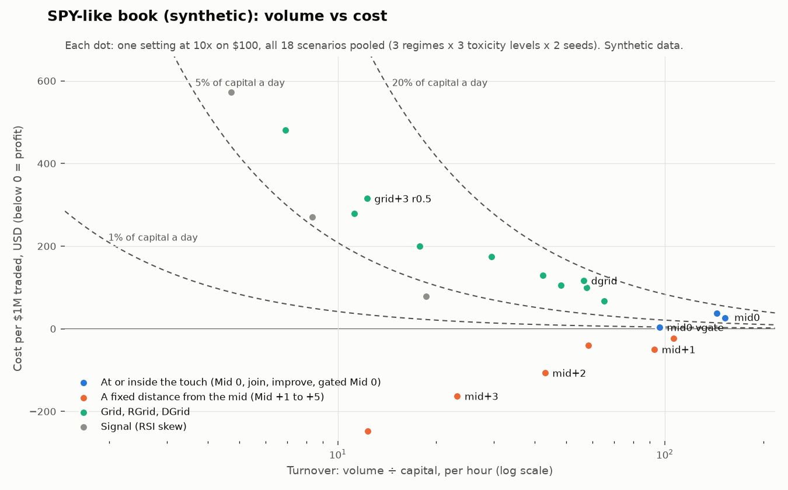

# Research report: farming volume from a small account with limit orders

Status: **draft, updated as results arrive.** Live paper trading has not started: this cloud session's network
policy blocks every exchange (see [7](#7-live-paper-run-on-arcus)).

## 1. Summary

_Provisional until the live run (tier D) happens._

- **Capital efficiency multiplies cost.** Loss per day as a share of capital = turnover × cost per $1M. The
  settings that turn a small account over fastest need a cost close to zero, or they drain it: Mid −1 at $237 per
  $1M (RiseX, 19 runs) is 1.2% a day at 50× turnover and 24% at 1,000×.
- **The best posted volume-per-dollar result** is a plain Grid on a zero-builder-fee venue: 525× the capital a day
  at ~$24 per $1M (S20). DGrid in calm hours had a trading profit; all its cost was fees (S02).
- **Mid 0 (the hypothesis) wins on volume, not on breakeven.** Every tight posted setting lost 1.4–3.3 bp before
  fees. On Arcus, which charges makers nothing, the equivalent settings cost $30–130 per $1M (the owner's recorded
  data). In the model Mid 0 was just above breakeven on quiet thin books and lost on busy or toxic ones.
- **Quoting 1–3 bps off the mid is the best trade-off** in every tier that measured it: GO near breakeven at
  100–230× the capital a day on real Arcus books, and ~60% of Mid 0's volume at a profit in the model.
- **Two filters help:** skip the US cash session (real data), and gate Mid 0 by volatility (new; model only).
- **Avoid for this goal:** BTC/ETH, last-fill grids without a soft reset (and RGrid/DGrid copies), RSI Signal, and
  20x+ on touch settings.
- **Not done:** the 12–15 hour live paper run. This session's network policy blocks `api.arcus.xyz`. The farm that
  does it is built, tested end to end against a stand-in server, and runs with one command (`bot farm run --hours
  15`).

## 2. What was asked, and how it was tested

The goal: out of the Tread.fi strategies in the three data dumps, find the ones that turn a **small** account over
the **most** times, **within hours**, at or near **breakeven**, using **limit (maker) orders only**. Label the risk
of each, test them, and check the hypothesis that quoting both sides at the mid (Mid 0) is the best way.

Four kinds of evidence, strongest first:

| Tier | Evidence | Where |
|---|---|---|
| A | Real runs posted by Tread.fi users and the Tread team (46 sources) | [3](#3-tier-a-what-the-tread-fi-posts-show) and [01_strategy_shortlist.md](01_strategy_shortlist.md) |
| B | This repository's backtests on 4 real recorded days of Arcus books (Sep 20–23, 2026) | [4](#4-tier-b-the-repositorys-own-backtests-on-recorded-arcus-data) |
| C | The paper farm on synthetic model markets: mechanics only | [5](#5-tier-c-synthetic-mechanics-study) |
| D | The paper farm on live Arcus data (12–15 h) | [7](#7-live-paper-run-on-arcus) |

**The paper farm** (`bot farm`, `bot/bot/farm/`) runs every setting on the same data at once: 30 Tread-style
settings (Mid 0, join / improve the touch, Mid +1…+5, Grid +1…+10 with soft resets, a trailing RGrid, a Dynamic
Grid approximation, RSI-skewed Signal, skip-US-session variants, and two additions of this research: a
volatility-gated Mid 0 and a volatility-adaptive Mid) at 5x, 10x, 20x and the market's maximum. Each
paper account has $100 and stops of 5% (position), 10% (day) and 20% (kill) of it, like the posts' 5–25% stops.
Fills use the scout's simulator: orders go live 150 ms after they are sent, and a resting order fills only when a
taker trades through its price, which is a lower bound on fills. The stops, order budget and liquidation rules are
the live bot's.

**The one formula that matters for this goal:**

> loss per day, in % of the capital = turnover per day × cost per $1M ÷ 10,000

Turnover is volume ÷ capital. A setup that trades 150× its capital an hour (Mid 0 at 10x did 155× in the model)
trades 3,600× a day. At a cost of $20 per $1M that is a 7.2% loss per day. **The more capital-efficient a setup is, the closer to zero
its cost per $1M must be.** A $237/1M setup (the RiseX Mid −1 runs) is fine at 50× a day (1.2%) and ruinous at
1,000× (24%).

## 3. Tier A: what the Tread.fi posts show

Details and all derivations: [01_strategy_shortlist.md](01_strategy_shortlist.md).

| Finding | Evidence |
|---|---|
| The best posted capital efficiency is a plain Grid on a venue with no builder fee: **525× the capital per day at ~$24 per $1M** (~1.2% of capital per day) | S20: $1.73M on $1,650 in 2 days, comp PnL −$40.80 (RiseX) |
| DGrid in calm hours had a **trading profit** (−0.35 bp); its whole cost was the 1 bp fee | S02: 9 BTC DGrid rows, $185k, fees $18.88, PnL +$6.49 |
| Mid −1 aggressive is the **reliable cost** setting: 19 of 19 runs lost, but in a tight band ($121–369 per $1M; 1.0 bp fee + 1.37 bp trading loss) | S04: $3.18M on RiseX BTC |
| Tight Mid on a volatile alt is the **fast way to lose the account**: −42% in a week at 152× capital per day | S03: Perpl SOL Mid −1..−3, $788k, win rate 20.9% |
| Every post at Mid ≤ 0 shows a **trading loss before fees** | S03 (3.25 bp), S04 (1.37 bp), S07 (Grid 0–1 bps "result in losses") |
| Wider settings win per trade but trade less; outright failures come from volatile periods and high leverage | S05 (every Mid +5..+50 / Grid +10..+20 run stopped out, $810–25,550 per $1M), S15 ("high leverage or over $100 it wrecks me") |
| On Tread, fees are most of the posted costs (1–3.6 bp); **Arcus charges makers nothing** | S04, S29, S11; Arcus fee tiers |

## 4. Tier B: the repository's own backtests on recorded Arcus data

These are the owner's measurements on 4 full recorded days (2026-09-20 to 09-23, 19 markets), with the same
simulator the farm uses, documented in the top-level README (sections 4.6 and 7.8). They are the only real Arcus
data available to this session.

| Result on real Arcus books | Number |
|---|---|
| The most maker volume per dollar near breakeven at $100: `deep 3bp, skew` on QQQ at 20x | $20,961 a day (**210× capital per day**, ~8.7× per hour), +$0.29/day, worst day −$1.60 |
| Aggressive Mid (`improve touch`, `touch 1bp`, the equivalents of Tread's Mid −1 / aggressive) | **$30–130 per $1M**: about Tread's trading loss, without Tread's fees |
| Skipping 09:00–16:30 New York time (Tread: "avoid NYC hours") | Better in 339 of 455 market × setting × leverage combinations; cost 1.19 → 0.72 bp; kept ~70% of the volume |
| Grid around the last fill (Tread's Grid) | Loses 2.4–4.0 bp per dollar without a soft reset; about breakeven with a 0.1% soft reset; best on NVDA and SLV |
| BTC / crypto majors with a DGrid-style setup | Lost in every hour of the day (−2.3 bp) |
| Pausing quotes on volatility | Hurt: the pause pulled quotes exactly when sweeps revert, which is where deep quotes earn |
| Capital scaling | $50–1,000: volume grows about in step with capital (100–230× capital a day); beyond ~$1,000 the markets' liquidity caps it |

## 5. Tier C: synthetic mechanics study

**Synthetic: the numbers come from a model market (`bot/bot/farm/synth.py`), not a real one.** The model has a
random-walk price with calm, volatile and trending regimes and jumps; makers who follow it with a 3-second lag;
noise takers whose sweeps push the book and then bounce back; and informed takers who trade stale quotes when the
move beats their cost. It shows how each setting behaves under those forces with the farm's own fill model. It
cannot say how large the forces are on Arcus today.

The books copy the Arcus snapshots in the repository's fixture (`tests/fixtures/live/arcus_ws_frames.json`): BTC
and SPY are **one tick wide** with only $6–500 at the touch and sparse levels behind it. Each scenario is 12 hours;
18 scenarios per book (chop, trend, mixed × informed-trader cost of 2.5, 1.0 and 0.5 bp × 2 seeds). Full tables:
[synthetic/arcus-like/SUMMARY.md](synthetic/arcus-like/SUMMARY.md).

SPY-like book, $100 at 10x, all 18 scenarios pooled:

| Setting | Turnover / h | Cost per $1M | Profitable scenarios | Worst drawdown | Risk (2nd-worst label) |
|---|---|---|---|---|---|
| `mid0` (the hypothesis) | 155× | $28 | 2 / 18 | 11.6% | R3 |
| `join` (at the touch) | 153× | $27 | 2 / 18 | 12.0% | R3 |
| `improve1` | 144× | $38 | 1 / 18 | 11.8% | R3 |
| `mid+1 skew` | 106× | −$23 | 15 / 18 | 8.5% | R2 |
| `mid0 vgate` (new) | 96× | $4 | 11 / 18 | 12.6% | R3 |
| `mid+1` | 93× | −$50 | 15 / 18 | 9.6% | R3 |
| `mid+2` | 43× | −$107 | 15 / 18 | 11.6% | R3 |
| `mid+3` | 23× | −$163 | 16 / 18 | 11.9% | R3 |
| `grid+1 r0.125` (best grid) | 65× | $68 | 3 / 18 | 13.3% | R3 |
| `dgrid` | 57× | $116 | 4 / 18 | 11.7% | R3 |

What the model shows:

1. **Distance from the mid trades volume for margin, smoothly.** Each extra bp away roughly halves the turnover and
   adds $55–80 per $1M of profit (Mid 0 → +1 → +2 → +3: 155×, 93×, 43×, 23× an hour; $28, −$50, −$107, −$163).
2. **Mid 0 and joining the touch are the same thing on a one-tick book,** and both sit just above breakeven at
   the highest turnover. At 155× an hour even $28 per $1M costs ~10% of the capital a day: 7 of 18 scenarios hit
   the 10% daily stop.
3. **Mid 0 degrades with toxic flow; Mid +1 does not.** From the calmest to the most toxic setting, Mid 0 went from
   $8 to $52 per $1M while Mid +1 stayed profitable at every level (−$61, −$79, −$26).
4. **Gating Mid 0 by volatility is the only change that made it roughly breakeven.** `mid0 vgate` quotes Mid 0 only
   while calm, and widens to up to 3 bps otherwise. It kept 60% of Mid 0's volume and was profitable in 11 of 18
   scenarios instead of 2. In trends it still lost ($64 per $1M): that is where it needs the skip-US-session filter
   or a stop.
5. **Grids around the last fill (Tread's Grid, RGrid, DGrid) lose in this model** ($68–480 per $1M): after a sweep
   the anchored side is left behind the move. That matches the owner's real-data finding (tier B) that grids need a
   soft reset to break even, and the Tread posts' "grid stalls in a trend".
6. **On the BTC-like book every setting lost.** Its touch holds far more flow, so the sweeps that pay wide quotes
   rarely reach them, while quotes at the touch pay $55–100 per $1M. This matches the owner's measured −2.3 bp on BTC
   (tier B) and the posts' warning that BTC is where the professional makers are (S45).
7. **More leverage multiplies turnover and loss alike.** At 20x `mid0` turned 254× an hour and hit the daily stop
   in 10 of 18 scenarios; at 5x it turned 93×, hit it in 2 and was near breakeven in 10 of 18.
8. **The queue assumption hardly matters on books this thin.** Re-running the touch settings with "front of the
   queue" fills (a print at our price fills us too: the upper bound) added 3–5% turnover and moved Mid 0 from $28 to
   $25 per $1M (profitable in 4 of 18 instead of 2). The touch holds so little that most taker orders sweep
   through it (`synthetic/arcus-like/results-front-of-queue.json`).
9. **The same ranking holds on wider books.** A second batch with 1–3 bp spreads (a thin index perp, a busy crypto
   major and a mid-cap alt; 12 scenarios each; [synthetic/wide-books/SUMMARY.md](synthetic/wide-books/SUMMARY.md))
   gave the same picture. `mid+1 skew` was the best trade-off on the index book: near breakeven in 12 of 12 at 123×
   an hour, −$43 per $1M, R1. Plain Mid 0 was marginal ($11 per $1M, 5 of 12) and the gated Mid 0 better (−$5, 9 of
   12 near breakeven). Grids lost $94–180 per $1M on every book, and on the busy major every setting lost except
   Mid +1, which barely traded (15× an hour).

## 6. The Mid 0 hypothesis

The idea: limit orders on both sides at the mid, 0 bps, limit orders only.

**Right about volume.** Mid 0 is the highest-turnover maker setting in every tier: the posts (S07: tight spreads have
the highest completion), the model (155× the capital an hour at 10x on the SPY-like book) and the owner's volume
lists (tier B). On a one-tick book it is the same as joining the touch.

**Not breakeven on its own.** Every tight posted setting lost before fees: 1.37 bp (RiseX BTC Mid −1, 19 runs),
3.25 bp (Perpl SOL), Nado Grid 0–1 bps "result in losses". The owner measured the Arcus equivalents at $30–130 per
$1M. The model has Mid 0 just above breakeven on a quiet thin book ($28 per $1M, profitable in 2 of 18 scenarios),
worse with toxic flow ($52), and losing on a busy book ($55). Because Mid 0 turns the capital over so fast, those
small costs are large per day: **$30 per $1M at 150× an hour is 10.8% of the capital a day.**

**What does better, in order of evidence:**

1. **Move 1–3 bps off the mid.** On real Arcus books the owner's GO settings were `deep 1.5bp`–`deep 3bp` (Mid +1.5
   to +3) on QQQ, SPY, GLD and NVDA, near breakeven at 100–230× the capital a day. In the model Mid +1 kept 60% of
   Mid 0's volume and was profitable in 15 of 18 scenarios.
2. **Skip the US cash session.** Real data: 339 of 455 combinations improved, cost 1.19 → 0.72 bp, 70% of the volume
   kept. Tread's own timing data says the same.
3. **Gate Mid 0 by volatility** (new here). In the model `mid0 vgate` was profitable in 11 of 18 scenarios instead
   of 2 and kept 60% of the volume. Not yet tested on real data.
4. **Use 5x, not 20x, for Mid 0.** Its loss per day scales with leverage: at 5x it hit its daily stop in 2 of 18
   scenarios, at 20x in 10.

Verdict: Mid 0 is the right tool when the goal is volume **and** something else pays for it (points, rewards,
rebates) at more than its cost, about $30–130 per $1M on Arcus. For volume at breakeven, quote 1–3 bps off the mid.

## 7. Live paper run on Arcus

_Pending._ Two things stopped it in this cloud session:

1. **The network policy denies every exchange host** (`api.arcus.xyz`, `api.hyperliquid.xyz`, Binance, Bybit, OKX
   and others: the proxy answers 403). Checked every hour from 17:10 to 19:58 UTC on 2026-09-25.
2. **The container is recycled while the session is idle** (it restarted at about 18:56 and 19:58 UTC). Background
   processes died with it, so even with network access a 15-hour recording here would have gaps. The farm resumes
   an existing run folder (`bot farm run research/runs/<id>`), but the hours it missed cannot be recorded later.

**Run it on a machine that stays up** (the same one that runs the scout, [section 11 of the main
README](../README.md#11-the-server-pc-what-runs-247)): `bot farm run --hours 15`. It commits its results hourly;
the leaderboard lands in `research/runs/<UTC start>/LEADERBOARD.md`. `bot/scripts/farm_when_reachable.sh` starts it
once Arcus answers.

## 8. Recommendation

**Provisional: based on tiers A–C. Tier D (live Arcus paper trading) could not run in this session.**

For the most volume per dollar within hours, at or near breakeven, with limit orders only, on Arcus:

| Rank | Setting (farm name → this bot's scout menu) | Where | Leverage | Expected | Risk |
|---|---|---|---|---|---|
| 1 | **Mid +1 with inventory skew** (`mid+1 skew` → the scout's `deep 1bp` or `touch 1bp`; the skew is `skew_kappa: 1` in the session) | Quiet RWA perps: QQQ, SPY, GLD, NVDA, SLV | 5–10x | Model: ~100× the capital an hour, profitable in most scenarios. Real (tier B): `touch 1bp` costs $30–130 per $1M | **R2** |
| 2 | **Deep 1.5–3 bp** (`mid+2`/`mid+3` → `deep 1.5bp, no pause`, `deep 3bp, skew`) | The same markets | 10–20x | Real (tier B): GO near breakeven at 100–230× the capital **a day** | **R1–R2** |
| 3 | **Gated Mid 0** (`mid0 vgate`, new) | The same markets | 5x | Model: ~60% of Mid 0's volume at about breakeven. No real data yet | **R3** until tested live |
| 4 | **Mid 0 / join / improve the touch** (`mid0`, `join`, `improve1` → `improve touch`) | Only where something pays more than ~$30–130 per $1M | 5x, skip the US session | Most volume; a steady loss of turnover × cost | **R3** |

Add the **skip-US-session** filter to all of them (real data: 339 of 455 combinations improved).

Avoid, for this goal:
- BTC, ETH and busy crypto majors (every tier: −2.3 bp real, all settings lost in the model; S45).
- Grids anchored to the last fill without a soft reset, and RGrid / DGrid copies (real: −2.4 to −4.0 bp; model:
  $94–480 per $1M; posts: "stalls in a trend", "$1200+ CPM" runs). **R3–R4.**
- RSI Signal for volume (the model's worst tails, R4; one posted round trip).
- 20x+ on the touch settings: turnover and loss scale together, and the daily stop fires.

Use the formula before sizing up: **loss per day % = turnover per day × cost per $1M ÷ 10,000.** A setting that is
fine at 50× a day can lose a fifth of the account at 1,000×.

How to confirm on live data (any machine that can reach Arcus): `bot farm run --hours 15`, then compare the
leaderboard's `mid+1 skew`, `mid+2`, `mid0 vgate` and `mid0` rows on QQQ, SPY, GLD and NVDA. Only move to real money
through the scout and pilot (`bot pilot approve`), in paper first.

## 9. Caveats

- Tier A is self-reported, often from referral posts; the shortlist labels confidence per source.
- Tier B covers 4 days. Tier C is a model. Only tier D (live) measures today's Arcus market.
- The fill model is conservative: a trade at our exact price never fills us. That undercounts fills most for
  settings that join the touch (Mid 0 on a one-tick book). The `--front-of-queue` re-analysis gives the upper bound.
- No backtest sees how our own quotes change other traders' behaviour. On books as thin as Arcus's (QQQ trades
  about $1M a day), a $400 order at the touch is visible and may be traded against differently.
