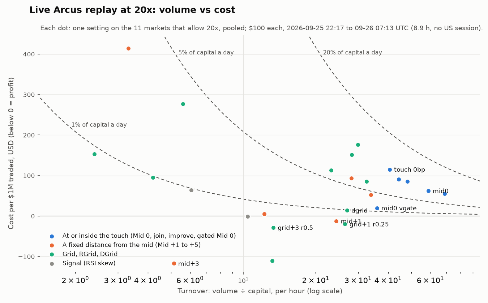

# Research report: farming volume from a small account with limit orders

Final, 2026-09-26. Evidence: 46 Tread.fi posts, the repository's recorded Arcus backtests, a synthetic mechanics
study, and **9.4 hours of live paper trading on Arcus** (2026-09-25 21:47 to 09-26 07:13 UTC).

## 1. Summary

**The question.** Which Tread.fi-style market-making settings turn a small account over the most times within
hours, at or near breakeven, with limit (maker) orders only? Is Mid 0 (both sides at the mid) the best way?

**The answer, from every source that measured it:**

1. **Volume and cost trade off along one curve.** Moving the quotes toward the mid adds volume and adds cost, with
   no setting off the curve. What decides the result is **loss per day = turnover × cost per $1M**. The faster a
   setting turns $100 over, the closer to zero its cost must be.
2. **Mid 0 is the volume maximum, not breakeven.** Live on Arcus at 20x it turned the capital over 59× an hour at
   **$62 per $1M**, profitable on 2 of 11 markets. `touch 0bp` (the scout's version, joining the touch) did 41× an
   hour at $115. At maximum leverage the 12 live paper engines lost **$36 on $305k of volume ($118 per $1M)**. 9 of
   the 11 that traded hit their daily or kill stop within hours.
3. **The breakeven line sits between Mid 0 and Mid +1.** Live at 20x: **Mid +1** 24× an hour at −$12 per $1M
   (profit), **Grid +1** (0.25% reset) 26× at −$20, **Grid +3** 13× at −$28 on 8 of 11 markets, and the new
   **volatility-gated Mid 0** 36× at $20. The synthetic study and the posts rank them the same way.
4. **Market choice matters as much as the setting.** Liquid perps that allow 20x (NVDA, SPY, ETH, SOL, BTC, QQQ,
   GLD, XRP) had settings in profit. Pooled, the alts capped at 10x (HYPE, NEAR, ZEC, ENA, PUMP, SUI and others)
   lost with every setting; their few profitable single runs were small and scattered.
5. **Best live combinations, at or near breakeven** (chosen after the fact from ~90 per market, so treat them as
   leads): NVDA `mid+1 skew` 20x (56× an hour, −$24 per $1M, 0.6% max drawdown), SPY `mid0 vgate` 50x (56×, −$7),
   ETH `grid+1 r0.25` 20x (60×, −$20), SOL `dgrid` 20x (72×, −$66, 9.5% drawdown), BTC `grid+2 r0.5` 20x (43×,
   −$99).

**What is not settled.** The live window was 9 hours overnight with no US cash session, and hour-to-hour PnL swings
by ±$10–20 per setting. The fill model also decides signs near zero: with generous fills, Mid +1 moves from −$12 to
+$28 per $1M. The ranking is solid; the exact breakeven setting per market is not.

## 2. What was tested, and how

| Tier | Evidence | Where |
|---|---|---|
| A | Real runs posted by Tread.fi users and the team (46 sources) | [01_strategy_shortlist.md](01_strategy_shortlist.md), section 3 |
| B | The repository's backtests on 4 recorded Arcus days (Sep 20–23) | section 4 |
| C | Synthetic model markets: mechanics only | section 5, [synthetic/](synthetic/) |
| D | **Live paper trading on Arcus, 9.4 h, 59 markets** | section 6, [runs/20260925-2147/](runs/20260925-2147/) |

**The paper farm** (`bot farm`, [bot/bot/farm/](../bot/bot/farm/)) records every Arcus perp and replays 31 settings on
the same data: Mid 0, join, improve, `touch 0bp`, Mid +1…+5, Grid +1…+10 with soft resets, a trailing RGrid, a
Dynamic Grid approximation, RSI-skewed Signal, skip-US-session variants, and two additions of this research
(a volatility-gated Mid 0 and a volatility-adaptive Mid). Each runs at 5x, 10x, 20x and the market's maximum, with
$100 and stops of 5% (position), 10% (day) and 20% (kill). A resting order fills only when a taker trades through
its price (a lower bound on fills); orders go live 150 ms after sending; stops, order budget and liquidation are the
live bot's.

**The paper engines** are the bot's own trading engine in paper mode. Each runs one session, the one Telegram's
`/run MARKET touch 0bp max` deploys ($100 at maximum leverage, stops 1% / 2% / 10%), on BTC, ETH, ZEC, NEAR, QQQ,
SPY, NVDA, TSLA, GLD, SLV, SOL and HYPE. They use the paper venue's queue-aware fill model, a second, more generous
model than the replay's.

## 3. Tier A: what the Tread.fi posts show

| Finding | Evidence |
|---|---|
| The best posted volume per dollar: a plain Grid at **525× the capital a day for ~$24 per $1M** (1.2% a day) | S20, RiseX, $1.73M on $1,650 in 2 days |
| DGrid in calm hours made a trading profit; its whole cost was the 1 bp fee | S02, 9 BTC runs, PnL +$6.49 on $185k |
| Mid −1 aggressive: a reliable cost, 19 of 19 runs lost, $121–369 per $1M | S04, RiseX BTC, $3.18M |
| Tight Mid on a volatile alt lost 42% of the account in a week | S03, Perpl SOL |
| Every tight (Mid ≤ 0) post lost before fees (1.4–3.3 bp) | S03, S04, S07 |
| Tread's posted costs are mostly fees (1–3.6 bp); **Arcus makers pay no fee** | S04, S29, S11 |

## 4. Tier B: the repository's backtests on recorded Arcus data

From the main README (sections 4.6 and 7.8), 4 recorded days, 19 markets, the same simulator:

| Result | Number |
|---|---|
| Most maker volume near breakeven at $100: `deep 3bp, skew` on QQQ at 20x | 210× the capital a day, +$0.29/day |
| `improve touch` / `touch 1bp` (Tread's Mid −1 equivalents) | $30–130 per $1M |
| Skipping 09:00–16:30 New York time | better in 339 of 455 combinations; cost 1.19 → 0.72 bp; 70% of volume kept |
| Last-fill grids | −2.4 to −4.0 bp without a soft reset; about breakeven with one |
| BTC with a DGrid-style setup | lost in every hour (−2.3 bp) |

## 5. Tier C: synthetic mechanics study (model, not real edge)

A model market ([bot/bot/farm/synth.py](../bot/bot/farm/synth.py)) with calm, trending and volatile regimes, lagging
makers, noise sweeps that revert, and informed takers who trade stale quotes when the move beats their cost. The books
copy Arcus's: one tick wide, thin at the touch. 36 twelve-hour scenarios on Arcus-like books and 36 on wider books.
Tables: [synthetic/arcus-like/SUMMARY.md](synthetic/arcus-like/SUMMARY.md),
[synthetic/wide-books/SUMMARY.md](synthetic/wide-books/SUMMARY.md).

On the SPY-like book at 10x: Mid 0 155× an hour at $28 per $1M, profitable in 2 of 18 scenarios; Mid +1 93× at
−$50, 15 of 18; gated Mid 0 96× at $4, 11 of 18; grids $68–480 per $1M. Mid 0 got worse as toxic flow rose ($8 →
$52) while Mid +1 stayed profitable; on the BTC-like book every setting lost. The live run (section 6) reproduced
this ordering.

## 6. Tier D: live paper trading on Arcus

Run folder: [runs/20260925-2147/](runs/20260925-2147/). Recording: 59 perps, 2026-09-25 21:47 to 09-26 07:13 UTC.
Replay window: 22:17–07:13 UTC (8.9 h; 30 minutes of warm-up). No US cash session was covered (it opens 13:30 UTC).

### 6.1 The `/run MARKET touch 0bp max` engines

| Market | Lev | Volume | Turnover / h | Fills | Net | Cost per $1M | End state | Replay, same window and stops: volume / net |
|---|---|---|---|---|---|---|---|---|
| NVDA | 20x | $80,712 | 86× | 306 | **+$1.68** | −$21 | quoting | $35,386 / −$1.02 |
| SPY | 50x | $52,121 | 56× | 99 | −$5.38 | $103 | daily stop | $31,549 / −$4.80 |
| SOL | 20x | $37,866 | 40× | 89 | −$4.31 | $114 | **killed** (−$9.03 from a +$4.7 peak) | $33,727 / −$2.90 |
| ETH | 20x | $37,088 | 40× | 79 | −$5.00 | $135 | daily stop | $11,277 / −$5.39 |
| BTC | 20x | $35,316 | 38× | 265 | −$4.50 | $127 | daily stop | $34,463 / −$5.07 |
| GLD | 25x | $18,568 | 20× | 52 | −$0.60 | $32 | quoting | $8,479 / +$0.71 |
| QQQ | 25x | $12,818 | 14× | 26 | −$2.54 | $198 | daily stop | $6,511 / −$1.84 |
| ZEC | 10x | $10,368 | 11× | 34 | −$4.25 | $410 | daily stop | $8,648 / −$5.48 |
| HYPE | 10x | $8,142 | 9× | 59 | −$4.80 | $589 | daily stop | $11,589 / −$4.29 |
| NEAR | 10x | $7,577 | 8× | 38 | −$3.67 | $484 | daily stop | $7,541 / −$6.07 |
| SLV | 25x | $4,198 | 4× | 6 | −$2.74 | $654 | daily stop | $5,663 / −$2.82 |
| TSLA | 10x | $0 | 0 | 0 | $0 | — | never traded (US closed) | — |
| **Total** | | **$304,774** | | | **−$36.10** | **$118** | | |

- **The 2% daily stop binds fast.** Most engines hit it within 1–2 hours, again within 30 minutes of the 00:00 UTC
  reset, and then stayed stopped. At maximum leverage the stop allows only $15–20k of BTC or ETH volume a day.
- **SOL shows maximum leverage's swing risk:** up $4.7, then down $9 from that peak, and the 10% kill fired.
- **NVDA was the only clear winner** (+$1.68 on $80.7k, quoting 99.5% of the time); GLD was nearly flat.
- **The two fill models agree on 9 of 11 signs** (they differ on NVDA and GLD, the two near zero). The engine's
  queue-aware paper venue fills more at the touch (2.3× the replay's volume on NVDA, 1.7× on SPY). The replay is the
  conservative bound.

### 6.2 The whole menu, live replay

**At 20x (the 11 markets that allow it):**

| Setting | Turnover / h | Cost per $1M | Upper-bound fills: turnover / cost | Profitable markets | Risk labels (R1 / R2 / R3 / R4) |
|---|---|---|---|---|---|
| `mid0` (the hypothesis) | 59× | $62 | 90× / $51 | 2 of 11 | 2 / 1 / 8 / 0 |
| `improve1` | 48× | $85 | 65× / $67 | 4 | 2 / 2 / 7 / 0 |
| `join` | 44× | $91 | 83× / $49 | 4 | 3 / 1 / 7 / 0 |
| `touch 0bp` (scout) | 41× | $115 | 68× / $60 | 3 | 3 / 1 / 6 / 1 |
| `mid0 vgate` (new) | 36× | **$20** | 45× / $44 | 2 | 4 / 1 / 6 / 0 |
| `mid+1 skew` | 34× | $53 | 40× / $54 | 4 | 3 / 2 / 6 / 0 |
| `dgrid` | 27× | $14 | — | 4 | 3 / 2 / 5 / 1 |
| `grid+1 r0.25` | 26× | **−$20** | — | 6 | 4 / 3 / 4 / 0 |
| `mid+1` | 24× | **−$12** | 30× / $28 | 4 | 4 / 2 / 5 / 0 |
| `grid+3 r0.5` | 13× | **−$28** | — | **8** | 7 / 0 / 3 / 1 |
| `mid+2` | 12× | $6 | 13× / −$63 | 5 | 4 / 2 / 4 / 1 |
| `mid+3` | 5× | **−$117** | — | **8** | 6 / 2 / 1 / 2 |
| `rgrid+1 r0.25` | 30× | $176 | — | 2 | 2 / 1 / 8 / 0 |

**At 10x (48 markets, mostly quieter stocks and alts):** every setting lost; the cheapest per $1M were `improve1`
($138), `touch 0bp` ($168), `mid0 vgate` ($178) and `grid+3 r0.5` ($210). At 5x (59 markets) the same, with only
`rsi+8` in profit on tiny volume. The losses concentrate in the illiquid names.

### 6.3 Where it works: per market

At or near breakeven, most turnover per market (live, chosen after the fact from ~90 combinations each):

| Market | Setting | Turnover / h | Volume | PnL | Cost per $1M | Max drawdown | Risk |
|---|---|---|---|---|---|---|---|
| SOL | `dgrid` 20x | 72× | $64,352 | +$4.22 | −$66 | 9.5% | R3 |
| ETH | `grid+1 r0.25` 20x | 60× | $53,386 | +$1.06 | −$20 | 5.7% | R2 |
| NVDA | `mid+1 skew` 20x | 56× | $49,824 | +$1.18 | −$24 | 0.6% | R1 |
| SPY | `mid0 vgate` 50x | 56× | $49,571 | +$0.35 | −$7 | 3.4% | R2 |
| BTC | `grid+2 r0.5` 20x | 43× | $38,223 | +$3.80 | −$99 | 3.3% | R2 |
| XRP | `mid0` 20x | 41× | $36,175 | +$5.45 | −$151 | 8.7% | R3 |
| QQQ | `grid+1 r0.25` 20x | 17× | $15,460 | +$1.30 | −$84 | 2.9% | R1 |
| GLD | `improve1` 25x | 10× | $8,820 | +$0.92 | −$104 | 0.7% | R1 |

The same markets at Mid 0: BTC 190× an hour at $101 per $1M (46% of the capital a day before the stop), ETH 101×
at $160, NVDA 94× at $49, SPY 101× at $111.

### 6.4 Hour by hour

Pooled over the 20x markets, single-hour PnL swings by ±$10–20 for every setting ([results](runs/20260925-2147/results/),
paper series in `paper/`). Mid 0's volume collapsed after 01:00 UTC as its daily stops fired. Nine hours separate the
families; they do not prove a single market × setting.

## 7. The Mid 0 hypothesis: verdict

**Right about volume.** Mid 0 had the most turnover in every tier: 59× the capital an hour live at 20x, 155× in the
model at 10x on the SPY-like book, 190× live on BTC.

**Not breakeven.** Live it cost $62 per $1M at 20x ($51–62 across both fill models) and $204 at 10x, and was
profitable on 2 of 11 liquid markets. At its turnover, $62 per $1M is 8–9% of the capital a day, so the 2% daily
stop fires within a few hours; the live engines showed exactly that.

**What to do instead, in order of evidence:**

1. **Quote 1–3 bps off the mid** (`mid+1`, `mid+3`, the scout's `deep 1.5bp`–`deep 3bp`). Live: Mid +1 −$12,
   Mid +3 −$117 per $1M, profitable on 4 and 8 of 11 markets. Owner's data: GO near breakeven at 100–230× a day.
   Model: profitable in 15–16 of 18 scenarios.
2. **Or a tight grid with a soft reset** (`grid+1 r0.25`, `grid+3 r0.5`): live −$20 and −$28 per $1M, 6 and 8 of 11
   markets. It was the best non-Mid family live, unlike in the model; the owner's data also found soft resets
   essential.
3. **If you want Mid 0's volume, gate it** (`mid0 vgate`, new): live 36× an hour at $20 per $1M, about a third of
   Mid 0's cost with 60% of its volume. Model: profitable in 11 of 18 instead of 2.
4. **Choose liquid markets that allow 20x+** (NVDA, SPY, ETH, SOL, BTC, QQQ, GLD, XRP). Avoid alts capped at 10x,
   which lost pooled with every setting.
5. **Skip the US session** (real-data evidence from tier B; this live window did not include it).

Mid 0 is the right tool only when something else (points, rewards, rebates) pays more than its cost: about $50–100
per $1M on Arcus at 20x, and far more on alts.

## 8. Recommendation

For the most volume per dollar at or near breakeven, maker orders only, on Arcus:

| Rank | Setting (farm name → bot) | Markets | Leverage | Live result | Risk |
|---|---|---|---|---|---|
| 1 | **Mid +1**, with inventory skew where it helps (`mid+1`, `mid+1 skew` → scout `deep 1bp` / `touch 1bp`, `skew_kappa: 1`) | NVDA, SPY, QQQ, GLD, ETH | 20x | 24–34× an hour, −$12 to $53 per $1M; NVDA −$24 at 56× | **R2** |
| 2 | **Grid +1 / +3 with soft reset** (`grid+1 r0.25`, `grid+3 r0.5` → the `anchor` mode) | ETH, BTC, QQQ, SOL | 20x | 13–26× an hour, −$20 to −$28 per $1M | **R2** |
| 3 | **Gated Mid 0** (`mid0 vgate`, new: needs a live strategy before real money) | SPY, NVDA, ETH | 20x+ | 36× an hour, $20 per $1M; SPY −$7 at 56× | **R3** until proven |
| 4 | **Deep 3 bp** (`mid+3` → scout `deep 3bp, skew`) | the same | 20x | 5× an hour, −$117 per $1M, 8 of 11 profitable | **R1** (low volume) |
| — | **Mid 0 / `touch 0bp` at max** | only if rewards pay > ~$100 per $1M | ≤ 20x | $62–115 per $1M, stops within hours | **R3** |

Avoid for this goal: alts capped at 10x (every setting lost pooled, live), RGrid copies (R3–R4), and maximum leverage on
touch settings, where the daily stop binds and SOL's kill fired.

**Before real money:** run the scout (it needs 3 recorded days) and let its GO checks confirm the pick. Paper-trade
it through the pilot, including a US session. Watch the dashboard's cost per $1M against the formula: at 50× a day,
$100 per $1M is 0.5% of the capital a day; at 1,000× a day it is 10%.

## 9. Caveats

- **One 9-hour overnight window.** No US cash session, one regime. Hourly PnL noise (±$10–20) is as large as many of
  the differences. Per-market "best" picks are selected after the fact from many combinations and will regress.
- **Fill models.** The replay counts only prints through our price (a lower bound). The paper engine's queue model is
  more generous. Near zero the sign depends on the model: Mid +1 was −$12 or +$28 per $1M.
- **Paper is not live.** Neither model sees how our own quotes change other traders' behaviour. On books this thin
  (QQQ traded ~$0.1M in the window), a $400–2,000 order at the touch is visible.
- **Tier A** is self-reported, often referral posts; **tier C** is a model.
- The Tread modes are approximations where their logic is unpublished (DGrid, RGrid); the gated Mid 0 is new and has
  no live strategy in the bot yet.

## 10. Files

| Path | What |
|---|---|
| [01_strategy_shortlist.md](01_strategy_shortlist.md) | The Tread.fi setups with cost, turnover and risk labels |
| [runs/20260925-2147/LEADERBOARD.md](runs/20260925-2147/LEADERBOARD.md) | Live replay: best runs and every setting across 59 markets |
| [runs/20260925-2147/results/latest.json](runs/20260925-2147/results/latest.json) | All 3,782 live paper runs (one row each) |
| [runs/20260925-2147/paper-engine/SUMMARY.md](runs/20260925-2147/paper-engine/SUMMARY.md) | The 12 `/run … touch 0bp max` engines; `fills/` has every fill |
| [runs/20260925-2147/variants/](runs/20260925-2147/variants/) | `engines-match` (same window and stops as the engines) and `front-of-queue` (upper-bound fills) |
| `runs/20260925-2147/candles/` | 1-minute candles for all 59 markets (mid OHLC, spread, volume, taker buys) |
| `runs/20260925-2147/paper/` | Per-minute paper equity, position and volume for every run, and every paper fill |
| `runs/20260925-2147/scout/tape/` | The raw recording (best bid/offer and trades), replayable with `bot farm analyze` |
| [synthetic/](synthetic/) | The two synthetic studies |
| [README.md](README.md) | How to run the farm and read these files |
